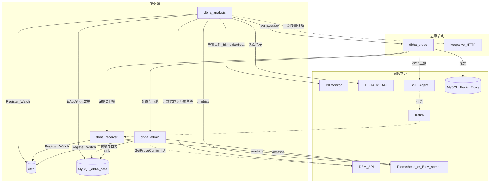

# DBHA v2 架构总览

本文描述 DBHA v2 的系统定位、组件职责、部署拓扑与端到端数据流。

工作流程细节见 [工作流程索引](../flows/README.md)。

## 1. 定位

DBHA v2 负责数据库实例的**持续探测**、**故障判定**与**自动切换**，作为蓝鲸 DBM 高可用链路的核心组件。

- **模块**：`dbm-services/common/dbha-v2`
- **形态**：四个可独立部署的微服务 + 运维工具，而非单体进程

## 2. 组件职责


| 组件               | 入口                                                                                  | 职责摘要                          |
| ---------------- | ----------------------------------------------------------------------------------- | ----------------------------- |
| **admin**        | `[cmd/admin](../../cmd/admin)`、`[internal/admin](../../internal/admin)`             | 负责对外提供API服务，数据库迁移初始化及探针的配置生成等 |
| **receiver**     | `[cmd/receiver](../../cmd/receiver)`、`[internal/receiver](../../internal/receiver)` | 负责接收探针发来的数据并将其转存到数据库持久化保存     |
| **analysis**     | `[cmd/analysis](../../cmd/analysis)`、`[internal/analysis](../../internal/analysis)` | 负责DBM 元数据同步、DB故障诊断及基于策略的故障切换  |
| **probe**        | `[cmd/probe](../../cmd/probe)`、`[internal/probe](../../internal/probe)`             | 负责采集各类DB状态数据                  |
| **dbha-cluster** | `[tools/cmd/cluster](../../tools/cmd/cluster)`                                      | 集群运维（如 CLB、DBM 调用）            |
| **dbha-bwmgr**   | `[tools/cmd/bwmgr](../../tools/cmd/bwmgr)`                                          | 黑白名单管理（见其 README）             |


## 3. 系统架构图




## 4. 部署拓扑

构建与打包见根目录 `Makefile`：


| 包          | 内容                                                                                   |
| ---------- | ------------------------------------------------------------------------------------ |
| **server** | `dbha-admin`、`dbha-analysis`、`dbha-receiver`，以及 `dbha-cluster`、`dbha-bwmgr` 与 etc 模板 |
| **probe**  | `dbha-probe`（Linux / Windows）                                                        |


典型拓扑：

- 中心机房部署 server 包（可多实例，依赖 etcd 做注册与 analysis 分片）
- 每台（或每组）DB 主机部署 probe；probe 通过 admin 拉配置，经 GSE 或直连 receiver 上报

配置模板与 RC 示例在 `[etc/](../../etc/)`；渲染与启停见 `[scripts/README.md](../../scripts/README.md)`。

## 5. 外部依赖


| 依赖                   | 用途                                                                                 | 主要代码                                                                                                |
| -------------------- | ---------------------------------------------------------------------------------- | --------------------------------------------------------------------------------------------------- |
| **etcd**             | 服务注册、analysis 实例发现与业务分片                                                            | `[pkg/discovery](../../pkg/discovery)`                                                              |
| **MySQL**            | 探测状态、元数据缓存、策略、切换日志等                                                                | `[pkg/storage/hamodel](../../pkg/storage/hamodel)`、`[hamysql](../../pkg/storage/hamysql)`           |
| **DBM API**          | 元数据拉取、实例状态更新、MySQL/Tendis 角色交换、域名增删、CLB 摘除、Polaris 解绑、Dumper 切换；admin 在本地无元数据时回退查询 | `[internal/analysis/dbm](../../internal/analysis/dbm)`、analysis 配置中的 `dbmApi`*                      |
| **BKMonitor**        | analysis 经 `bkmonitorbeat` 上报告警/事件（切换成败、策略 Notify、扫描失败、二次探测结果等）                    | `[pkg/monitor](../../pkg/monitor)`、`[workflow/alarm.go](../../internal/analysis/workflow/alarm.go)` |
| **DBHA v1 API**      | 扫描前拉取黑白名单（`dbhav1ApiBlackWhitelistGet`）                                            | `[workflow/dbhav1_whitelist.go](../../internal/analysis/workflow/dbhav1_whitelist.go)`              |
| **GSE**              | probe 可选上报通道                                                                       | `[internal/probe/client/gse.go](../../internal/probe/client/gse.go)`                                |
| **Kafka**            | receiver 可选 source（与 probe gRPC 并存，常承接 GSE 链路）                                     | `[internal/receiver/source](../../internal/receiver/source)`                                        |
| **Prometheus / APM** | admin / analysis / receiver 暴露 `/metrics`，供 Prometheus 或 BKMonitor 抓取              | `[pkg/haapm](../../pkg/haapm)`                                                                      |
| **SSH**              | analysis 二次存活探测（含远端 `dbha-probe health`）                                           | `[internal/analysis/detector](../../internal/analysis/detector)`、workflow                           |


## 6. 周边系统关系

以下按「谁 → 谁、方向、用途」说明，与 §3 架构图对应：

- **DBHA → DBM**：analysis 主动调用 DBM HTTP API——周期性同步元数据到 `t_dbm_metadata`；切换时执行换角、更新实例状态，并按集群类型触发域名 / CLB / Polaris / Dumper 等副作用。admin 在 `GetProbeConfig` 本地无元数据时也会回退访问 DBM。CLB、Polaris 等不单独成系统，统一经 DBM API 完成。
- **DBHA → BKMonitor**：analysis 通过本机/配置的 `bkmonitorbeat` 将事件投递到 BKMonitor（`PostBKMonitor`），用于故障与切换相关告警；不是业务探测数据主通道。
- **DBHA → DBHA v1**：analysis 在 Scan 阶段查询 v1 黑白名单 API，决定哪些集群/实例进入探测与后续窗口。
- **Probe → GSE →（可选 Kafka）→ Receiver**：边缘上报的旁路；直连路径为 Probe gRPC → Receiver。
- **服务端 → Prometheus / BKMonitor 抓取**：各服务 haapm 暴露 `/metrics`，由外部抓取做容量与延迟观测，与 BKMonitor 事件上报互补。
- **Analysis → Probe（SSH / health / keepalive）**：二次探测时访问边缘主机与 probe 进程，确认存活后再入滑动窗口。


## 7. 端到端主路径

```text
配置下发 → 边缘采集 → 上报入库 → 元数据同步 / 分片扫描
       → 二次探测 → 滑动窗口 → 策略匹配 → 切换执行 → 日志 / 告警
```


| 阶段                         | 文档                                                                           |
| -------------------------- | ---------------------------------------------------------------------------- |
| Probe 从 admin 拉取并渲染配置      | [config-sync](../flows/config-sync.md)                                       |
| Harvester 采集并经 reporter 上报 | [probe-harvest-and-report](../flows/probe-harvest-and-report.md)             |
| Analysis 扫描、窗口、切换          | [failure-detection-and-failover](../flows/failure-detection-and-failover.md) |
| 按 DB 类型的探测/切换设计（MySQL）     | [detection 文档索引](../detection/detection-doc-index.md)                        |


## 8. 关键数据表与载荷（简表）

库名一般为 `dbha_data`（以部署配置为准）。模型定义在 `[pkg/storage/hamodel](../../pkg/storage/hamodel)`。


| 表                             | 用途                                 |
| ----------------------------- | ---------------------------------- |
| `t_dbha_status`               | 探测状态 / 事件（receiver 写入，analysis 读取） |
| `t_dbm_metadata`              | DBM 元数据缓存                          |
| `t_db_switching_strategy`     | 切换策略                               |
| `t_db_switching_log`          | 切换日志                               |
| `t_db_switching_snapshot_log` | 切换快照                               |
| `t_db_black_white_list`       | 黑白名单                               |
| `t_skip_dbinstance`           | 跳过实例                               |


探测载荷类型见 `[pkg/storage/haprobe](../../pkg/storage/haprobe)`（如 `HarvestData`、各 DB 状态结构、事件名常量）。  
表结构迁移由 admin：`dbha-admin migrate`（`[internal/admin/migrator](../../internal/admin/migrator)`）。

## 9. 进程与守护（简述）

共享库 `[pkg/process](../../pkg/process)` 提供 PID、前台/后台启停、guard 守护重启、Unix 信号与 Windows 命名事件等。Probe 另有 `ensure` / `ensure-keepalive`（crontab / schtasks）。细节以代码与 scripts 为准，本文不展开运维手册。

## 10. 源码索引


| 主题                   | 路径                                                               |
| -------------------- | ---------------------------------------------------------------- |
| 服务入口                 | `cmd/{admin,analysis,receiver,probe}/`                           |
| Admin gRPC / 配置生成    | `internal/admin/grpc.go`、`internal/admin/config/probe_config.go` |
| Admin Open API       | `internal/admin/api/open/`                                       |
| Receiver source/sink | `internal/receiver/source/`、`internal/receiver/sink/`            |
| Analysis 编排          | `internal/analysis/workflow/`                                    |
| 切换执行                 | `internal/analysis/switcher/`                                    |
| Probe 框架与插件          | `internal/probe/probe.go`、`internal/probe/harvester/`            |
| 上报客户端                | `internal/probe/client/`、`internal/probe/reporter/`              |
| Proto                | `pkg/proto/idl/*.proto`                                          |
| 构建                   | `Makefile`、`build.ps1`                                           |


