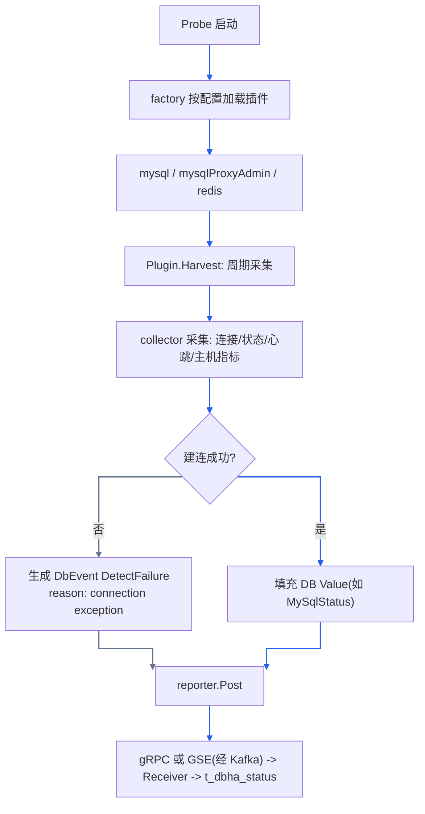
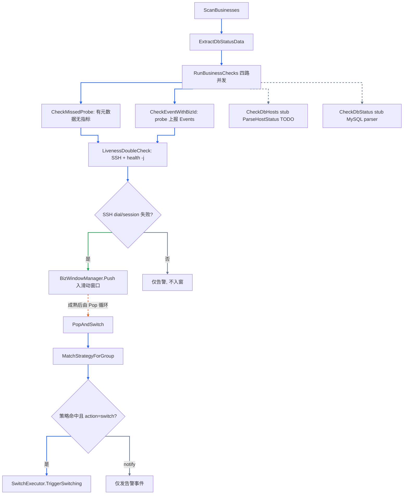

# DBHA v2 故障探测文档索引（探测设计索引）

## 范围说明

聚焦 **MySQL 家族**（`tendbha` / `tendbcluster`）故障探测/切换设计文档。通用架构与组件职责以 [架构总览](../architecture/overview.md) 为准；本文侧重探测域总览与索引。

- Probe harvester 实际加载 3 个插件实例：`mysql`、`mysqlProxyAdmin`（MySQL 插件变体，专用于 TenDBHA proxy admin 端口）、`redis`（由 `provider/*/harvest` 经 `harvester.Register` 自注册，probe 入口 blank-import `provider/allprobe`）。
- Analysis 侧 **switcher 仅注册 MySQL**（由 `provider/mysql/switch` 经 `switcher.Register` 自注册，`workflow.New` 调用 `switcher.Build()`；analysis 入口 blank-import `provider/allanalysis`）；其余 `DbType` 可采集、可因 SSH dial/session 失败入窗（入窗 EventName 仍为 `DoubleCheckSshFailureV1`），但暂不执行自动切换。
- Analysis 侧基于 metrics 的一次解析（status parser）**当前为 stub**（见下文），故障主链路依赖「probe 直报事件 + missed probe + SSH 二次探测」。

入窗细则以 [mysql-detection-design.md §5](./mysql-detection-design.md) 为准；窗口 / 锁 / 策略运行时路径见 [故障判定与切换](../flows/failure-detection-and-failover.md)。总入口见 [文档索引](../README.md)。新增 DB 类型请阅读 [新增 DB 类型扩展指南](./add-db-type-guide.md)（含块名归一、Match 谓词、builtin 弱注册与 provider 骨架）。admin / receiver 通过 blank-import `provider/alldesc` 链接 CapDesc 映射。

---

## v2 总体架构（摘要）

v2 由 probe / receiver / analysis / admin 组成：边缘采集上报 → receiver 落库 → analysis 判定与切换；admin 负责配置下发与运维 API。Probe 经 reporter 走 **GSE 或 gRPC**（进程内二选一）。组件职责、部署拓扑与周边依赖见 [架构总览](../architecture/overview.md)。

二次探测：analysis 经 SSH 执行远端 `dbha-probe health -j`（不含 keepalive HTTP）。

---

## Probe 通用探测流程

Probe 启动时由 factory 加载插件实例，每个插件独立 `Harvest` 协程周期采集，产出 `HarvestData`（含 `Events` 与具体 DB `Value`），经 reporter 上报。



> 色例：蓝=主路径；灰=建连失败分支。

当前仅建连类失败稳定 emit `DetectFailure`；建连成功后的状态/心跳等采集失败多为日志，不写入 `Events`（MySQL 细节见 [mysql-detection-design.md §4](./mysql-detection-design.md)）。

- `Plugin` 接口：[harvester/plugin/plugin.go](../../internal/probe/harvester/plugin/plugin.go)

```go
type Plugin interface {
	Name() (string, error)
	Harvest(ctx context.Context, machineID, serviceID string) (<-chan *HarvestData, error)
	Close() error
}
```

- 插件加载：[internal/probe/factory.go](../../internal/probe/factory.go)

---

## Analysis 通用判定与切换流程

analysis 的 `Workflow` 启动后并行运行元数据同步、分片 watch、Scan 定时、Pop 定时。单业务判定入口为 `RunBusinessChecks`（四路并发）：其中 `CheckMissedProbe` / `CheckEventWithBizId` **内部**触发 `LivenessDoubleCheck`；`CheckDbHosts` / `CheckDbStatus` 当前 stub。**仅 SSH dial/session 失败入窗**，再由 Pop 匹配策略并触发切换。下图表示数据因果；Push 与 PopAndSwitch 分属不同定时循环，非同一次调用栈。



> 色例：蓝=主路径；绿=入窗；灰=stub / 仅告警；橙虚线=异步 Pop。

要点：

- `RunBusinessChecks` 四路：[workflow/checker.go](../../internal/analysis/workflow/checker.go)。
- hosts/status 为 stub，不产生诊断事件；故障主链路依赖 Events + missed probe + SSH。入窗见 [§5](./mysql-detection-design.md)；窗口/锁/策略见 [故障判定与切换](../flows/failure-detection-and-failover.md)。
- 二次探测：[workflow/detector_handler.go](../../internal/analysis/workflow/detector_handler.go)。

---

## BKMonitor 事件与数据结构

analysis 通过 `pkg/monitor` 经 `bkmonitorbeat` 向 BKMonitor 上报事件。

### 上报入口与调用方

| 入口 | 主要调用方 | 用途 |
| --- | --- | --- |
| `AlarmNotifier.TriggerWithDetectorResponse` | 二次探测处理 | 上报探测/二次探测事件 |
| `AlarmNotifier.TriggerWithBizId` | 扫描/切换流程 | 业务级异常告警 |
| `SwitchExecutor.postSuccessAlarms` / `postFailureAlarms` | 切换成败 | `dbha_mysql_switch_ok` / `_err` |
| `PostBKMonitor` | monitor 包统一出口 | 经 `bkmonitorbeat -report` 投递 |

源码：[pkg/monitor/monitor.go](../../pkg/monitor/monitor.go)、[workflow/alarm.go](../../internal/analysis/workflow/alarm.go)。

### 事件清单（摘要）

常量定义见 [db_event.go](../../pkg/storage/haprobe/db_event.go)。**含义、Reason、影响与入窗语义详见 [mysql-detection-design.md §5](./mysql-detection-design.md)**。

| 常量 | 字符串值 | 是否作为入窗 EventName |
| --- | --- | --- |
| `DbEventNameDetectFailure` | `dbha_detect_db_failure` | 否（可触发二次探测候选；详见 §5） |
| `DbEventNameProbeOffline` | `dbha_probe_offline` | 否；同名策略实质不可命中（详见 §5） |
| `DbEventNameDoubleCheckSshFailureV1` | `dbha_doublecheck_ssh_fail` | **是**（唯一入窗路径） |
| `DbEventNameTendbhaProxyBackendFailure` | `dbha_tendbha_proxy_backend_failure` | 否（非 emit；Pop 时按窗内角色组合计数命中策略，详见 §5） |
| `DbEventNameTendbclusterSpiderRemoteFailure` | `dbha_tendbcluster_spider_remote_failure` | 否（非 emit；Pop 时按窗内角色组合计数命中策略，详见 §5） |

V1 兼容事件（部分）：`dbha_mysql_switch_ok` / `dbha_mysql_switch_err` 等。`auth failure` / `ssh auth failure` 为 Reason 枚举已定义；当前主路径未写入（SSH 鉴权失败仍落为 dial/session → `DoubleCheckSshFailureV1` + `connection exception`）。

### 上报数据结构

`EventData`（含 `Dimension`）字段来自 [pkg/monitor/monitor.go](../../pkg/monitor/monitor.go)：

```go
type EventData struct {
	Name      string // event_name
	Target    string
	Timestamp uint64 // 毫秒
	Content   struct{ Content string }
	Dimension struct {
		Reporter          string
		BkCloudId         int
		IP                string
		Port              int
		BkBizId           int
		DbClusterType     haprobe.DbmMetadataClusterType
		DbMachineType     haprobe.DbmMetadataMachineType
		DbTypeName        haprobe.DbType
		DbEventName       haprobe.DbEventName
		DbEventNameReason haprobe.DbEventNameReasonStr
		SwitchId          string
		// ... V1 兼容 / 切换详情 / 二次探测 / 全局 / API 维度字段
	}
}
```

维度分组：实例与业务、元数据、事件、V1 兼容、切换详情、二次探测、全局、API。

---

## DB 类型无关的扩展点

- `Plugin` 接口（[harvester/plugin/plugin.go](../../internal/probe/harvester/plugin/plugin.go)）：新增 DB 采集只需实现 `Name` / `Harvest` / `Close`。
- `DBTyper` / `HarvestData`（[pkg/storage/haprobe](../../pkg/storage/haprobe)）：`Value` 通过 `GetDbType()` 标识 DB 类型。
- **Provider 注册表（推荐）**：在 `internal/provider/<db>/` 按能力分子包自注册，并在 [`manifest.go`](../../internal/provider/manifest.go) 登记后 `go generate`；详见 [新增 DB 类型扩展指南](./add-db-type-guide.md)。
- `harvester.Register`（[harvester/registry.go](../../internal/probe/harvester/registry.go)）：采集块名 + DbType + Factory。
- `switcher.Register` / `Build`（[switcher/registry.go](../../internal/analysis/switcher/registry.go)）：DbType -> Switcher。
- `parser.Register`（[analysis/parser](../../internal/analysis/parser/)）：DbType -> Processer。
- `pkg/dbtype` catalog（[pkg/dbtype](../../pkg/dbtype)）：`ClusterType -> DbType`；MySQL 等内建，Redis 等走 provider `dbtypedesc`。
- `switchcore` 抽象（[switcher/switchcore](../../internal/analysis/switcher/switchcore)）：标准切换流程接口。

### 非对称性

| 能力 | MySQL 现状 | 新 DB 要求 |
|------|------------|------------|
| parse | 实现 + 注册均在 `provider/mysql/parse` | 同左 |
| switch | 实现 + 注册均在 `provider/mysql/switch` | 同左 |
| harvest | 已在 `provider/mysql/harvest` | 同左 |

框架 `internal/analysis/parser` 与 `internal/analysis/switcher` 仅保留接口与注册表；**新 DB 实现应放在 provider 子包**。

---

## 文档列表

- [文档索引](../README.md)
- [架构总览](../architecture/overview.md)
- [配置下发](../flows/config-sync.md)
- [采集与上报](../flows/probe-harvest-and-report.md)
- [故障判定与切换](../flows/failure-detection-and-failover.md)
- [MySQL 探测设计](./mysql-detection-design.md)
- [新增 DB 类型扩展指南](./add-db-type-guide.md)
