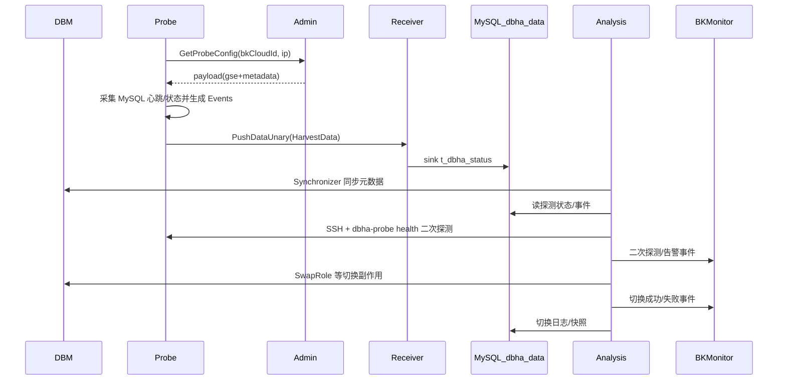
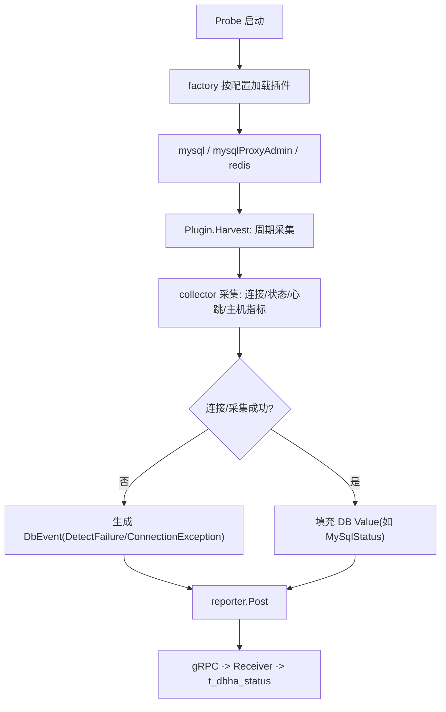
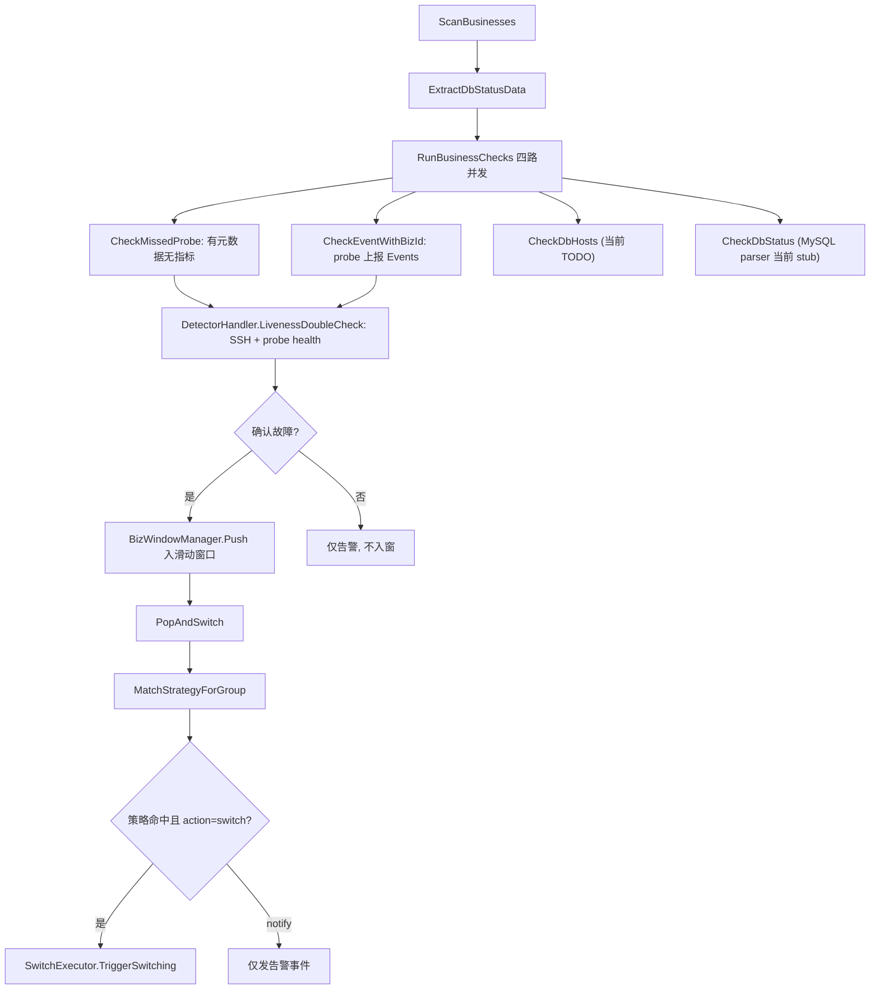

# DBHA v2 故障探测文档索引

## 范围说明

本索引汇总 `dbha-v2/docs/detection` 下基于 v2 源码提炼的故障探测/切换设计文档。

本轮聚焦 **MySQL 家族**（`tendbha` / `tendbcluster`）。补充说明 v2 当前实现边界：

- Probe harvester 实际加载 3 个插件实例：`mysql`、`mysqlProxyAdmin`（MySQL 插件变体，专用于 TenDBHA proxy admin 端口）、`redis`。
- Analysis 侧 **switcher 仅注册 MySQL**（[`workflow.go`](../../internal/analysis/workflow/workflow.go) 的 `switchers` 只含 `DbTypeMySql`）；其余 `DbType` 可采集、可入窗，但暂不执行自动切换。
- Analysis 侧基于 metrics 的一次解析（status parser）**当前为 stub**（见下文），故障主链路依赖「probe 直报事件 + missed probe + SSH 二次探测」。

---

## v2 总体架构

v2 由 probe / receiver / analysis / admin 四个服务组成。probe 在边缘采集并上报，receiver 落库，analysis 判定与切换，admin 下发配置。总体交互见下（另见 [架构总览](../architecture/overview.md)）。



### 组件职责说明

| 组件 | 职责 | 核心代码 |
| --- | --- | --- |
| `DBM` | 保存实例/集群/角色/状态等元数据；供 analysis 同步与切换副作用调用 | [`internal/analysis/dbm`](../../internal/analysis/dbm) |
| `Probe` | 按配置对 MySQL / mysqlProxyAdmin / Redis 端点采集，产出 `HarvestData` 与 `DbEvent`，经 reporter 上报 | [`internal/probe`](../../internal/probe) |
| `Receiver` | 接收 probe gRPC（或 Kafka）并写入 `t_dbha_status` | [`internal/receiver`](../../internal/receiver) |
| `Analysis` | 元数据同步、业务分片扫描、二次探测、滑动窗口、策略匹配、切换执行 | [`internal/analysis/workflow`](../../internal/analysis/workflow) |
| `Detector` | analysis 内部 SSH 二次探测，远端执行 `dbha-probe health` | [`internal/analysis/detector`](../../internal/analysis/detector) |
| `Switcher` | 按 DbType 执行切换（当前仅 MySQL） | [`internal/analysis/switcher`](../../internal/analysis/switcher) |
| `BKMonitor` | 接收 analysis 的探测/二次探测/切换/告警事件 | [`pkg/monitor`](../../pkg/monitor) |

---

## Probe 通用探测流程

Probe 启动时由 factory 加载插件实例，每个插件独立 `Harvest` 协程周期采集，产出 `HarvestData`（含 `Events` 与具体 DB `Value`），经 reporter 上报。



- `Plugin` 接口：[`harvester/plugin/plugin.go`](../../internal/probe/harvester/plugin/plugin.go)

```go
type Plugin interface {
	Name() (string, error)
	Harvest(ctx context.Context, machineID, serviceID string) (<-chan *HarvestData, error)
	Close() error
}
```

- 插件加载：[`internal/probe/factory.go`](../../internal/probe/factory.go)

---

## Analysis 通用判定与切换流程

analysis 的 `Workflow` 启动后并行运行元数据同步、分片 watch、Scan 定时、Pop 定时。单业务的判定入口为 `RunBusinessChecks`，四路并发检查后经 SSH 二次探测确认，再推入滑动窗口；Pop 循环匹配策略并触发切换。



要点（与代码一致）：

- `RunBusinessChecks` 四路：[`workflow/checker.go`](../../internal/analysis/workflow/checker.go)。
- `CheckDbHosts` 委托 `ParseHostStatus`（当前为 TODO，直接返回 nil，见 [`workflow/status_parser.go`](../../internal/analysis/workflow/status_parser.go)）；`CheckDbStatus` 委托 `ParseDbStatus`，按 `DbType` 分发到对应 parser，其中 MySQL parser 的 `Process` 目前直接返回 nil（见 [`workflow/parser/mysql.go`](../../internal/analysis/workflow/parser/mysql.go)）。因此 metrics 规则引擎尚未落地，故障判定主要来自 probe 上报的 `Events` 与 missed probe，再由 SSH 二次探测确认。
- 二次探测结果处理：[`workflow/detector_handler.go`](../../internal/analysis/workflow/detector_handler.go)。
- 策略匹配与动作（`switch` / `notify`）：[`workflow/switch_flow.go`](../../internal/analysis/workflow/switch_flow.go)、[`workflow/strategy.go`](../../internal/analysis/workflow/strategy.go)。

---

## BKMonitor 事件与数据结构

analysis 通过 `pkg/monitor` 经 `bkmonitorbeat` 向 BKMonitor 上报事件。

### 上报入口与调用方

| 入口 | 主要调用方 | 用途 |
| --- | --- | --- |
| `AlarmNotifier.TriggerWithDetectorResponse` | 二次探测处理 | 上报探测/二次探测事件（`ProbeOffline` / `DetectFailure` / `DoubleCheckSshFailureV1` 等） |
| `AlarmNotifier.TriggerWithBizId` | 扫描/切换流程 | 业务级异常告警（事件名可为空） |
| `SwitchExecutor.postSuccessAlarms` | 切换成功 | `dbha_mysql_switch_ok` |
| `SwitchExecutor.postFailureAlarms` | 切换失败 | `dbha_mysql_switch_err` |
| `PostBKMonitor` | monitor 包统一出口 | 经 `bkmonitorbeat -report` 投递（timeout 最小 5s） |

源码：[`pkg/monitor/monitor.go`](../../pkg/monitor/monitor.go)、[`workflow/alarm.go`](../../internal/analysis/workflow/alarm.go)。

### 事件清单

事件名常量定义在 [`pkg/storage/haprobe/db_event.go`](../../pkg/storage/haprobe/db_event.go)。

V2 核心事件（`DbEventNameList`）：

| 常量 | 字符串值 | 主要产生方 |
| --- | --- | --- |
| `DbEventNameDetectFailure` | `dbha_detect_db_failure` | harvester 连接失败；二次探测 probe 存活但无 DB 指标 |
| `DbEventNameProbeOffline` | `dbha_probe_offline` | Detector 默认事件（missed probe） |
| `DbEventNameDoubleCheckSshFailureV1` | `dbha_doublecheck_ssh_fail` | SSH 二次探测 dial/session 失败 |
| `DbEventNameTendbhaProxyBackendFailure` | `dbha_tendbha_proxy_backend_failure` | 策略预留（special match），harvester 暂未直接 emit |
| `DbEventNameTendbclusterSpiderRemoteFailure` | `dbha_tendbcluster_spider_remote_failure` | 策略预留（special match），harvester 暂未直接 emit |

V1 兼容事件（部分）：`dbha_mysql_switch_ok` / `dbha_mysql_switch_err`、`dbha_detect_db_fail`、`dbha_detect_ssh_fail`、`dbha_detect_ssh_auth_fail`、`dbha_global_monitor`、`dbha_call_api_fail` 等。

事件原因（`DbEventNameReason`）：`connection exception`、`auth failure`、`ssh auth failure`、`missed probe`、`no target`。

### 上报数据结构

`EventData`（含 `Dimension`）字段来自 [`pkg/monitor/monitor.go`](../../pkg/monitor/monitor.go)：

```go
type EventData struct {
	Name      string // event_name
	Target    string
	Timestamp uint64 // 毫秒
	Content   struct{ Content string }
	Dimension struct {
		Reporter          string
		BkCloudId         int
		IP                string
		Port              int
		BkBizId           int
		DbClusterType     haprobe.DbmMetadataClusterType
		DbMachineType     haprobe.DbmMetadataMachineType
		DbTypeName        haprobe.DbType
		DbEventName       haprobe.DbEventName
		DbEventNameReason haprobe.DbEventNameReasonStr
		SwitchId          string
		// ... V1 兼容 / 切换详情 / 二次探测 / 全局 / API 维度字段
	}
}
```

维度分组：实例与业务（`bk_cloud_id`/`ip`/`port`/`bk_biz_id`）、元数据（`dbm_cluster_type`/`dbm_machine_type`/`db_type_name`）、事件（`db_event_name`/`db_event_name_reason`）、V1 兼容自愈字段（`appid`/`server_ip`/...）、切换详情（`instance_role`/`idc`/`double_check_id`/`new_master_*`）、二次探测（`cluster_type`/`detector_exit_code`/`detector_proc_name`/`detector_proc_status`）、全局（`uncovered_ins_num` 等）、API（`api_name`/`api_message`）。

---

## DB 类型无关的扩展点

- `Plugin` 接口（[`harvester/plugin/plugin.go`](../../internal/probe/harvester/plugin/plugin.go)）：新增 DB 采集只需实现 `Name` / `Harvest` / `Close`。
- `DBTyper` / `HarvestData`（[`pkg/storage/haprobe`](../../pkg/storage/haprobe)）：`Value` 通过 `GetDbType()` 标识 DB 类型，序列化与还原统一。
- `DbType -> Switcher` 映射（[`workflow.go`](../../internal/analysis/workflow/workflow.go)）：新增可切换 DB 需向 `switchers` 注册对应 `switcher.Switcher`。
- `switchcore` 抽象（[`switcher/switchcore`](../../internal/analysis/switcher/switchcore)）：`SwitchableInstance` / `SwitchableCluster` 定义 `CheckBeforeSwitch` / `DoSwitch` / `UpdateMetaInfo` / `DoFinal` / `RollBack` 等标准流程。

---

## 文档列表

- [`mysql-detection-design.md`](./mysql-detection-design.md)
