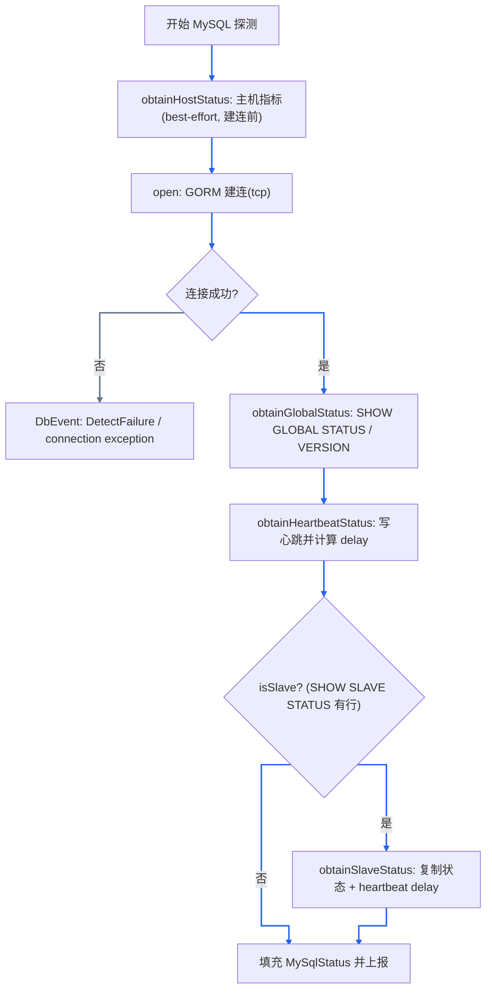
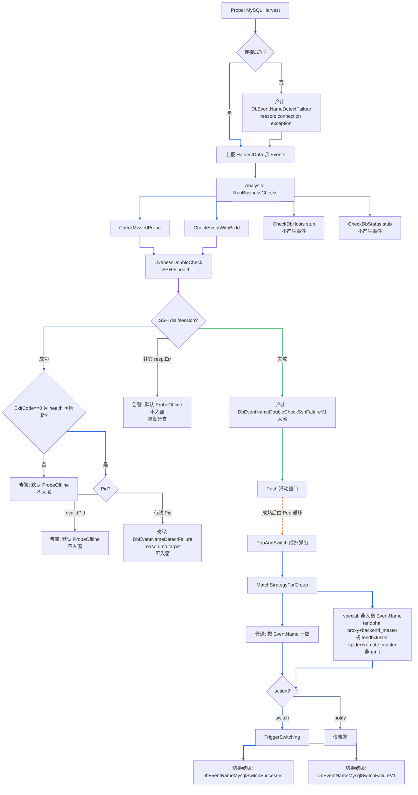
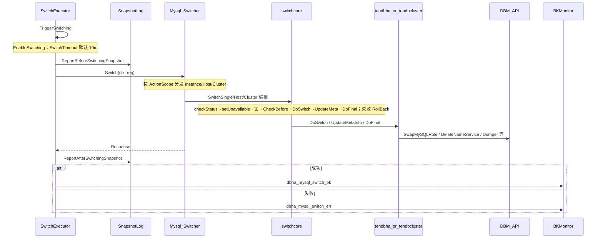
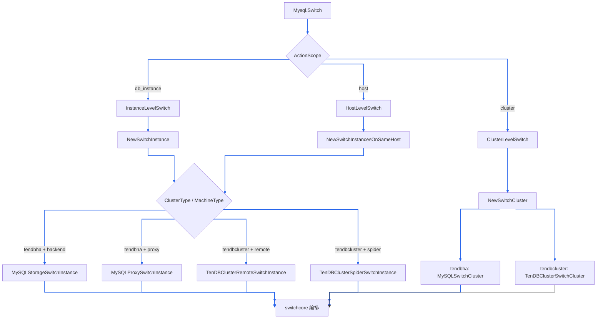
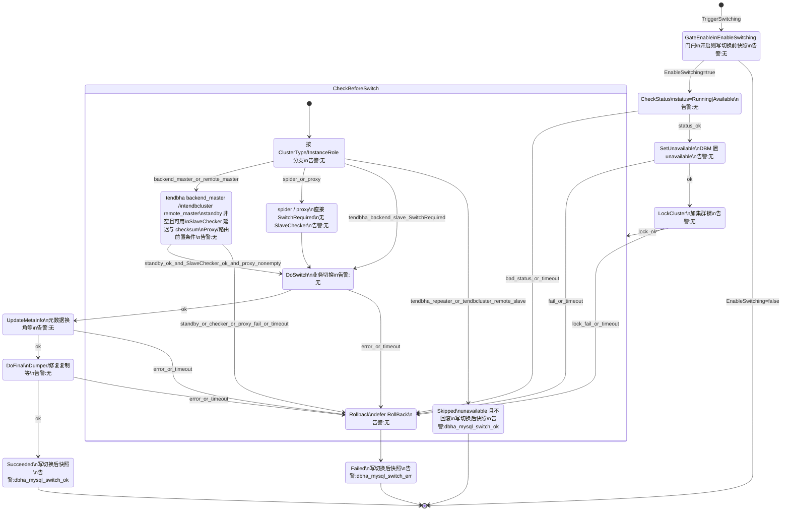
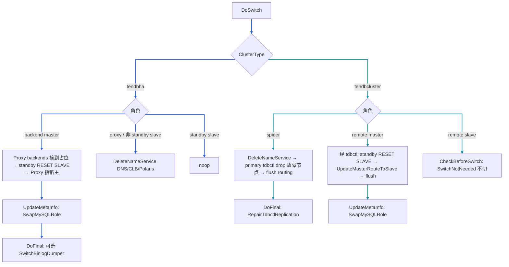

# DBHA v2 MySQL 故障探测设计文档

## 1. 背景与范围

本文档定义 DBHA v2 中 MySQL 家族的故障探测与切换机制，覆盖以下 `clusterType`：

- `tendbha`（TenDBHA）
- `tendbcluster`（TenDBCluster）

相关文档：[文档索引](../README.md) · [探测设计索引](./detection-doc-index.md) · [故障判定与切换](../flows/failure-detection-and-failover.md)

---

## 2. 关键数据结构

### 2.1 采集数据载荷

代码：[`pkg/storage/haprobe/harvest_data.go`](../../pkg/storage/haprobe/harvest_data.go)

`HarvestBaseData` 是所有 DB 通用的采集基础字段，`HarvestData` 在其上携带具体 DB 的 `Value`（实现 `DBTyper`）与原始 JSON。

```go
type HarvestBaseData struct {
	SequenceID      uint64
	MachineID       string
	AgentID         string
	BkCloudID       int
	MessageID       string
	ServiceID       string
	DbTypeName      DbType
	AccessLayer     DbmMetadataAccessLayerType
	ClusterType     DbmMetadataClusterType
	MachineType     DbmMetadataMachineType
	DbIp            string
	DbPort          int
	ReportTimestamp uint64
	Events          []*DbEvent
	Host            *HostMetric
}

type HarvestData struct {
	HarvestBaseData
	Value    DBTyper         // 具体 DB 状态，MySQL 为 *MySqlStatus
	RawValue json.RawMessage
}
```

### 2.2 MySQL 状态结构

代码：[`pkg/storage/haprobe/mysql_status.go`](../../pkg/storage/haprobe/mysql_status.go)

`MySqlStatus` 是聚合结构，按被探测端点类型只填充对应子状态：

```go
type MySqlStatus struct {
	SpiderCtlStatus        *MySqlSpiderCtlStatus        // TenDBCluster spider-ctl
	ProxyStatus            *MySqlProxyStatus            // TenDBHA proxy admin 端口
	ProxyServicePortStatus *MySqlProxyServicePortStatus // TenDBHA proxy 数据端口
	GlobalStatus           *MySqlGlobalStatus           // SHOW GLOBAL STATUS
	HeartbeatStatus        *MySqlHeartbeatStatus        // 心跳写入与 delay
	SlaveStatus            *MySqlSlaveStatus            // SHOW SLAVE STATUS + 复制 delay
	InnoDB                 *InnoDBStatus                // 结构预留，当前 harvester 未采集
}

func (m MySqlStatus) GetDbType() DbType { return DbTypeMySql }
```

子状态结构分别定义在同目录：`mysql_global_status.go`、`mysql_heartbeat_status.go`、`mysql_slave_status.go`、`mysql_proxy_status.go`（含 `MySqlProxyBackend`、`MySqlProxyServicePortStatus`）、`mysql_spider_status.go`（含 `MySqlSpiderCtlRoute`、`MySqlSpiderCtlNode`）。

### 2.3 事件结构

代码：[`pkg/storage/haprobe/db_event.go`](../../pkg/storage/haprobe/db_event.go)

```go
type DbEvent struct {
	Name       DbEventName
	Reason     DbEventNameReason
	DbTypeName DbType
	Endpoint   *hanet.Endpoint
	Message    string
	BkCloudID  int
}
```

---

## 3. 枚举与类型清单

定义：[`pkg/storage/haprobe/harvest_data.go`](../../pkg/storage/haprobe/harvest_data.go)、[`db_event.go`](../../pkg/storage/haprobe/db_event.go)

### 3.1 DbType

MySQL 家族统一 `DbType = "mysql"`（`DbTypeMySql`）。

### 3.2 clusterType

- `tendbha`
- `tendbcluster`

### 3.3 accessLayer / machineType

- accessLayer：`proxy`、`storage`
- machineType（与探测路由相关）：`proxy`、`backend`、`remote`、`spider`

### 3.4 instanceRole

```go
// tendbha
MySQLStorageMaster   = "backend_master"
MySQLStorageSlave    = "backend_slave"
MySQLStorageRepeater = "backend_repeater"

// tendbcluster
TenDBClusterStorageMaster = "remote_master"
TenDBClusterStorageSlave  = "remote_slave"
TenDBClusterProxyMaster   = "spider_master"
TenDBClusterProxySlave    = "spider_slave"
```

---

## 4. Agent(Probe) 的 MySQL 探测机制

Probe 的 MySQL 采集入口为 `MySql.Harvest → collecting`，按端点的 `accessLayer / machineType / clusterType / isAdmin` 分支：

代码：[`harvester/mysql/mysql.go`](../../internal/probe/harvester/mysql/mysql.go)、[`harvester/mysql/collector.go`](../../internal/probe/harvester/mysql/collector.go)

| 场景 | 判定 | 采集内容 | 关键 SQL/操作 |
| --- | --- | --- | --- |
| 普通存储（backend/remote/spider 数据节点） | 其他情况 | 主机指标 + GlobalStatus + 心跳 +（从库）SlaveStatus | 见 4.1 |
| TenDBHA proxy 数据端口 | `clusterType=tendbha && machineType=proxy && !isAdmin` | 可达性 + 经 proxy 写心跳验证转发 | `SELECT 1`；`REPLACE INTO infodba_schema.master_slave_heartbeat ...` |
| TenDBHA proxy admin 端口 | 同上且 `isAdmin` | proxy 后端列表 | `select * from backends` |
| TenDBCluster spider-ctl admin | `machineType=spider && clusterType=tendbcluster && isAdmin` | 路由 + ctl 节点；填完后仍走 `collectCommonStatus` | `select * from mysql.servers`；`select * from information_schema.TDBCTL_NODES` |

> 说明：当前仅建连类失败稳定 emit `DetectFailure`（`connection exception`）；建连成功后的 GlobalStatus / 心跳 / Slave / proxy backends 等采集失败多为日志，不写入 `Events`。

### 4.1 普通存储探测主流程



> 色例：蓝=主路径；灰=建连失败。

> 说明：主机指标 `obtainHostStatus` 为 best-effort，且在建连之前采集；TenDBHA proxy 数据端口路径（见上表）会跳过主机指标与 `collectCommonStatus`。

### 4.2 关键探测语句

代码：[`harvester/mysql/collector.go`](../../internal/probe/harvester/mysql/collector.go)

- 存活/状态：`SHOW GLOBAL STATUS`；`SELECT VERSION()`
- 心跳写入：

```sql
SET SESSION sql_log_bin=ON|OFF;
SELECT @@server_id;
SET SESSION TRANSACTION ISOLATION LEVEL REPEATABLE READ;
SET SESSION binlog_format='STATEMENT';
REPLACE INTO infodba_schema.master_slave_heartbeat
  (master_server_id, slave_server_id, master_time, slave_time, delay_sec)
  VALUES(?, @@server_id, now(), sysdate(), timestampdiff(SECOND, now(), sysdate()));
```

- 从库复制：`SHOW SLAVE STATUS`，并读取 `infodba_schema.master_slave_heartbeat` 计算 delay
- Spider 会话隔离：`SET SESSION ddl_execute_by_ctl=OFF`；tdbctl 侧 `SET SESSION tc_admin=OFF`
- 连接失败时构造事件（见 `connectionExceptionEvent`）：`Name=DbEventNameDetectFailure`，`Reason=connection exception`

---

## 5. 异常事件分层

事件常量：[`pkg/storage/haprobe/db_event.go`](../../pkg/storage/haprobe/db_event.go)

本节将异常事件分层叠在故障诊断流程上：在产出（或改写）事件的节点标注事件名；图下说明含义与影响。
探测侧建连失败细节见 §4.1。Push 与 PopAndSwitch 分属不同定时循环，下图表示数据因果而非同一次调用栈。



> 色例：蓝=主路径；紫=SSH 二次探测；绿=入窗；灰=仅告警/stub；橙虚线=异步 Pop。

### 5.1 异常事件含义与影响

| 阶段 | 事件常量 | 字符串值 | Reason | 含义 | 影响 |
| --- | --- | --- | --- | --- | --- |
| 探测 | `DbEventNameDetectFailure` | `dbha_detect_db_failure` | `connection exception` | Probe 建连失败 | 写入 `HarvestData.Events`，触发二次探测候选；**不直接入窗**，事件名不带入窗口（见本节流程图 / [`detector_handler.go`](../../internal/analysis/workflow/detector_handler.go)） |
| 二次探测 | `DbEventNameDoubleCheckSshFailureV1` | `dbha_doublecheck_ssh_fail` | `connection exception` | SSH dial/session 失败 | **确认故障并入窗**；默认全局策略可 `action=switch` |
| 二次探测 | `DbEventNameProbeOffline` | `dbha_probe_offline` | `missed probe` | Detector 任务默认名；InvalidPid / 其它非入窗失败路径告警时常用 | **当前实现不入窗**；以该名为 `TriggerEventName` 的策略在生产路径**实质不可命中** |
| 二次探测 | `DbEventNameDetectFailure` | `dbha_detect_db_failure` | `no target` | SSH 成功且 probe 进程存活，解读为无目标 DB 指标 | 仅告警，**不入窗** → 默认不会因「纯 DB 不可达但主机/probe 可达」触发全局切换 |
| 策略 | `DbEventNameTendbhaProxyBackendFailure` | `dbha_tendbha_proxy_backend_failure` | — | special 策略触发名（**非**入窗 EventName） | **tendbha** 同集群 proxy + backend_master 各自因 SSH 失败入窗后，Pop 时组合计数命中；**非 emit** |
| 策略 | `DbEventNameTendbclusterSpiderRemoteFailure` | `dbha_tendbcluster_spider_remote_failure` | — | special 策略触发名（**非**入窗 EventName） | **tendbcluster** 同集群 spider + remote_master 各自因 SSH 失败入窗后，Pop 时组合计数命中；**非 emit** |
| 切换 | `DbEventNameMysqlSwitchSuccessV1` / `DbEventNameMysqlSwitchFailureV1` | `dbha_mysql_switch_ok` / `dbha_mysql_switch_err` | — | 切换结果 | 仅 BKMonitor 告警，不参与探测入窗 |

补充说明：

- 二次探测其它失败（非 dial/session 的 `resp.Err`、`ExitCode!=0`、health JSON 解析失败）→ 仅告警、不入窗。图中「其它 resp.Err」为防御分支（当前 ssh 实现几乎只返回 dial/session 错；命令失败多走 ExitCode）。
- `CheckDbHosts` / `CheckDbStatus` 当前 stub，不产生 MySQL 诊断事件。
- **业务后果**：probe 进程不可用（InvalidPid → 默认 ProbeOffline）不入窗，故默认全局策略不会因此切换；DB 建连失败仅写入 Events 触发复检，若复检 SSH 成功则仍不入窗。

---

## 6. 端到端工作流

总览：Probe 上报 `HarvestData`/Events → Receiver 落库 → Analysis Scan → 二次探测（事件/入窗见 **§5**）→ 滑动窗口 / Pop / 白名单 / 策略（见 [故障判定与切换](../flows/failure-detection-and-failover.md)）→ 命中 `switch` 后进入 §7。

关键代码：

- 扫描与检查：[`workflow/workflow.go`](../../internal/analysis/workflow/workflow.go)、[`workflow/checker.go`](../../internal/analysis/workflow/checker.go)
- 二次探测：[`workflow/detector_handler.go`](../../internal/analysis/workflow/detector_handler.go)、[`internal/analysis/detector`](../../internal/analysis/detector)
- 策略与切换编排：[`workflow/switch_flow.go`](../../internal/analysis/workflow/switch_flow.go)

---

## 7. MySQL 切换触发与流程

§6 端到端流程在策略命中且 `action=switch` 后进入本节。编排入口：[`TriggerSwitching`](../../internal/analysis/workflow/switch_flow.go)；实现入口：[`mysqlswitch.Mysql.Switch`](../../internal/provider/mysql/switch/mysql_switcher.go)。切换前白名单再过滤见 [故障判定与切换](../flows/failure-detection-and-failover.md)。

### 7.1 切换工作流程

仅当策略 `action=switch` 且配置 `EnableSwitching` 开启时执行；整次切换超时默认 `SwitchTimeout=10m`。



### 7.2 Switcher 注册与接口

MySQL switcher 由 `provider/mysql/switch` 在 `init` 中自注册（经 analysis 入口 blank-import [`provider/allanalysis`](../../internal/provider/allanalysis/)），`workflow.New` 通过 [`switcher.Build()`](../../internal/analysis/workflow/workflow.go) 装配：

```go
// provider/mysql/switch/register.go
switcher.Register(haprobe.DbTypeMySql, func() switcher.Switcher {
	return &Mysql{} // mysqlswitch.Mysql
})

// workflow.New
switchers: switcher.Build(),
```
`Switcher` 接口（[`switcher/switcher.go`](../../internal/analysis/switcher/switcher.go)）：

```go
type Switcher interface {
	DbTypeName() haprobe.DbType
	Switch(ctx context.Context, req *Request) *Response
}
```

### 7.3 ActionScope 与实现分发

`ActionScopeType`（[`hamodel/db_switching_strategy.go`](../../pkg/storage/hamodel/db_switching_strategy.go)）：`db_instance` / `host` / `cluster`。MySQL switcher 据此分发（[`mysql_switcher.go`](../../internal/provider/mysql/switch/mysql_switcher.go)）：

| ActionScope | 方法 | 编排器 | 并发控制 |
| --- | --- | --- | --- |
| `db_instance` | `InstanceLevelSwitch` | `SwitchSingleInstance` | 每实例一 goroutine |
| `host` | `HostLevelSwitch` | `SwitchSameHostInstances` | 按 host 分组，bounded sem（默认 32） |
| `cluster` | `ClusterLevelSwitch` | `SwitchSameClusterInstances` | 按 cluster 分组，bounded sem（默认 32） |



> 色例：蓝=分发与编排主路径。

### 7.4 switchcore 标准流程

`SwitchableInstance`（[`switcher/switchcore/switchable_instance.go`](../../internal/analysis/switcher/switchcore/switchable_instance.go)）核心方法：

```go
type SwitchableInstance interface {
	CheckBeforeSwitch() (SwitchCheckCode, error)
	DoSwitch() error
	DoFinal() error
	RollBack() error
	SetInstanceUnavailable() error
	UpdateMetaInfo() error
	// ...
}
```

`SwitchCheckCode`：`SwitchRequired` / `SwitchNotNeeded` / `SwitchCheckUnpass`。

标准单实例执行顺序：`checkStatus → setUnavailable → 集群锁 → CheckBeforeSwitch → DoSwitch → UpdateMetaInfo → DoFinal`；失败则 `RollBack`。编排见 [`switchcore`](../../internal/analysis/switcher/switchcore) 下 `switch_instance_execution.go` / `switch_host_execution.go` / `switch_cluster_execution.go`。

#### 单实例切换状态机

单实例路径（Host/Cluster 编排同序，另有完整性校验）。`GateEnable` 与切换前后快照为 `TriggerSwitching` 请求级；其后为 `SwitchSingleInstance` 单实例编排。告警写在状态节点上；边只表示判断条件。



### 7.5 tendbha / tendbcluster 切换副作用

流量切换载体不同：tendbha 依赖 **MySQL Proxy backends**；tendbcluster 依赖 **primary tdbctl 路由表**。域名侧共性为 `DeleteNameService`（DNS / CLB / Polaris）。



> 色例：蓝=tendbha 分支；青=tendbcluster 分支。

### 7.6 从库切换校验参数

从库切换前校验（[`mysql_slave_checker.go`](../../internal/provider/mysql/switch/mysql_slave_checker.go)）依赖 analysis 配置 `switchFlow`（[`internal/analysis/config/config.go`](../../internal/analysis/config/config.go)）默认值：

| 参数 | 默认值 | 含义 |
| --- | --- | --- |
| `allowedMaxHeartbeatDelay` | 600 | 允许最大心跳延迟（秒） |
| `allowedMaxIODelay` | 300 | 允许最大 IO delay（秒） |
| `allowedMaxChecksumFailCnt` | 2 | 允许 checksum 失败次数 |
| `allowedIgnoreCheckSum` | false | 是否忽略 checksum 校验 |
| `allowedIgnoreSlaveDelay` | false | 是否忽略从库延迟 |
| `dbConnectTimeout` | 3s | 切换时 DB 连接超时 |
| `execSqlTimeout` | 6s | 切换 SQL 超时 |
| `clusterLockTimeout` | 60s | 集群锁超时 |

---

## 8. 关键代码索引

- MySQL 采集：[`internal/probe/harvester/mysql/mysql.go`](../../internal/probe/harvester/mysql/mysql.go)、[`collector.go`](../../internal/probe/harvester/mysql/collector.go)
- 状态模型：[`pkg/storage/haprobe/mysql_status.go`](../../pkg/storage/haprobe/mysql_status.go) 及同目录子状态
- 事件常量：[`pkg/storage/haprobe/db_event.go`](../../pkg/storage/haprobe/db_event.go)
- 判定与二次探测：[`internal/analysis/workflow/checker.go`](../../internal/analysis/workflow/checker.go)、[`detector_handler.go`](../../internal/analysis/workflow/detector_handler.go)
- 切换编排：[`workflow/switch_flow.go`](../../internal/analysis/workflow/switch_flow.go)、[`mysql_switcher.go`](../../internal/provider/mysql/switch/mysql_switcher.go)、[`switchcore`](../../internal/analysis/switcher/switchcore)
- tendbha 切换：[`mysql_switch_instance.go`](../../internal/provider/mysql/switch/mysql_switch_instance.go)、[`mysql_switch_cluster.go`](../../internal/provider/mysql/switch/mysql_switch_cluster.go)
- tendbcluster 切换：[`tendbcluster_switch_instance.go`](../../internal/provider/mysql/switch/tendbcluster_switch_instance.go)、[`tendbcluster_switch_cluster.go`](../../internal/provider/mysql/switch/tendbcluster_switch_cluster.go)
- 配置默认值：[`internal/analysis/config/config.go`](../../internal/analysis/config/config.go)
