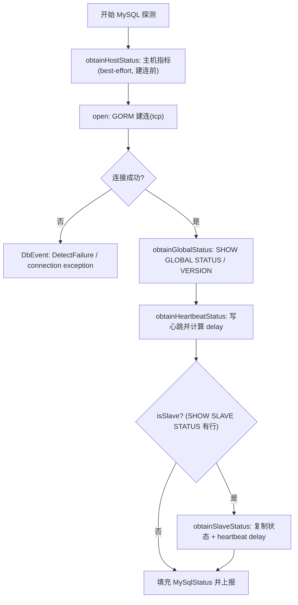
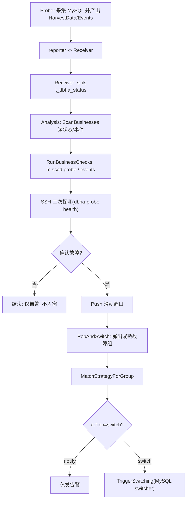

# DBHA v2 MySQL 故障探测设计文档

## 1. 背景与范围

本文档定义 DBHA v2 中 MySQL 家族的故障探测与切换机制，覆盖以下 `clusterType`：

- `tendbha`（TenDBHA）
- `tendbcluster`（TenDBCluster）

总体架构与跨 DB 的通用流程见 [探测文档索引](./detection-doc-index.md)。

---

## 2. 关键数据结构

### 2.1 采集数据载荷

代码：[`pkg/storage/haprobe/harvest_data.go`](../../pkg/storage/haprobe/harvest_data.go)

`HarvestBaseData` 是所有 DB 通用的采集基础字段，`HarvestData` 在其上携带具体 DB 的 `Value`（实现 `DBTyper`）与原始 JSON。

```go
type HarvestBaseData struct {
	SequenceID      uint64
	MachineID       string
	AgentID         string
	BkCloudID       int
	MessageID       string
	ServiceID       string
	DbTypeName      DbType
	AccessLayer     DbmMetadataAccessLayerType
	ClusterType     DbmMetadataClusterType
	MachineType     DbmMetadataMachineType
	DbIp            string
	DbPort          int
	ReportTimestamp uint64
	Events          []*DbEvent
	Host            *HostMetric
}

type HarvestData struct {
	HarvestBaseData
	Value    DBTyper         // 具体 DB 状态，MySQL 为 *MySqlStatus
	RawValue json.RawMessage
}
```

### 2.2 MySQL 状态结构

代码：[`pkg/storage/haprobe/mysql_status.go`](../../pkg/storage/haprobe/mysql_status.go)

`MySqlStatus` 是聚合结构，按被探测端点类型只填充对应子状态：

```go
type MySqlStatus struct {
	SpiderCtlStatus        *MySqlSpiderCtlStatus        // TenDBCluster spider-ctl
	ProxyStatus            *MySqlProxyStatus            // TenDBHA proxy admin 端口
	ProxyServicePortStatus *MySqlProxyServicePortStatus // TenDBHA proxy 数据端口
	GlobalStatus           *MySqlGlobalStatus           // SHOW GLOBAL STATUS
	HeartbeatStatus        *MySqlHeartbeatStatus        // 心跳写入与 delay
	SlaveStatus            *MySqlSlaveStatus            // SHOW SLAVE STATUS + 复制 delay
	InnoDB                 *InnoDBStatus
}

func (m MySqlStatus) GetDbType() DbType { return DbTypeMySql }
```

子状态结构分别定义在同目录：`mysql_global_status.go`、`mysql_heartbeat_status.go`、`mysql_slave_status.go`、`mysql_proxy_status.go`（含 `MySqlProxyBackend`、`MySqlProxyServicePortStatus`）、`mysql_spider_status.go`（含 `MySqlSpiderCtlRoute`、`MySqlSpiderCtlNode`）。

### 2.3 事件结构

代码：[`pkg/storage/haprobe/db_event.go`](../../pkg/storage/haprobe/db_event.go)

```go
type DbEvent struct {
	Name       DbEventName
	Reason     DbEventNameReason
	DbTypeName DbType
	Endpoint   *hanet.Endpoint
	Message    string
	BkCloudID  int
}
```

---

## 3. 枚举与类型清单

定义：[`pkg/storage/haprobe/harvest_data.go`](../../pkg/storage/haprobe/harvest_data.go)、[`db_event.go`](../../pkg/storage/haprobe/db_event.go)

### 3.1 DbType

MySQL 家族统一 `DbType = "mysql"`（`DbTypeMySql`）。

### 3.2 clusterType

- `tendbha`
- `tendbcluster`

### 3.3 accessLayer / machineType

- accessLayer：`proxy`、`storage`
- machineType（与探测路由相关）：`proxy`、`backend`、`remote`、`spider`

### 3.4 instanceRole

```go
// tendbha
MySQLStorageMaster   = "backend_master"
MySQLStorageSlave    = "backend_slave"
MySQLStorageRepeater = "backend_repeater"

// tendbcluster
TenDBClusterStorageMaster = "remote_master"
TenDBClusterStorageSlave  = "remote_slave"
TenDBClusterProxyMaster   = "spider_master"
TenDBClusterProxySlave    = "spider_slave"
```

---

## 4. Agent(Probe) 的 MySQL 探测机制

Probe 的 MySQL 采集入口为 `MySql.Harvest → collecting`，按端点的 `accessLayer / machineType / clusterType / isAdmin` 分支：

代码：[`harvester/mysql/mysql.go`](../../internal/probe/harvester/mysql/mysql.go)、[`harvester/mysql/collector.go`](../../internal/probe/harvester/mysql/collector.go)

| 场景 | 判定 | 采集内容 | 关键 SQL/操作 |
| --- | --- | --- | --- |
| 普通存储（backend/remote/spider 数据节点） | 其他情况 | 主机指标 + GlobalStatus + 心跳 +（从库）SlaveStatus | 见 4.1 |
| TenDBHA proxy 数据端口 | `clusterType=tendbha && machineType=proxy && !isAdmin` | 可达性 + 经 proxy 写心跳验证转发 | `SELECT 1`；`REPLACE INTO infodba_schema.master_slave_heartbeat ...` |
| TenDBHA proxy admin 端口 | 同上且 `isAdmin` | proxy 后端列表 | `select * from backends` |
| TenDBCluster spider-ctl admin | `machineType=spider && clusterType=tendbcluster && isAdmin` | 路由 + ctl 节点 | `select * from mysql.servers`；`select * from information_schema.TDBCTL_NODES` |

### 4.1 普通存储探测主流程



> 说明：主机指标 `obtainHostStatus` 为 best-effort，且在建连之前采集；TenDBHA proxy 数据端口路径（见上表）会跳过主机指标与 `collectCommonStatus`。

### 4.2 关键探测语句

代码：[`harvester/mysql/collector.go`](../../internal/probe/harvester/mysql/collector.go)

- 存活/状态：`SHOW GLOBAL STATUS`；`SELECT VERSION()`
- 心跳写入：

```sql
SET SESSION sql_log_bin=ON|OFF;
SELECT @@server_id;
SET SESSION TRANSACTION ISOLATION LEVEL REPEATABLE READ;
SET SESSION binlog_format='STATEMENT';
REPLACE INTO infodba_schema.master_slave_heartbeat
  (master_server_id, slave_server_id, master_time, slave_time, delay_sec)
  VALUES(?, @@server_id, now(), sysdate(), timestampdiff(SECOND, now(), sysdate()));
```

- 从库复制：`SHOW SLAVE STATUS`，并读取 `infodba_schema.master_slave_heartbeat` 计算 delay
- Spider 会话隔离：`SET SESSION ddl_execute_by_ctl=OFF`；tdbctl 侧 `SET SESSION tc_admin=OFF`
- 连接失败时构造事件（见 `connectionExceptionEvent`）：`Name=DbEventNameDetectFailure`，`Reason=connection exception`

---

## 5. 异常事件分层

事件常量：[`pkg/storage/haprobe/db_event.go`](../../pkg/storage/haprobe/db_event.go)

探测阶段（probe harvester）：

- `DbEventNameDetectFailure`（`dbha_detect_db_failure`）+ `connection exception`

二次探测阶段（analysis detector）：

- `DbEventNameProbeOffline`（`dbha_probe_offline`）：missed probe 默认事件
- `DbEventNameDoubleCheckSshFailureV1`（`dbha_doublecheck_ssh_fail`）：SSH dial/session 失败

切换阶段（analysis）：

- `DbEventNameMysqlSwitchSuccessV1`（`dbha_mysql_switch_ok`）
- `DbEventNameMysqlSwitchFailureV1`（`dbha_mysql_switch_err`）

策略预留（special match，harvester 暂未直接 emit）：

- `DbEventNameTendbhaProxyBackendFailure`（`dbha_tendbha_proxy_backend_failure`）：同集群 proxy + backend_master 同时故障
- `DbEventNameTendbclusterSpiderRemoteFailure`（`dbha_tendbcluster_spider_remote_failure`）：同集群 spider + remote_master 同时故障

---

## 6. 端到端工作流



关键代码：

- 扫描与检查：[`workflow/workflow.go`](../../internal/analysis/workflow/workflow.go)、[`workflow/checker.go`](../../internal/analysis/workflow/checker.go)
- 二次探测：[`workflow/detector_handler.go`](../../internal/analysis/workflow/detector_handler.go)、[`internal/analysis/detector`](../../internal/analysis/detector)
- 策略与切换编排：[`workflow/switch_flow.go`](../../internal/analysis/workflow/switch_flow.go)

---

## 7. MySQL 切换触发与流程

### 7.1 Switcher 注册与接口

MySQL switcher 在 workflow 装配时注册（[`workflow.go`](../../internal/analysis/workflow/workflow.go)）：

```go
switchers: map[haprobe.DbType]switcher.Switcher{
	haprobe.DbTypeMySql: &switcher.Mysql{},
},
```

`Switcher` 接口（[`switcher/switcher.go`](../../internal/analysis/switcher/switcher.go)）：

```go
type Switcher interface {
	DbTypeName() haprobe.DbType
	Switch(ctx context.Context, req *Request) *Response
}
```

### 7.2 按 ActionScope 分发

`ActionScopeType`（[`hamodel/db_switching_strategy.go`](../../pkg/storage/hamodel/db_switching_strategy.go)）：`db_instance` / `host` / `cluster`。MySQL switcher 据此分发（[`switcher/mysql.go`](../../internal/analysis/switcher/mysql.go)）：

| ActionScope | 方法 | 并发控制 |
| --- | --- | --- |
| `db_instance` | `InstanceLevelSwitch` | 每实例一 goroutine |
| `host` | `HostLevelSwitch` | 按 host 分组，bounded sem（`hostLevelSwitchMaxHostNum`，默认 32） |
| `cluster` | `ClusterLevelSwitch` | 按 cluster 分组，bounded sem（`clusterLevelSwitchMaxClusterNum`，默认 32） |

ClusterType / MachineType 进一步决定切换实例实现（[`switcher/mysql`](../../internal/analysis/switcher/mysql)）：`tendbha` → MySQL 存储/proxy 切换；`tendbcluster` → 按 machineType `remote` / `spider` 分别处理。

### 7.3 switchcore 标准流程

`SwitchableInstance`（[`switcher/switchcore/switchable_instance.go`](../../internal/analysis/switcher/switchcore/switchable_instance.go)）核心方法：

```go
type SwitchableInstance interface {
	CheckBeforeSwitch() (SwitchCheckCode, error)
	DoSwitch() error
	DoFinal() error
	RollBack() error
	SetInstanceUnavailable() error
	UpdateMetaInfo() error
	// ...
}
```

`SwitchCheckCode`：`SwitchRequired` / `SwitchNotNeeded` / `SwitchCheckUnpass`。

标准单实例执行顺序：`checkStatus → setUnavailable → 集群锁 → CheckBeforeSwitch → DoSwitch → UpdateMetaInfo → DoFinal`；失败则 `RollBack`。编排见 [`switchcore`](../../internal/analysis/switcher/switchcore) 下 `switch_instance_execution.go` / `switch_host_execution.go` / `switch_cluster_execution.go`。

### 7.4 从库切换校验参数

从库切换前校验（[`switcher/mysql/mysql_slave_checker.go`](../../internal/analysis/switcher/mysql)）依赖 analysis 配置 `switchFlow`（[`internal/analysis/config/config.go`](../../internal/analysis/config/config.go)）默认值：

| 参数 | 默认值 | 含义 |
| --- | --- | --- |
| `allowedMaxHeartbeatDelay` | 600 | 允许最大心跳延迟（秒） |
| `allowedMaxIODelay` | 300 | 允许最大 IO delay（秒） |
| `allowedMaxChecksumFailCnt` | 2 | 允许 checksum 失败次数 |
| `allowedIgnoreCheckSum` | false | 是否忽略 checksum 校验 |
| `allowedIgnoreSlaveDelay` | false | 是否忽略从库延迟 |
| `dbConnectTimeout` | 3s | 切换时 DB 连接超时 |
| `execSqlTimeout` | 6s | 切换 SQL 超时 |
| `clusterLockTimeout` | 60s | 集群锁超时 |

---

## 8. 关键代码索引

- MySQL 采集：[`internal/probe/harvester/mysql/mysql.go`](../../internal/probe/harvester/mysql/mysql.go)、[`collector.go`](../../internal/probe/harvester/mysql/collector.go)
- 状态模型：[`pkg/storage/haprobe/mysql_status.go`](../../pkg/storage/haprobe/mysql_status.go) 及同目录子状态
- 事件常量：[`pkg/storage/haprobe/db_event.go`](../../pkg/storage/haprobe/db_event.go)
- 判定与二次探测：[`internal/analysis/workflow/checker.go`](../../internal/analysis/workflow/checker.go)、[`detector_handler.go`](../../internal/analysis/workflow/detector_handler.go)
- 切换：[`internal/analysis/switcher/mysql.go`](../../internal/analysis/switcher/mysql.go)、[`switcher/mysql`](../../internal/analysis/switcher/mysql)、[`switchcore`](../../internal/analysis/switcher/switchcore)
- 配置默认值：[`internal/analysis/config/config.go`](../../internal/analysis/config/config.go)
