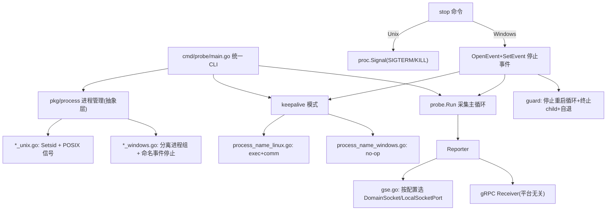

# dbha-probe 同时支持 Linux 与 Windows 实现方案

> 状态：已评审定稿（归档），尚未实施
> 概述：通过 Go build-tag 平台拆分 + 配置驱动，让 dbha-probe 在 Linux 与 Windows 上均可编译、原生运行（采集/上报/进程管理/keepalive/GSE），并补齐 Windows 构建、部署脚本与交叉编译门禁，保证 Linux 侧零回归。
> 复核：经八轮全盘 review，累计修正 15 项（C1/C2、O1–O4、D1、N-race/N-pidfile、E1/E2/E3、F1/F2、G1），均已并入本文对应章节。

## 待办清单

- [ ] **keepalive-split**：keepalive 平台拆分——抽出常量到 `process_name.go`，新增 windows/other no-op 实现（编译阻断）
- [ ] **process-abstract**：`pkg/process` 新增 `sysproc_{unix,windows}.go` + `stopper_{unix,windows}.go` + `waitstop_{unix,windows}.go`，改造 daemon/stop/cmds（`Setsid` 为编译阻断）。所有 `*_unix.go` 必须显式 `//go:build unix`（E3）；Windows `DETACHED_PROCESS` 取自 `x/sys/windows` 经 `CreationFlags` 设置（E1）
- [ ] **win-namedevent**：实现 Windows 命名事件停止——manual-reset 事件、启动 `CreateEvent` 后 `ALREADY_EXISTS` 则 `ResetEvent` 防残留自停（N-race）、事件名派生（pid 文件路径 `Abs`+`Clean` 归一化 D1；keepalive 按 `--ping-http-addr` O3）、独立 reload 事件（worker 直接监听、guard 不转发 N-reload-fwd）、stop `SetEvent`（含 not-found=not running）、`ForceKill` 兜底删 pid（N-pidfile）、进程侧 `WaitForSingleObject` + 优雅退出复用 `setupGracefulShutdown`
- [ ] **win-guard-stop**：覆盖三路径停止——worker(start)、guard+worker(daemon-start，共享事件 + 先停循环 + 重启竞态防护 + Kill 兜底)、keepalive
- [ ] **stop-wait-notify**：`run.go`、`keepalive_mode.go`、`daemon.go` `RunWithGuard`（O2）三处 `signal.Notify` 改用 `waitstop` 抽象；Windows 事件驱动优雅退出，Unix 保持 SIGHUP≠停止，保留 reload 事件占位仅记日志
- [ ] **gse-config-runtime**：`ReporterConfig` 增 `localSocketPort`；`gse.go` 永远传 `WithDomainSocketPath(Endpoint)`，`port!=0` 时追加 `WithLocalSocketPort`（非互斥，E2）
- [ ] **gse-config-plumbing**：H1 配置链路——`probeconfig.GseConfig` + `genconfig_types` + `GenProbeYAML` + admin 填充 + 模板占位符 + `render_configs.py` 默认注入（F1 防存量渲染失败）+ rc 示例（零值回退兼容）
- [ ] **genconfig-ip**：`machine.GetOutboundIP()` 回退，`cmds.go` gen-config 在接口查询失败时回退（R3，所有平台生效）
- [ ] **build-package**：Makefile 增 `probe-windows`（独立目标产出 `.exe`）/`package-probe-windows`（仅 `.ps1`、排除 bash 与 `guard-utils.sh`）/`check-windows`，加入 `.PHONY`；`x/sys/windows` 转直接依赖
- [ ] **render-fcntl**：`render_configs.py` 将 `fcntl` 改为条件导入（Windows 跳过 ioctl 回退）+ 新增 `apply_probe_reporter_local_socket_port_default` 默认注入（F1），均不影响 Linux 运行行为
- [ ] **win-scripts**：新增 Windows PowerShell 部署/守护脚本（两段式停止，强杀前校验 exe `Path`+`StartTime` 防 PID 复用误杀 G1）+ schtasks 周期幂等注册/注销，更新 `scripts/README.md`
- [ ] **test-regression**：补单测（GSE/事件名/waitstop/OutboundIP/GenProbeYAML）+ 进程名匹配验证 + Linux/Windows 交叉编译 + Linux 回归（含 admin/analysis/receiver 因 `pkg/process` 共享的影响面 O1）

---

## 目标与约束

- 完整对等：采集、gRPC/GSE 上报、`start/stop/restart/reload/daemon-start`、keepalive、部署，均可在 Windows 原生运行。
- Windows 也支持 GSE（SDK 已内置 Windows TCP 通道）。
- 强制遵守零回归：Linux 现有行为、接口、日志语义完全不变；所有平台差异通过 build tag 或配置分流，不改公共调用契约。

## 已确认决策

- **Windows 停止机制：命名事件（Named Event）** 统一覆盖 `daemon-start` guard、worker、keepalive 三条进程路径。`stop` 用 `OpenEvent+SetEvent` 置位停止事件；各进程内 goroutine `WaitForSingleObject` 等待，触发后复用与 Linux 信号处理相同的 `p.Close()` + 清理逻辑。放弃此前"loopback HTTP 控制端点 + token"方案（在双进程/keepalive 场景下需多端点、多 addr/token 文件，且与 `StopWithPidFile` 流程不契合）。
- 引入 `golang.org/x/sys/windows` 为**直接依赖**（命名事件 API：`CreateEvent`/`OpenEvent`/`SetEvent`/`WaitForSingleObject`）。当前 go.mod 已含 `v0.39.0`（indirect），转直接不改版本。
- Windows 常驻仍用 `daemon-start` guard + 计划任务；CLI 与 Linux 统一。
- Windows reload 语义：**与 Linux 保持一致**（no-op / 仅日志），不映射为 restart。但保留 reload 通道占位（独立 reload 事件 + `ReloadCmdRunE` 记日志），为后续真正重载预留。
- Windows Service（`x/sys/windows/svc`）暂不纳入本次范围，作为后续增强项。

## 平台耦合点分类（区分编译阻断 vs 行为差异）

**编译阻断（GOOS=windows 直接编译失败，必须改）**

- keepalive：[`process_name_linux.go`](../../internal/probe/keepalive/process_name_linux.go)（`//go:build linux`，用 `syscall.Exec` 与 `/proc/self/comm`），Windows 下 `keepalive_mode.go` 引用符号未定义。
- 进程管理：[`daemon.go`](../../pkg/process/daemon.go) 的 `SysProcAttr{Setsid: true}`（`Setsid` 字段 Unix 专属）。

**仅行为差异（能编译，运行期不正确，需抽象）**

- `syscall.SIGHUP/SIGTERM/SIGKILL` 在 Windows `syscall` 包有常量、可编译，但 `proc.Signal()` 运行期报错：`daemon.go`/`cmds.go`/`stop.go`/`run.go`/`keepalive_mode.go`。
- GSE 上报：[`gse.go`](../../internal/probe/client/gse.go) 仅用 `WithDomainSocketPath`（Windows 需 `WithLocalSocketPort`）。
- 默认网卡：[`constant.go`](../../pkg/constant/constant.go) 的 `DefaultLocalIPInterface = "eth1"`（Windows 网卡名不同）。
- 采集主机指标：[`harvester/base/collector.go`](../../internal/probe/harvester/base/collector.go) 用 gopsutil。**降级路径已核实（F2）**：`SetCpuStatus` 在 `load.Avg()` 失败时 `return error`（Windows 上 legacy gopsutil v3.21.11 通过 PDH 计数器 `ProcessorQueueLength` 实现，本地化/受限环境可能失败），但调用方 `obtainHostStatus`（mysql/redis collector）把四个 `Set*Status` 错误统一降级为 `logger.Warn` + 继续，故 Windows 上仅表现为 `CpuLoad1/5/15` 为 0 + 一条 warn，整轮采集不中断、probe 不崩溃——与"可接受"结论一致，且与 Linux 上 load.Avg 失败时行为一致（非回归）。`disk.Partitions` 盘符语义不同，需文档说明。`mem`/`net`(gopsutil/v4) 在 Windows 正常。

**已核实跨平台、无需改动（审查闭环）**

- `machine.ID()`（`run.go` 启动关键路径）：用 `github.com/denisbrodbeck/machineid` `ProtectedID`，Windows 读注册表 `MachineGuid`，跨平台。
- `machine.GetLocalIPWithInterface`：用 `net.InterfaceByName`，跨平台（Windows 找不到 `eth1` 由 gen-config 的 `GetOutboundIP` 回退兜住）。
- `pkg/process` 全用 `gopsutil/v3`（`PidExists`/`NewProcess`/`Name`/`Cmdline`），Windows 可用。
- root 命令 `RunE: probe.Run`，`start` 子进程运行 worker；keepalive 在 `main()` 顶部经 `--ping-http-addr` 早分发，进程持有该值可派生事件名。

**构建/部署（非代码）**

- Makefile 默认 `GO_OS=linux`；`scripts/*.sh` 全为 bash。

## 架构方案

核心原则：**保留 Linux 实现文件不动**，新增 `_windows.go` / `_unix.go` 兄弟文件，把 OS 专属原语收敛到少量小函数中。

> **构建约束铁律（E3，编译致命）**：`unix` **不是合法 GOOS**，`*_unix.go` 文件名后缀**不产生任何隐式构建约束**，会被编译进所有平台（含 Windows）。因此所有 `*_unix.go`（`sysproc_unix.go`/`stopper_unix.go`/`waitstop_unix.go` 等）**必须显式写 `//go:build unix` 头**（或 `//go:build !windows`），否则 `Setsid:true` 等 Unix 原语会泄漏进 Windows 构建，复现编译阻断。`*_windows.go`/`*_linux.go` 靠文件名即自动约束，无需显式 tag（GSE SDK 的 `internal/agent/unix.go` 首行即 `//go:build unix`，佐证此规则）。

## 具体改动

### 1. keepalive 平台拆分（`internal/probe/keepalive/`）

- 新增 `process_name.go`（无 build tag）：迁移 `KeepaliveProcessNameFull`/`KeepaliveProcessNameComm` 等平台无关常量（`keepalive_mode.go` 引用 `KeepaliveProcessNameComm`，故必须放无 tag 文件，否则 Windows 编译失败）。
- 保留 `process_name_linux.go`：仅留 Linux 版 `EnsureExecWithKeepaliveArgv0`、`SetCommName`（及其私有常量 `keepaliveExecEnv`/`maxCommNameLen`）。
- 新增 `process_name_windows.go`（`//go:build windows`）：两函数实现为安全 no-op（`return nil`；Windows 无 `/proc/self/comm` 与 `syscall.Exec`）。
- 新增 `process_name_other.go`（`//go:build !linux && !windows`）：no-op，防御性避免其他平台编译失败。
- `ping_server.go` 为 `net/http`，无需改动。

### 2. 进程管理平台拆分（`pkg/process/`）

> **影响面提醒（O1）**：`pkg/process/{daemon,stop,cmds}.go` 被 **admin/analysis/receiver/probe 四个服务共用**，本节抽象改造会波及全部四者。Linux 零回归前提是各平台函数值/语义等同现内联实现（详见测试章节的共享影响面回归）。

- 新增 `sysproc_unix.go`（`//go:build unix`）/ `sysproc_windows.go`：提供 `newDetachedSysProcAttr()`；Unix 用 `&syscall.SysProcAttr{Setsid:true}`，Windows 用 `&syscall.SysProcAttr{CreationFlags: windows.CREATE_NEW_PROCESS_GROUP | windows.DETACHED_PROCESS}`。**注意（E1，编译致命）**：`DETACHED_PROCESS` 不在标准库 `syscall`（windows 版只有 `CREATE_NEW_PROCESS_GROUP`），必须取自 `golang.org/x/sys/windows`（`DETACHED_PROCESS=0x8`）；Windows `SysProcAttr` 无 `Setsid` 对应物，只能经 `CreationFlags` 字段设置。`daemon.go` 的 `StartDaemon` 改为调用该函数（Linux 行为不变）。
- 新增停止抽象平台文件 `stopper_unix.go` / `stopper_windows.go`：
  - `stopper_unix.go`：沿用现有 `proc.Signal(SIGTERM)` → 轮询 → `SIGKILL` 语义；reload 发 `SIGHUP`。
  - `stopper_windows.go`：`SetStopEvent(name)` = `OpenEvent+SetEvent`；`SetReloadEvent(name)` = 置位独立 reload 事件（供共享的 `ReloadCmdRunE` 调用，O4）；`ForceKill(proc)` = `proc.Kill()`（TerminateProcess 兜底）。
- 新增 `waitstop_unix.go` / `waitstop_windows.go`：进程侧等待停止触发。Unix 返回 `signal.Notify` 通道（SIGINT/SIGTERM/SIGHUP）；Windows 起 goroutine `WaitForSingleObject(stopEvent)`（含独立 reload 事件占位），命中后回调统一的优雅退出。
- `StopWithPidFile`/`StopCmdRunE` 按平台分流：Windows 走"派生停止事件名 → SetEvent → 轮询 `IsAliveWithProcessName` → 超时 `ForceKill`"。优雅退出时由进程自身删 pid 文件；**`ForceKill` 兜底分支须 `os.Remove(pidFile)`**，与 Linux `stop.go` Force+SIGKILL 分支对等，避免残留 pid 文件导致下次 `start` 误判"已在运行"（N-pidfile）。
- 事件命名：按 pid 文件路径派生确定性事件名（如 `Global\dbha-probe-<hash(pidfile)>-stop` / `-reload`）。**修订（方案 C）**：必须用 **`Global\`**（非 `Local\`），以便 Session 0 SYSTEM 常驻进程可被交互会话 `stop`/`OpenEvent`；`CreateEvent` 需带 DACL（Authenticated Users：`EVENT_MODIFY_STATE|SYNCHRONIZE`）。**派生前必须 `filepath.Abs`+`Clean` 归一化路径（D1）**：默认 `PidFile` 为相对路径（`./pids/probe.pid`），若 `stop` 命令与运行进程 cwd 不同会 hash 出不同事件名，导致 `stop` 静默打不到进程。keepalive 的 Go 进程不拥有 pid 文件（`probe-keepalive.pid` 由 shell/PS/`ensure-keepalive` 管理），故其事件名按运行进程与停止脚本都持有的 `--ping-http-addr` 派生（O3）。
- **命名事件实现约束（M1，强制正确性）**：
  - **manual-reset 事件**：guard 与 worker 是两个进程各自 `WaitForSingleObject` 同一事件；auto-reset 只唤醒一个等待者会导致只停一方，必须 manual-reset。
  - **单一共享停止事件**：`stop` 置位后 guard 与 worker 同时收到，guard 无需再向 child 事件单独 SetEvent。
  - **not-found 语义**：`stop` 时 `OpenEvent` 返回 `ERROR_FILE_NOT_FOUND`（进程未运行）等价于 Linux `ErrProcessNotRunning`，打印 "not running" 而非报错。
  - **句柄生命周期**：命名事件仅在有句柄打开时存活；`stop` `SetEvent` 后保留句柄直至目标退出，避免过早销毁；进程正常退出后对象自动回收。
  - **启动防"残留置位"自停（N-race，强制正确性）**：`CreateEvent` 若对象已存在会返回 `ERROR_ALREADY_EXISTS` 并给回现有对象且不重置状态。若上一轮 `stop`/worker 句柄尚未释放、事件仍 SET，新进程 `CreateEvent` 会拿到已置位事件 → `waitstop` 立即命中 → 刚启动就自杀退出（触发于 restart/快速重启）。修复：进程启动 `CreateEvent` 后若 `GetLastError()==ERROR_ALREADY_EXISTS` 必须 `ResetEvent` 一次。

### 3. daemon guard/worker + keepalive 三路径停止

- **worker（`start` 单进程）**：pid=worker，worker 侧 `waitstop` 命中 → `p.Close()` + 删 pid 文件（复用 `setupGracefulShutdown` 逻辑）。
- **daemon-start（guard+worker）**：pid=guard。guard 与 worker 共享同一 manual-reset 停止事件。`stop` 置位后：worker 自行优雅退出；guard 命中事件后**停止重启循环** → 等 child 退出、超时 `childProc.Kill()` 兜底 → 自退并删 pid 文件。这解决"worker 任何退出都被 guard 重启"的问题——必须先让 guard 退出循环。
  - **重启竞态防护**：guard 循环在每次 `StartDaemon` 前，先以 timeout=0 检查停止事件是否已置位；已置位则不再拉起，直接退出。
- **keepalive（独立进程）**：复用同一等待机制；keepalive 的 Go 进程不写 pid 文件，故按 `--ping-http-addr` 派生停止事件名（O3）。ping server 无需加 HTTP 停止接口。

### 4. reload 语义（两平台一致 + 保留通道占位）

- Linux 保持 SIGHUP 现状（`run.go` 仅记录日志的 stub，不改）。
- Windows：保留独立 reload 事件与 `ReloadCmdRunE`，命中后仅记日志（与 Linux stub 一致），不做 restart。
- **reload 不经 guard 转发（N-reload-fwd）**：Linux 语义是 guard 收到 SIGHUP 后转发给 child（`daemon.go`）。Windows 用独立 reload 事件，**worker 直接监听该 reload 事件**、guard 不转发；实现时勿照搬 Linux 的 guard 转发逻辑。reload 事件名与 stop 事件同源（按归一化 pid 文件路径派生，后缀 `-reload`）。

### 5. run.go / keepalive_mode.go 停止等待

- `internal/probe/run.go`、`internal/probe/keepalive_mode.go`、`pkg/process/daemon.go` 的 `RunWithGuard`（三处都有 `signal.Notify` 循环，O2）：改为使用 §2 的 `waitstop` 抽象。**Windows** 通过命名事件驱动优雅退出；**Unix 保持信号语义**（SIGINT/SIGTERM 停止、SIGHUP reload），不引用命名事件、不把 SIGHUP 折叠为停止。
- **零回归约束（R1，强制）**：Unix `waitstop` 必须按信号种类分流，当前语义必须逐字保留：
  - `run.go`：SIGHUP → 记 "reloading configuration..." 后 `continue`；SIGINT/SIGTERM → `p.Close()` + 删 pid 文件 + 退出。
  - `keepalive_mode.go`：SIGHUP → `continue`；SIGINT/SIGTERM → 返回。
  - `daemon.go` guard：SIGHUP → 转发给 child 并继续等待；SIGTERM/SIGINT → 终止 child 后退出。
  - 抽象方式建议暴露原始信号或提供 reload/shutdown 双通道，避免语义丢失。

### 6. GSE 支持 Windows（配置链路：admin → probe 两条来源都要改）

运行期：

- [`config.go`](../../internal/probe/config/config.go) `ReporterConfig` 新增 `LocalSocketPort uint`（`yaml:"localSocketPort" mapstructure:"localSocketPort"`，注意与既有 `BkCloudID` 保持 struct-tag 对齐）。
- [`genconfig_types.go`](../../internal/probe/config/genconfig_types.go) `probeReporterYAML` 字段用 `yaml:"localSocketPort,omitempty"`（R2）：Linux（未设置）生成的 YAML 与现状字节一致，不新增 `localSocketPort: 0` 行。
- [`gse.go`](../../internal/probe/client/gse.go) `NewGSEClient` 组装 options（**E2，勿用 if/else 互斥**）：SDK 连接选路是 **build-tag 驱动**——`internal/agent/unix.go` 的 `Dial` 只读 `DomainSocketPath`，`internal/agent/windows.go` 只读 `LocalSocketPort`。因此**永远调用 `WithDomainSocketPath(cfg.Endpoint)`（Linux 代码路径逐字不变）**，再在 `LocalSocketPort != 0` 时**追加** `WithLocalSocketPort(port)`。若改用互斥写法，Linux 上误配 `localSocketPort` 会丢掉 domain socket 路径导致连接失败。SDK `WithLocalSocketPort(port uint)` 已确认存在（v0.0.3 `options.go`）。

配置生成来源一（部署模板路径）：

- [`etc/templates/probe.yaml`](../../etc/templates/probe.yaml) 增 `localSocketPort: {{PROBE_REPORTER_LOCAL_SOCKET_PORT}}`。
- **向后兼容硬约束（F1，破坏性风险）**：[`render_configs.py`](../../scripts/render_configs.py) 对未渲染占位符是硬退出（`find_missing_placeholders` → `sys.exit(1)`），且通用替换对 rc 缺失 key 原样保留 `{{...}}`。`probe.yaml` 是 Linux/Windows 共享模板，若只加占位符 + 更新 rc 示例，存量 Linux 部署（旧 rc 无该 key）升级模板后 `render_configs.py` 会渲染失败、部署中断。必须仿照现有 `apply_*_default` 模式**新增 `apply_probe_reporter_local_socket_port_default(values)`：rc 缺该 key 时注入默认 `"0"`**，使存量 rc 仍可渲染（`localSocketPort: 0` → 零值回退 domain socket，Linux 运行行为不变）。即 **render 默认注入 + rc 示例补 key** 两者都要做。
- **链路区分**：模板渲染出的 Linux `probe.yaml` 会新增一行 `localSocketPort: 0`，这是仅模板链路的外观变化、非运行时变化；R2 的"字节一致"只约束 `GenProbeYAML`/gen-config 链路。

配置生成来源二（`gen-config` 从 admin 下发，H1）：

- [`metadata.go`](../../pkg/probeconfig/metadata.go) `GseConfig` 新增 `LocalSocketPort`（admin→probe 契约，必须可选、零值回退 domain socket，保持向后兼容；json 用 snake_case `local_socket_port,omitempty`）。
- `genconfig_types.go` `probeReporterYAML` 新增字段。
- [`genconfig.go`](../../internal/probe/config/genconfig.go) `GenProbeYAML` reporter 组装填充该字段。
- admin 侧生成 payload 处补充填充逻辑（仅 Windows 探针需要时下发）。

### 7. gen-config 本地 IP 探测（Windows 兼容）

- [`cmds.go`](../../internal/probe/cmds/cmds.go)：当 `GetLocalIPWithInterface(ifName)` 失败时，回退到 `machine.GetOutboundIP(adminHost)`：先扫描物理网卡 IPv4（`GetPrimaryLocalIPv4`），再对 `--admin-endpoints` 首地址做 UDP connect 读 `LocalAddr`（无硬编码公网 IP）。
- [`host.go`](../../pkg/machine/host.go) 新增 `GetPrimaryLocalIPv4()` / `GetOutboundIP(detectHost)`；Linux 默认仍优先 `eth1`。
- **已批准的行为变更（R3，非零回归例外）**：回退在**所有平台**生效。即 Linux 上 `eth1` 缺失/查询失败时，由原来的"直接报错"改为"返回出网 IP"。此为有意改善，已获确认；需在 `scripts/README.md` 与 commit message 中显式说明该语义变化，并补测试覆盖新旧两条分支。

### 8. 构建与打包（`Makefile`）

- 新增 `probe-windows` 目标：`GOOS=windows GOARCH=amd64 ... -o build/dbha-probe.exe cmd/probe/main.go`。`GO_BUILD` define 的 `-o` 不带 `.exe`，故 `probe-windows` 必须独立构建调用（不复用 `GO_BUILD`）。
- 新增 `package-probe-windows`：打包 `dbha-probe.exe` + PowerShell 脚本 + `etc/` 模板为 `*-probe-windows.zip`；只打包 `.ps1`，**排除 bash 脚本与 `guard-utils.sh`（Linux 专属）**。
- 新增 `check-windows` 门禁目标：`GOOS=windows go vet ./...`（或 `go build ./...`）用于交叉编译回归校验。三个新目标须加入 `.PHONY`。
- 依赖：`golang.org/x/sys/windows` 提升为**直接依赖**（当前 `v0.39.0`，含 `DETACHED_PROCESS`）；`fsnotify` 本次不引入（reload 保持 stub）。`go mod tidy` 后确认无版本漂移。

### 9. Windows 部署脚本（`scripts/`，新增 PowerShell）

- 新增 `start-probe.ps1`/`stop-probe.ps1`/`start-probe-keepalive.ps1`/`stop-probe-keepalive.ps1`：调用 `dbha-probe.exe daemon-start|stop|...`。
- 停止脚本两段式对齐 [`stop-probe.sh`](../../scripts/stop-probe.sh)（M3）：先 `dbha-probe.exe stop`（走命名事件优雅停），兜底再 `Stop-Process`（等价 SIGKILL）。**防误杀须对齐 `stop-probe.sh` 的双重校验（G1）**：`stop-probe.sh` 在 TERM 时记录进程启动时间，KILL 前用 exe 路径 + 启动时间双校验以防 PID 复用后误杀。`stop-probe.ps1` 强杀前应同样校验 `Get-Process -Id` 的 `.Path`（exe 一致）**和** `.StartTime`（PID 复用防护），不能只比对 exe/cmdline。停止末尾对应 `remove_cron_guard` → **注销 schtasks 计划任务**（幂等）。
- 开机常驻 + 挂了自动拉起：用计划任务**周期触发**（`schtasks /SC MINUTE /MO 1 ...`，等价 crontab 周期守护，而非仅 `ONSTART`），并保证注册/更新/注销幂等（M2）。
- `render_configs.py` **并非天然跨平台**：顶层 `import fcntl`（Unix 专属）会使脚本在 Windows 导入即失败（H1）。修正：将 `fcntl` 改为**条件导入**（`try/except ImportError`），Windows 上跳过 `_get_iface_ipv4` 的 ioctl 回退，仅用 `_guess_primary_ipv4` 的 UDP 主路径 + loopback 兜底；此改动不影响 Linux。
- `scripts/README.md` 增补 Windows 小节（PowerShell 脚本用法、计划任务、gen-config 说明）。

### 10. 测试与验证（防回归 + 防复发）

- 单测：GSE option 选择（有/无 `LocalSocketPort`）、`stopper`/`waitstop` 平台分支、事件名派生一致性、`GetOutboundIP()` 回退、`GenProbeYAML` 输出含/不含 `localSocketPort`。
- 交叉编译：`GOOS=windows go build ./...` 与 `GOOS=linux go build ./...` 均通过。
- 进程名匹配（M4）：确认 Windows 下 `procName()` 走 `BinaryName()`（`dbha-probe.exe`）与 `proc.Name()` 一致，guard/worker 依 cmdline 含 `daemon-start` 区分；补一条 Windows 验证项。
- CI 局限（M3）：`*_windows_test.go` 在 Linux CI 被 build tag 跳过，`check-windows` 仅保证可编译；Windows 行为依赖交叉编译 + 手工冒烟（无 Windows runner 时）。
- Linux 回归：`go test -race ./...`（probe、pkg/process、keepalive）全绿；确认 `start/stop/restart/reload/daemon-start`、GSE domain socket 行为与改动前一致。
- **共享影响面回归（O1）**：`pkg/process` 被 admin/analysis/receiver/probe 四个服务共用，§2 抽象改造波及全部四者。需验证 admin/analysis/receiver 在 Linux 上仍可编译、进程管理行为与改动前一致（`sysproc_unix` 值等同 `Setsid:true`、`stopper_unix` 保持 SIGTERM/SIGKILL、reload 保持 SIGHUP）。
- Windows 冒烟（若有环境）：`dbha-probe.exe start/daemon-start/stop/reload` 三路径均优雅退出（guard 不重启、pid 文件清理）、keepalive 停止、采集上报 gRPC、GSE `localSocketPort`。

## Linux 零回归复核结论

- 采用 build-tag 拆分 + 保留 `//go:build linux` 文件不动，Linux 代码路径不被触碰。
- 逐项确认零回归：keepalive 常量外提（不重复声明）、`sysproc_unix` 值等同内联、GSE 永远传 `WithDomainSocketPath`（Linux 代码路径逐字不变，E2）、新增字段零值兼容、Makefile `probe` 目标不变、`x/sys/windows` 转直接依赖不改版本/仅进 Windows 构建、PowerShell 脚本纯新增。
- **构建约束正确性（E3）**：所有 `*_unix.go` 显式 `//go:build unix`，确保 Unix 专属代码不泄漏进 Windows 构建、且 Linux/Unix 侧行为不变。
- 两条实现约束保证 Linux 不回归：**R1**（Unix waitstop 按信号分流，SIGHUP≠停止）、**R2**（`localSocketPort,omitempty`，生成 YAML 字节一致）。
- **R3 例外（已批准）**：gen-config 的 IP 回退在所有平台启用，Linux 上 `eth1` 失败由"报错"改为"返回出网 IP"。这是唯一有意的 Linux 行为变更，需在 README/commit 说明并补测。

## 风险与决策点

- Windows 停止已定稿为命名事件；实现风险在事件名派生的确定性（stop 与目标进程必须一致）与权限（**`Global\` + DACL**；Session 0 SYSTEM 常驻时交互 stop 必须跨会话可见）。
- guard/worker 停止顺序：必须先让 guard 停循环，再优雅停 worker，避免竞态重启。
- GSE `localSocketPort` 是 admin→probe 契约变更，务必零值回退、保持旧 admin/probe 兼容。
- **共享影响面（O1）**：`pkg/process` 为 4 服务共用，抽象改造需保证 admin/analysis/receiver 的 Linux 行为与可编译性不变。
- **事件名确定性（D1）**：派生前归一化 pid 文件路径；keepalive 按 `--ping-http-addr` 派生（Go 进程不持 pid 文件），避免 `stop` 静默失效。
- Windows Service（`x/sys/windows/svc`）为后续增强项；本次用 `daemon-start` guard + 计划任务达成常驻。

## 复核修正索引（八轮 review 累计）

| 编号 | 类别 | 内容 |
|------|------|------|
| C1 | 矛盾 | §5 曾误写"Unix 通过命名事件驱动"——已改为"Windows 命名事件 / Unix 保持信号" |
| C2 | 计数 | "三条实现约束"实为两条（R1/R2），已改 |
| O1 | 影响面 | `pkg/process` 被 4 服务共用，测试范围含 admin/analysis/receiver |
| O2 | 遗漏 | `daemon.go` `RunWithGuard` 信号循环也纳入 waitstop 改造 |
| O3 | 一致性 | keepalive 事件名按 `--ping-http-addr` 派生（Go 进程不持 pid 文件） |
| O4 | 抽象 | stopper 补 reload 通道（Unix SIGHUP / Windows SetReloadEvent） |
| D1 | 正确性 | 事件名派生前 `filepath.Abs`+`Clean` 归一化，防 stop 静默失效 |
| N-race | 编译/运行致命 | 启动 `CreateEvent` 遇 `ALREADY_EXISTS` 须 `ResetEvent`，防残留置位自停 |
| N-pidfile | 对等性 | Windows `ForceKill` 兜底须删 pid 文件 |
| N-reload-fwd | 澄清 | Windows worker 直接监听 reload 事件，guard 不转发 |
| E1 | 编译致命 | `DETACHED_PROCESS` 取自 `x/sys/windows`、经 `CreationFlags` 设置 |
| E2 | 行为错配 | gse.go 永远传 `WithDomainSocketPath`，`port!=0` 追加 `WithLocalSocketPort`（非互斥） |
| E3 | 编译致命 | `*_unix.go` 必须显式 `//go:build unix` |
| F1 | 破坏性 | `render_configs.py` 默认注入 `localSocketPort`，防存量部署渲染硬失败 |
| F2 | 澄清 | 采集 `load.Avg` 失败由调用方降级 warn+继续，非致命 |
| G1 | 健壮性 | PS 停止脚本强杀前校验 exe `Path`+`StartTime`，防 PID 复用误杀 |
