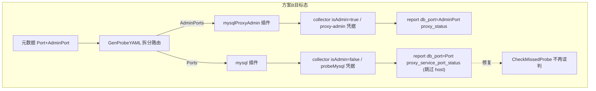

# TendbHA MySQL Proxy 双端口采集实现方案

> 状态：已评审定稿（归档），尚未实施
> 推荐方案：方案 B（数据口路由进 mysql 插件，天然复用 probeMysql 凭据）
> 概述：在保持 TendbHA mysql-proxy 管理端口（AdminPort）采集逻辑不变的前提下，为同一 proxy 节点的数据端口（Port）增加轻量级可达性探测，并以自定义状态结构上报；非 proxy 节点采集路径零改动。

## 待办清单

- [ ] **schema**：在 haprobe 增加 `MySqlProxyServicePortStatus` 并挂入 `MySqlStatus`
- [ ] **genconfig**：proxy 双产出（数据口只含 Ports 进 mysql、管理口进 mysqlProxyAdmin）；确认回退路径；修复同 5 元组排序确定性
- [ ] **collector**：新增 `obtainTendbHaProxyServicePortStatus`（open 成功即 ok，无需新增凭据字段）
- [ ] **collecting**：`mysql.collecting` 在 `obtainHostStatus` 前加 `isTendbHaProxy && !isAdmin` 前置单块（open 成功即 ok、跳过 host、提前返回）；admin/非 proxy 不变
- [ ] **tests**：改 `TestGenProbeYAML_MysqlProxyOnly`（proxy 现产出 mysql 块）；新增仅 data 用例 + 带 Port 的双端口回退用例；跑 probe 包全量测试
- [ ] **analysis（可选）**：`parser/mysql.go` 解析 `proxy_service_port_status` 失败为 `DbEvent`

---

## 背景与现状

当前 proxy 采集链路：


关键约束与缺口（均已对代码核实）：

- 元数据实例主键为 `(bk_cloud_id, ip, **port**)`，其中 `port` 为**业务/数据端口**，`admin_port` 为管理口（见 [`hamodel/dbm_metadata_cache.go`](../../pkg/storage/hamodel/dbm_metadata_cache.go)）。
- [`genconfig.go`](../../internal/probe/config/genconfig.go) 对 mysql-proxy **主动丢弃 `Ports`**，只下发 `AdminPorts`（L274-285）。
- 采集侧 [`mysql.go`](../../internal/probe/harvester/mysql/mysql.go) 在 `isTendbHaProxy() && isAdmin()` 时 early return，仅填充 `proxy_status`。
- analysis 侧 [`metadata.go`](../../internal/analysis/workflow/metadata.go) 用 `meta.Port`（数据口）建 `metaInsts`，[`dbha_data.go`](../../internal/analysis/storage/dbha_data.go) 回读状态也按 `(bk_cloud_id, db_ip, db_port=数据口)` 做 `IN` 匹配。

> 由上一条得出两个**已验证的事实**，直接影响方案选择：
> 1. **proxy 数据口长期被 `CheckMissedProbe` 视为漏采**（上报记录 `db_port=4001`，而 metadata 主键 `port=10000`，匹配不上）。数据口上报后即可修复。
> 2. **admin 口那条记录（`db_port=AdminPort`）在 analysis 永远读不回**：metadata 没有 `port=AdminPort` 的条目，回读 `IN` 条件匹配不到。这是既有现象，本方案不改变它；要让 analysis 真正消费 `backends`，须把 `proxy_status` 挂到数据口那条记录上（属方案 C 的形态，超出本需求）。

需求映射：

| 需求 | 含义 |
|------|------|
| 双端口同时采集 | 元数据同时有**非零** `Port` 与 `AdminPort` 时，两端口均参与采集 |
| 管理口不变 | 仍走 proxy-admin 凭据 + `backends` 查询，上报 `proxy_status` |
| 数据口轻量探测 | 仅验证连接/采集是否成功，结果写入**新自定义结构** |
| 非 proxy 不变 | `machine_type != proxy` 或 `access_layer != proxy` 的节点不进入新分支 |

### 前置假设

- 上游 DBHA/DBM 元数据为 proxy 同时填充**非零** `port` 与 `admin_port`。genconfig 会丢弃 `port==0` 条目，若 proxy 的 `port` 为 0，则数据口分支不会触发。

---

## 共享设计（各方案通用）

### 1. 新增上报数据结构

在 [`pkg/storage/haprobe/mysql_proxy_status.go`](../../pkg/storage/haprobe/mysql_proxy_status.go) 增加：

```go
// MySqlProxyServicePortStatus TendbHA mysql-proxy 数据端口可达性探测结果。
type MySqlProxyServicePortStatus struct {
    State         string `json:"state"`                    // "ok" | "failed"
    FailureReason string `json:"failure_reason,omitempty"` // 脱敏后的错误摘要，禁止密码/token
}
```

在 [`mysql_status.go`](../../pkg/storage/haprobe/mysql_status.go) 增加字段：

```go
ProxyServicePortStatus *MySqlProxyServicePortStatus `json:"proxy_service_port_status,omitempty"`
```

- **管理口上报**：继续填充 `proxy_status`（不变）。
- **数据口上报**：仅填充 `proxy_service_port_status`；不执行 `SHOW GLOBAL STATUS` / 心跳 / 主从采集。

### 2. 数据口探测逻辑（collector 新方法）

在 [`collector.go`](../../internal/probe/harvester/mysql/collector.go) 新增：

```go
func (c *collector) obtainTendbHaProxyServicePortStatus() (*haprobe.MySqlProxyServicePortStatus, error)
```

实现要点：

- **`open()` 成功即视为 `state=ok`**（已代码核实）：`open()` → `hamysql.NewGormDB` → `gorm.Open(mysql.New(...))`（[`hamysql/mysql.go`](../../pkg/storage/hamysql/mysql.go) L92）；collector 显式传 `OptionSkipInitializeWithVersion(false)`、默认值亦为 false（[`options.go`](../../pkg/storage/hamysql/options.go) L52）。gorm mysql dialector 在 `SkipInitializeWithVersion==false` 时于 Initialize 阶段执行 `SELECT VERSION()`，**建真实连接并在不可达/鉴权失败时上抛 error** → `open()` 返回非空 `dbEvent + err`。故连接成功本身即代表"连接+查询"链路通，**无需再额外 `SELECT 1`**。（旁证：`NewSqlxDB` L126 显式 `select version();` 做连通性校验，语义一致。）
- 失败时 `state=failed`，`failure_reason` 取 `err.Error()`，但遵守日志规范（`errmsg: %s` 风格、禁止密码/token）。
- 数据口（proxy 面向客户端的 MySQL 协议口，转发到后端）使用 **probeMysql 后端账号**，**不是** proxy-admin 账号。

### 3. 采集分支（collecting）

**需求 2 解读（假设）**：数据口"只验证是否采集成功"理解为 **`open()` 连通即成功**（`open()` 自身已含一次 `SELECT VERSION()`），不跑 `collectCommonStatus` 全量采集后再只报成败。

当前 [`collecting()`](../../internal/probe/harvester/mysql/mysql.go) 的实际顺序是 **先 `obtainHostStatus()` 再 `open()`**。为干净地跳过 host 采集，**采用前置单块**：在 `obtainHostStatus()` 之前判断并自包含处理、提前返回，避免在 host 步骤再加第二个守卫（单触点）：

```go
// 前置块：放在 obtainHostStatus() 之前
if c.isTendbHaProxy() && !c.isAdmin() {
    if dbEvent, err := c.open(); err != nil {
        dbEvent.BkCloudID = m.bkCloudID
        data.Events = []*haprobe.DbEvent{dbEvent}
        status.ProxyServicePortStatus = &haprobe.MySqlProxyServicePortStatus{
            State: "failed", FailureReason: err.Error(),
        }
        return
    }
    status.ProxyServicePortStatus = &haprobe.MySqlProxyServicePortStatus{State: "ok"}
    return // 不采 host、不进 collectCommonStatus
}
// ... 原有 obtainHostStatus / open / admin / common 流程保持不变
```

- 非 proxy 节点 `isTendbHaProxy()` 为 false，不进入前置块，原 host + `collectCommonStatus()` 路径零改动（满足需求 3）。
- **数据口跳过 `obtainHostStatus()`**：主机指标仅由 admin 口上报（非回退时由 mysqlProxyAdmin 插件、回退时由 mysql 插件 admin collector），避免每周期对同一 proxy 主机做两次 1s CPU 采样。
- 失败态是否同时写 `Events` 可按 analysis 约定取舍；上方骨架默认连接失败时既写 `proxy_service_port_status` 也写既有 `DbEvent`（复用现有失败上报路径），probe 阶段不引入新事件类型。

### 4. 配置生成改造（genconfig，方案 B 路由）

核心是**不再丢弃 proxy 的 data ports**，并把同一 proxy 拆分到两个 harvester：

- 仅 `adminPorts`：行为与现网一致（只采管理口）。
- 仅 `ports`：建议跳过并打 info 日志（无 admin 能力时避免误配）。
- `adminPorts` 与 `ports` 均存在：管理口进 `mysqlProxyAdmin`、数据口进 `mysql`。

#### 4.1【硬约束】数据口 endpoint 只能携带 Ports，绝不带 AdminPorts

`mysql` 插件 `loadCollectors` 只要发现 `AdminPorts` 非空就会调 `loadAdminCollectors`，用 **probeMysql 账号去连管理口**。因此拆分时数据口 endpoint 必须**只含 Ports**，管理口 endpoint 只含 AdminPorts，分属两个 slice。测试需断言 `mysql` 的 proxy endpoint `AdminPorts` 为空。

#### 4.2 `buildEndpointsFromMetadata` proxy 分支改为"双产出"

现状 L274-287 是 `adminPorts==0 则 continue`、有 ports 则丢弃。改造为：

```go
if isMysqlProxyEndpoint(...) {
    if len(adminPorts) > 0 {
        adminEp := ep            // 值拷贝
        adminEp.AdminPorts = adminPorts
        mysqlProxyAdmin = append(mysqlProxyAdmin, adminEp)
    }
    if len(ports) > 0 {
        dataEp := ep             // 值拷贝
        dataEp.Ports = ports
        mysql = append(mysql, dataEp)
    }
    continue
}
```

`ep` 为值类型，两个分支各自赋值，避免共享底层 slice 字段。

#### 4.3【回退路径】`payload.ProxyAdmin == nil` 行为确认（非回归）

`GenProbeYAML` L58-66 在无 proxy-admin 凭据时把 `mysqlProxyAdminEndpoints` 并入 `mysqlEndpoints`。方案 B 下同一 proxy 此时在 `mysql` 块出现两条 endpoint：

- 数据口（Ports）→ storage collector → 新轻量分支；
- 管理口（AdminPorts，来自回退）→ admin collector → 走**现有** `obtainTendbHaProxyStatus()`（`select * from backends`），用 probeMysql 账号 —— **与今天 legacy 降级行为完全一致**，不构成回归。

需补一个回退用例覆盖此路径。

#### 4.4【确定性修复】同 5 元组、不同端口的排序稳定性

回退路径下，`mysql` slice 内数据口 ep 与管理口 ep 的排序键 `(ip, cluster_type, machine_type, instance_role, access_layer)` **完全相同**，而 `sortEndpoints` 用的是 `sort.Slice`（非稳定排序），两条同键 endpoint 顺序可能在不同进程间翻转，破坏 deterministic yaml 并导致 `genconfig_test` 偶发失败。

**修复（二选一，实现时确定）**：

- 方案 i：在 `sortEndpoints` 增加对 `Ports`/`AdminPorts` 的次级 tie-break，使同键有序；
- 方案 ii（更简）：回退路径下对同一 proxy **合并为单条** endpoint（同时含 Ports+AdminPorts），回退时无需分离凭据，合并天然唯一。

---

## 方案对比

### 方案 B（推荐）：双 harvester 分流 — admin 与 data 分属不同插件

**思路**：genconfig 将同一 proxy 元数据**拆分**写入两个 harvester block：

| 端口 | Harvester | 凭据 |
|------|-----------|------|
| AdminPort | `mysqlProxyAdmin` | `proxy_admin` |
| Port | `mysql` | `probeMysql` |

`mysql` 插件 `collecting()` 增加 `isTendbHaProxy() && !isAdmin()` 轻量分支；`mysqlProxyAdmin` 保持现状。

**优点**

- **凭据天然分离**：数据口落在 `mysql` 插件，直接复用 `probeMysql` 账号，**无需新增任何凭据字段**（不动 `MySqlHarvesterConfig` / `probeconfig` payload / admin config）。
- 数据口上报 `db_port=Port`，与 analysis 主键对齐，**修复 missed-probe**。
- admin 口逻辑完全不动，满足"管理口不变"。

**缺点**

- 同一 proxy 的两个端口分属两个插件，各自使用所属 harvester 的 interval/timeout（数据口=probeMysql，管理口=proxyAdmin），相互独立；这不是约束，但需知晓两口采集节奏可不同。
- 混合机（同 IP 既有 backend 又有 proxy）时 `mysql` endpoints 变长；靠 `isTendbHaProxy()` 守卫确保 proxy data endpoint 不误触 backend 采集逻辑。
- 需更新 admin/genconfig 中"proxy 不走 mysql harvester"的历史注释（仅文档）。

**涉及文件**

- [`genconfig.go`](../../internal/probe/config/genconfig.go)：`buildEndpointsFromMetadata` proxy 分支双产出（4.2）；`GenProbeYAML` 回退路径确认（4.3）；`sortEndpoints` 确定性修复（4.4）。
- [`mysql.go`](../../internal/probe/harvester/mysql/mysql.go) / [`collector.go`](../../internal/probe/harvester/mysql/collector.go)：新增数据口分支与探测方法。
- [`mysql_proxy_status.go`](../../pkg/storage/haprobe/mysql_proxy_status.go) / [`mysql_status.go`](../../pkg/storage/haprobe/mysql_status.go)：新结构体。
- [`genconfig_test.go`](../../internal/probe/config/genconfig_test.go)：更新用例。
- [`admin/config/config.go`](../../internal/admin/config/config.go)：注释更新。

### 方案 A：单插件双端口 — `mysqlProxyAdmin` 承载两端口

**思路**：仍在 `mysqlProxyAdmin` 一个插件内，`loadCollectors()` 同时为 AdminPorts 与 Ports 创建 collector。

**关键代价（评审修正）**：数据口必须用 probeMysql 凭据，但 `mysqlProxyAdmin` 插件只持有 proxy-admin 凭据。因此需在 `MySqlHarvesterConfig` + `probeconfig` payload + admin config **新增第二套 service 凭据字段**，并在 `makeCollector` 按 `isAdminNode` 选凭据——这是**跨 admin/probe 多层的类型改动，比方案 B 更大、更分散**。原计划"改动最小"的判断不成立。

**上报形态**：两条 `HarvestData`/周期（admin→`db_port=AdminPort`；data→`db_port=Port`）。

**结论**：除非要求 proxy 双口共用单插件统一调度，否则不优于方案 B。

### 方案 C：单实例合并上报 — 一次采集、一条 HarvestData

**思路**：按 `(ip, cluster_type, machine_type, ...)` 聚合 proxy 实例，单 collector 同时连 admin + data 端口，输出一条 `HarvestData`：`db_port=Port`，`value` 同时含 `proxy_status` + `proxy_service_port_status`，主机指标只采一次。

**优点**

- 与元数据主键天然对齐；**唯一能让 admin 口 `backends` 进入 analysis 状态路径**的形态。
- 无 host 指标重复。

**缺点**

- 需重构 `loadCollectors` / `collecting`（per-port → per-instance），改动面最大、回归风险最高。
- 改变了"管理口上报形态"，与需求"管理口采集保持不变"存在张力。

**定位**：适合作为二期重构（当需要基于 backends 做自动切换时）。

---

## 下游影响

### 仅 probe（最小交付，推荐本期范围）

- receiver [`sink/mysql.go`](../../internal/receiver/sink/mysql.go) 按 `(machine_id, bk_cloud_id, db_ip, db_port)` upsert：admin（4001）与 data（10000）为两行，互不冲突，新增 JSON 字段以 `json.RawMessage` 透传，**无需改动**。
- analysis [`parser/mysql.go`](../../internal/analysis/workflow/parser/mysql.go) 当前 `Process` 为 **no-op**，本期可不改；数据口上报已能修复 `CheckMissedProbe` 漏判。
- 说明：`DbEventNameTendbhaProxyBackendFailure` 目前仅存在于策略注册与测试中（[`strategy.go`](../../internal/analysis/workflow/strategy.go)），**生产侧尚未接线**。本期若不做 analysis，数据口失败态仅入库、不触发动作。

### 全链路（若需故障自动判定，二期）

- 在 `parser/mysql.go` 解析 `proxy_service_port_status.state == failed` → 生成 `DbEvent`。
- 评估 admin 口 `backends` 异常与数据口可达性的分工（admin 看路由，data 看业务口）。注意：admin 口状态当前不被 analysis 读回（见背景"已验证事实 2"），若要基于 backends 判定需先解决其消费路径（倾向方案 C）。

---

## 推荐选择

| 维度 | 方案 A | 方案 B（推荐） | 方案 C |
|------|--------|----------------|--------|
| 凭据/配置改动 | 大（新增 service 凭据贯穿多层） | 小（复用 probeMysql，无新字段） | 中 |
| 回归风险 | 中 | 低 | 高（重构采集模型） |
| 满足本期需求 | 是 | 是 | 是（但改变管理口形态） |
| 让 backends 进入 analysis | 否 | 否 | 是 |

**默认推荐：方案 B** —— 凭据天然分离、改动集中在 genconfig 路由 + mysql harvester 分支，回归风险最低，完整满足"双端口同时采集 + 管理口不变 + 数据口自定义结构 + 非 proxy 不变"。

---

## 测试与防回归（强制）

按 [`no-regression-and-no-reopen`](../../../../.cursor/rules/no-regression-and-no-reopen.mdc)：

| 测试 | 覆盖点 |
|------|--------|
| `genconfig_test` | proxy 同时产出 mysql(Ports) 与 mysqlProxyAdmin(AdminPorts)；仅 admin / 仅 data / 混合机；回退路径；非 proxy 不受影响 |
| 现有 `probe_test` / `harvester_test` | 插件注册与 nil cfg 跳过逻辑不变 |

#### 既有测试语义变更（有意变更，非回归，需自觉接受）

- **`TestGenProbeYAML_MysqlProxyOnly` 必然要改**：其 fixture 同时有 `Port:10000` 与 `AdminPort:4001`，当前断言 `MySQL == nil`。方案 B 后该 proxy 会**额外生成 mysql 块**（数据口），断言改为：`MySQL != nil` 且其 endpoint `Ports:["10000"]`、`AdminPorts` 为空、`MachineType=proxy`；`MySQLProxyAdmin` 仍含 `AdminPorts:["4001"]`。
- `TestGenProbeYAML_MixedProxyAndStorage` 的 proxy 项只有 AdminPort、无 Port，保持 admin-only，不受影响。

#### 不受影响的现有用例（已逐个核对）

`MixedProxyAndStorage` / `MultiFamily` / `FallbackWhenProxyAdminMissing` 的 proxy 项均**只有 AdminPort、无 Port**，`DropsZeroPort` 与 `ProxyAccessButNonMysqlCluster` 非 mysql-proxy，故全部保持绿色。

#### 新增用例

- **仅 data proxy**：proxy 仅有 Port → 按 4 节策略跳过并打 info（断言两个 mysql 块均不含该 endpoint）。
- **双端口 + 回退**：proxy **同时带 Port 与 AdminPort** 且 `ProxyAdmin==nil`。注意现有 `FallbackWhenProxyAdminMissing` 的 proxy 无 Port，走不到方案 B 的双 endpoint 回退路径，**必须用带 Port 的新 fixture** 才能覆盖 4.3/4.4：断言 mysql 块同时含数据口（Ports）与回退来的管理口（AdminPorts）两条 endpoint，且输出确定（验证 4.4 修复）。

> 说明：`internal/probe/harvester/mysql` 下目前仅有 `stats_test.go`，无 DB mock 设施；`obtainTendbHaProxyServicePortStatus` 依赖真实/mock 连接，自动化覆盖**现实上主要落在 `genconfig_test`**，collector 分支以代码评审 + 手工验证为主，不强行承诺难落地的 collector 单测。

验证命令：`go test ./internal/probe/... ./pkg/storage/haprobe/...`

---

## 实施步骤（方案 B）

1. **数据结构**：在 haprobe 新增 `MySqlProxyServicePortStatus` 并挂入 `MySqlStatus`。
2. **genconfig**：`buildEndpointsFromMetadata` proxy 分支改为"双产出"（见 4.2）——数据口 endpoint **只含 Ports** 进 `mysql`（硬约束 4.1），管理口 endpoint 只含 AdminPorts 进 `mysqlProxyAdmin`。
3. **确定性**：按 4.4 二选一修复同 5 元组排序（次级 tie-break 或回退合并单条）。
4. **collector**：新增 `obtainTendbHaProxyServicePortStatus`（`open()` 成功即 ok）。
5. **collecting**：`mysql` 插件 collecting 增加 `isTendbHaProxy() && !isAdmin()` 轻量分支，跳过 host 采集并提前返回；admin 与非 proxy 路径不动。
6. **测试**：更新 `TestGenProbeYAML_MysqlProxyOnly`，新增 仅 data / 回退路径用例；跑 probe 包全量测试。
7. **文档**：更新 admin/genconfig 中"proxy 不走 mysql harvester"的历史注释。
8. **（可选/二期）analysis**：parser 识别数据口失败态。


