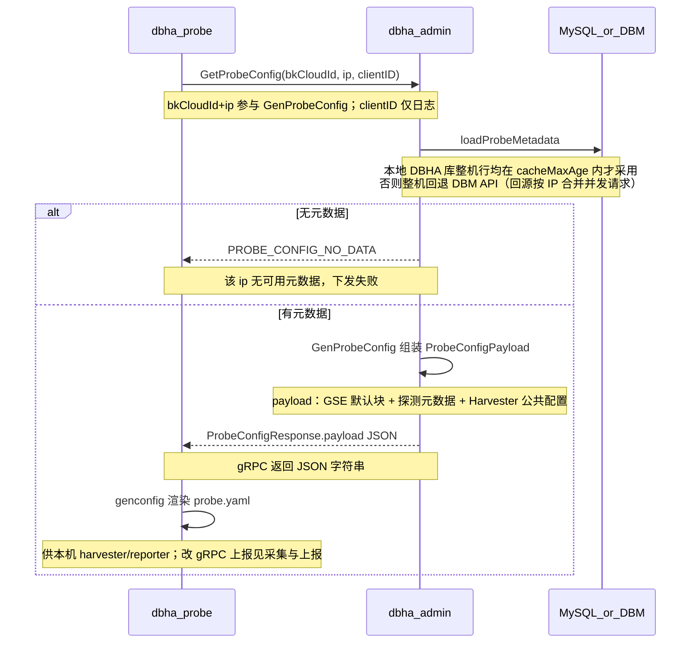

# 流程：Probe 配置下发

Probe 不在本地硬编码业务元数据，而是通过 Admin 的 `GetProbeConfig` 拉取配置元数据，再在本机渲染为最终的配置文件 `probe.yaml`。

相关文档：[架构总览](../architecture/overview.md) · [采集与上报](probe-harvest-and-report.md) · [文档索引](../README.md)

## 1. 参与方

| 角色 | 说明 |
| --- | --- |
| **dbha-probe** | 命令行子命令 `gen-config` 触发，或运行中的 probe 按 `admin.syncInterval` 周期触发 |
| **dbha-admin** | 提供 gRPC API 供 probe 调用获取元数据 |
| **MySQL / DBM** | 元数据优先读 DBHA 本地库（须在新鲜度窗口内）；不可用则整机回退 DBM API |

## 2. 工作原理

Probe 经 Admin 拉取 `ProbeConfigPayload` 后在本机渲染为 `probe.yaml`。

有两条触发路径，共用同一套拉取与渲染逻辑（[internal/probe/configsync](../../internal/probe/configsync)）：

- **人工**：`gen-config` 子命令，一次性拉取并写盘。
- **周期**：配置了 `admin.syncInterval` 的运行中 probe，每轮自动拉取、比较、必要时写盘并热加载。见下文 §5。

运行期 `Heartbeat`（见 [admin.proto](../../pkg/proto/idl/admin.proto)）侧重轻量 ack，当前无配置增量，不替代全量下发。写入 `probe.yaml` 后可用 `gen-config -o ... --reload` 或 `dbha-probe reload` 通知运行中的 probe 热加载（见 [gen-config-design.md](gen-config-design.md) §6.5）。



代码入口：[GenProbeConfig](../../internal/admin/config/probe_config.go) · [pkg/probeconfig](../../pkg/probeconfig) · [genconfig](../../internal/probe/config/genconfig.go)

## 3. 关键代码路径

| 步骤 | 路径 |
| --- | --- |
| Proto | [pkg/proto/idl/admin.proto](../../pkg/proto/idl/admin.proto) |
| gRPC 处理 | [internal/admin/grpc.go](../../internal/admin/grpc.go)（`GetProbeConfig` / `Heartbeat`） |
| 配置生成 | [internal/admin/config/probe_config.go](../../internal/admin/config/probe_config.go) |
| Payload 类型 | [pkg/probeconfig/metadata.go](../../pkg/probeconfig/metadata.go) |
| Probe CLI / 渲染 | [internal/probe/cmds](../../internal/probe/cmds)、[internal/probe/config/genconfig.go](../../internal/probe/config/genconfig.go) |
| Probe 拉取 / 渲染共用逻辑 | [internal/probe/configsync](../../internal/probe/configsync) |
| Probe 周期同步 | [internal/probe/adminsync.go](../../internal/probe/adminsync.go) |

## 4. Admin 侧元数据新鲜度

Admin 回答 `GetProbeConfig` 时优先用本地 `t_dbm_metadata`，但只在整机新鲜时采用：

- **`probeMetadata.cacheMaxAge`**（默认 `10m`，下限 `1m`）：该 IP 的缓存行只要有一行的 `updated_at` 超出窗口，整机都回源 DBM。不做逐行取舍，是因为混用新旧行会让 probe 拿到半更新的机器视图——继续探测已迁走的实例，或漏掉新到的实例——比多一次 DBM 查询更糟。
- **`probeMetadata.tombstoneAge`**（默认 `24h`，不得小于 `cacheMaxAge`）：早于该窗口的行直接忽略。元数据同步只 upsert 不删除，已下架实例的残留行否则会永远过期，把这台机器的缓存彻底关掉。
- 回源按 `(bk_cloud_id, ip)` 合并并发请求，一台机器同一时刻只打一次 DBM。probe 改为周期拉取后，同步滞后会让整片机器同时回源，这层合并是必要的。

可观测：`probe_metadata_fallback_total{reason="miss"|"stale"}`。该指标持续上升说明 admin 正在把 probe 的周期流量放大到 DBM 上，应先查元数据同步是否滞后，而不是直接调大 `cacheMaxAge`。

## 5. Probe 侧周期同步

在 `probe.yaml` 配置 `admin` 块即可开启：

```yaml
admin:
  endpoints: ["<admin-host>:19001"]
  bkCloudID: 0
  localIP: "<本机 IP>"
  syncInterval: 60s   # 0（默认）表示关闭
```

行为要点：

- **只改两段**：每轮把 admin 返回的内容渲染后，只与文件里的 `reporter`、`harvester` 做**语义**比较，一致就不写盘。`serviceID`、`pidFile`、`client`、`log`、`admin`、`clearPorts` 等本机字段一律以**磁盘上的文件**为准原样保留——运维刚改完还没 reload 的编辑不会被内存里的旧值覆盖。
- **拉取参数必须与文件同源**：本轮 fetch 使用的 `endpoints` / `bkCloudID` / `localIP` 若与磁盘上的 admin 块不一致，本轮跳过写入并请求 reload，等内存追上后再写。否则会把旧参数拉到的 harvester 和磁盘上的新 admin 拼在一起，与下一次 `gen-config` 来回横跳。
- **`clearPorts` 与 gen-config 共用**：文件里的排除端口在渲染 harvester 时生效，因此 `gen-config --clear-port` 写入的裁剪不会被下一轮同步还原。
- **格式会被重排**：真正写盘时整个文件由生成器重新渲染，缩进与引号风格会变成生成器的样式，文件内注释会丢失。不变更时不写盘，所以注释只在配置真的发生变化时才会被覆盖。
- **不会拿坏配置覆盖好配置**：渲染结果先自解析校验，解析不过就保留原文件并告警；反过来，磁盘文件已经损坏时会用 admin 的内容重写以自愈。
- **`syncInterval` 下限 10s**，低于此值会被抬高并告警。每轮加最多 1/10 间隔的抖动，首轮再额外错峰（最多 30s），避免整片机器同时打 admin。
- **改 `syncInterval` 不中断采集**：只有 `admin` 块变化的 reload 只更新配置，不重建 harvester。
- **admin 无该机元数据时保持原配置**：返回 `PROBE_CONFIG_NO_DATA` 只告警，不会把正在工作的配置清空。

容量估算：每台 probe 每个周期给 admin 一次元数据查询。10k 台按 60s 约 167 req/s，缓存命中时不落到 DBM。据此选 `syncInterval`，不要为了"更快感知"把它压到很低。

## 6. 运维注意

- 元数据为空时返回 `PROBE_CONFIG_NO_DATA`，需先保证 analysis 同步或 DBM 侧有该 IP 的实例信息。
- 部署侧常用 `dbha-probe gen-config` 后再 `start` / `daemon-start`；自动化见 scripts 与 `ensure` 子命令。首次部署不要在 start 之前带 `--reload`。
- 运行中更新配置：`dbha-probe gen-config -o <probe.yaml 路径> --reload`。写已有文件时会保留本机 `admin` / `client` / `log` / `clearPorts` 等字段；`--admin-endpoints` 覆盖文件里的地址列表，必须一次传全。未传 `--cloud-id` / `--local-ip` 时沿用文件值。打包布局下命令会切到安装根目录；`-o` 应与进程 `-c` 为同一文件。
- Admin 下发默认 reporter 为 GSE；运行时 gRPC / GSE 二选一与改法见 [采集与上报](probe-harvest-and-report.md)。**若把 reporter 手工改成 gRPC，又同时开了周期同步**，那么每轮都会检出差异并把它改回 GSE。这两项要么只用其一，要么让 admin 侧的 `probeGse` 与本机期望一致。
- **凭据暴露面**：payload 里带明文 DB 密码，gRPC 连接当前未启用 TLS，`probe.yaml` 默认权限 `0644`。这两点在一次性 `gen-config` 时就已存在，开启周期同步会让明文密码按周期反复经过网络，请在受控网络内使用，并按需收紧文件权限。
