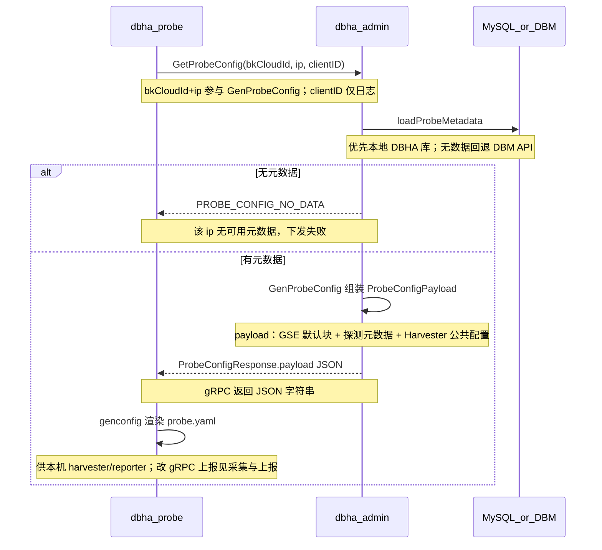

# 流程：Probe 配置下发

Probe 不在本地硬编码业务元数据，而是通过 Admin 的 `GetProbeConfig` 拉取配置元数据，再在本机渲染为最终的配置文件 `probe.yaml`。

相关文档：[架构总览](../architecture/overview.md) · [采集与上报](probe-harvest-and-report.md) · [文档索引](../README.md)

## 1. 参与方

| 角色 | 说明 |
| --- | --- |
| **dbha-probe** | 命令行子命令 `gen-config` 触发，通过 gRPC 调用获取元数据 |
| **dbha-admin** | 提供 gRPC API 供 probe 调用获取元数据 |
| **MySQL / DBM** | 元数据优先读 DBHA 本地库；未查到则回退调用 DBM API |

## 2. 工作原理

Probe 经 Admin 拉取 `ProbeConfigPayload` 后在本机渲染为 `probe.yaml`。

配置全量刷新以 `GetProbeConfig` / `gen-config` 为主；运行期 `Heartbeat`（见 [admin.proto](../../pkg/proto/idl/admin.proto)）侧重轻量 ack，当前无配置增量，不替代全量下发。写入 `probe.yaml` 后可用 `gen-config -o ... --reload` 或 `dbha-probe reload` 通知运行中的 probe 热加载（见 [gen-config-design.md](gen-config-design.md) §5.5）。

代码入口：[GenProbeConfig](../../internal/admin/config/probe_config.go) · [pkg/probeconfig](../../pkg/probeconfig) · [genconfig](../../internal/probe/config/genconfig.go)

## 3. 关键代码路径

| 步骤 | 路径 |
| --- | --- |
| Proto | [pkg/proto/idl/admin.proto](../../pkg/proto/idl/admin.proto) |
| gRPC 处理 | [internal/admin/grpc.go](../../internal/admin/grpc.go)（`GetProbeConfig` / `Heartbeat`） |
| 配置生成 | [internal/admin/config/probe_config.go](../../internal/admin/config/probe_config.go) |
| Payload 类型 | [pkg/probeconfig/metadata.go](../../pkg/probeconfig/metadata.go) |
| Probe CLI / 渲染 | [internal/probe/cmds](../../internal/probe/cmds)、[internal/probe/config/genconfig.go](../../internal/probe/config/genconfig.go) |

## 4. 运维注意

- 元数据为空时返回 `PROBE_CONFIG_NO_DATA`，需先保证 analysis 同步或 DBM 侧有该 IP 的实例信息。
- 部署侧常用 `dbha-probe gen-config` 后再 `start` / `daemon-start`；自动化见 scripts 与 `ensure` 子命令。
- 运行中更新配置：在安装根目录执行 `dbha-probe gen-config -o <probe.yaml 路径> --reload`（或改完文件后执行 `dbha-probe reload`），使 probe 热加载新 YAML。
- Admin 下发默认 reporter 为 GSE；运行时 gRPC / GSE 二选一与改法见 [采集与上报](probe-harvest-and-report.md)。
