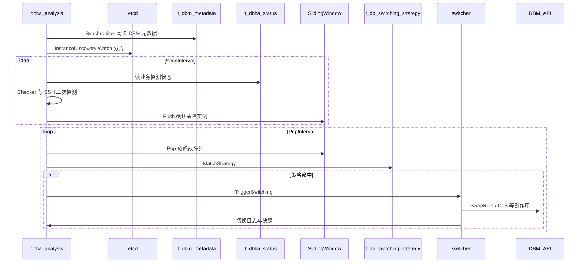

# 流程：故障判定与切换

Analysis 的 `Workflow` 在服务启动后并行运行：DBM 元数据同步、etcd 分片 watch、定时 Scan（发现故障入滑动窗口）、定时 Pop（成熟后匹配策略并切换）。

相关文档：[架构总览](../architecture/overview.md) · [采集与上报](probe-harvest-and-report.md) · [流程索引](README.md)

## 1. 参与方

| 角色 | 说明 |
|------|------|
| **Synchronizer** | 从 DBM 拉取元数据写入 `t_dbm_metadata` |
| **InstanceDiscovery** | 基于 etcd 的 analysis 实例列表与业务分片 |
| **Scan 循环** | `ScanBusinesses` → 按业务检查探测数据 → 二次探测 → 推入滑动窗口 |
| **Pop 循环** | `PopAndSwitch` → 弹出成熟故障组 → 策略匹配 → `SwitchExecutor` / switcher → DBM |
| **MySQL** | `t_dbha_status`、策略表、切换日志 / 快照等 |

## 2. 工作原理

编排入口：[`Workflow.Run`](../../internal/analysis/workflow/workflow.go)。

### 2.1 启动后的并行循环

1. **`Synchronizer.Run`**：持续同步 DBM 元数据。
2. **`InstanceDiscovery.RunWatch`**：watch etcd，维护本实例负责的业务集合（一致性哈希分片）。
3. **Scan 定时器**（`ScanInterval`）：对已分配业务执行 `ScanBusinesses`。
4. **Pop 定时器**（`PopInterval`）：对已分配业务执行 `PopAndSwitch`。

Scan 与 Pop 使用不同业务锁（ScanLock / SwitchLock），避免多 AM 实例互相踩踏，同时允许扫描与切换流水线化。

### 2.2 Scan：从探测数据到滑动窗口

单业务路径 `CheckBusinessWithBizID` 大致为：

1. 获取 ScanLock，读取业务元数据。
2. 白名单过滤（仅扫描白名单集群内实例）。
3. 按实例条件读取近期 `t_dbha_status` 指标。
4. 结合 skip 列表，由 `BusinessChecker` / detector 判定疑似故障。
5. **二次探测**（SSH、远端 `dbha-probe health`、keepalive 等）：`DetectorHandler.LivenessDoubleCheck` 确认失败后，将 `FailureInstanceInfo` **Push** 进滑动窗口。

策略匹配与真正切换**不在** Scan 路径内完成，而由 Pop 循环异步处理。

### 2.3 Pop：策略匹配与切换执行

`PopAndSwitch` → `popAndSwitchForBiz`：

1. 获取 SwitchLock。
2. 从滑动窗口弹出已「成熟」的故障组（窗口时长用于抑制抖动 / 要求持续失败）。
3. `SwitchExecutor.MatchStrategyForGroup`：匹配业务级 / 全局策略（`t_db_switching_strategy`）。
4. 构造 switcher 请求（补充 DBM 元数据、过滤不可用实例）。
5. `TriggerSwitching`：按 `DbType` 调用对应 switcher（如 TendbHA / TendbCluster MySQL），并写切换日志、快照、告警。

## 3. 交互顺序图

## 4. 关键代码路径

| 步骤 | 路径 |
|------|------|
| 编排 | [`internal/analysis/workflow/workflow.go`](../../internal/analysis/workflow/workflow.go) |
| 元数据同步 | [`workflow/synchronizer.go`](../../internal/analysis/workflow/synchronizer.go) |
| 分片发现 | [`workflow/instance_discovery.go`](../../internal/analysis/workflow/instance_discovery.go) |
| 检查与二次探测 | [`workflow/checker.go`](../../internal/analysis/workflow/checker.go)、[`detector_handler.go`](../../internal/analysis/workflow/detector_handler.go)、[`internal/analysis/detector`](../../internal/analysis/detector) |
| 白名单 | [`workflow/dbhav1_whitelist.go`](../../internal/analysis/workflow/dbhav1_whitelist.go) |
| 策略与切换 | [`workflow/switch_flow.go`](../../internal/analysis/workflow/switch_flow.go)、[`internal/analysis/switcher`](../../internal/analysis/switcher) |
| DBM 客户端 | [`internal/analysis/dbm`](../../internal/analysis/dbm) |
| 快照 / 日志 | [`workflow/switch_snapshot_log.go`](../../internal/analysis/workflow/switch_snapshot_log.go)、[`snapshotlogger`](../../internal/analysis/switcher/snapshotlogger) |

## 5. 设计要点

- **滑动窗口**：把「瞬时探测失败」与「触发切换」解耦，降低误切。
- **分片 + 业务锁**：多 analysis 实例水平扩展时，同一业务同一时刻只有一个实例在切换。
- **策略驱动**：是否切换、何种事件名（如二次探测 SSH 失败）由策略表配置，而非写死在探测插件中。
