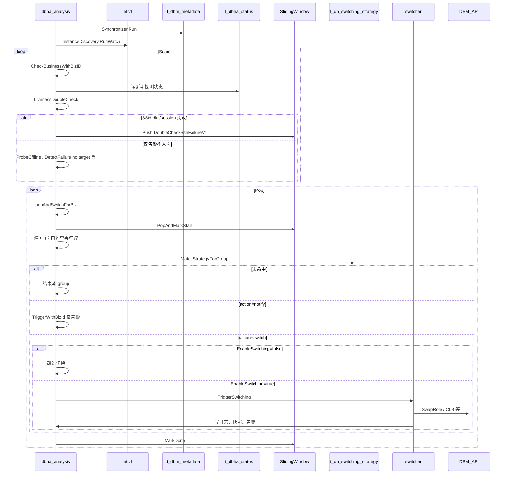
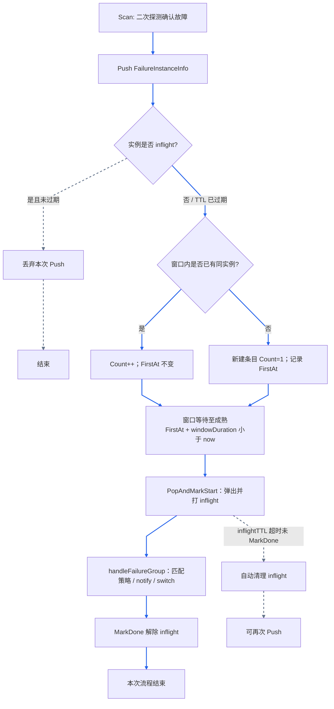
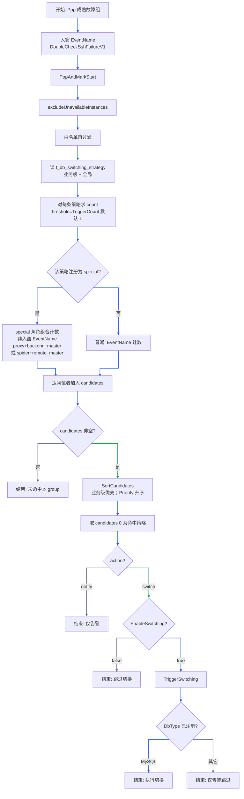

# 流程：故障判定与切换

Analysis 的 `Workflow` 在服务启动后并行运行：DBM 元数据同步、etcd 分片 watch、定时 Scan（发现疑似 → 二次探测 → 条件满足则入滑动窗口）、定时 Pop（成熟后匹配策略并切换）。

入窗语义以 [mysql-detection-design.md §5](../detection/mysql-detection-design.md) 为准；本文描述 Scan/Pop、窗口、锁、策略与白名单运行时路径。

相关文档：[架构总览](../architecture/overview.md) · [采集与上报](probe-harvest-and-report.md) · [MySQL 探测设计 §5](../detection/mysql-detection-design.md) · [文档索引](../README.md)

## 1. 参与方

| 角色 | 说明 |
|------|------|
| **Synchronizer** | 从 DBM 拉取元数据写入 `t_dbm_metadata` |
| **InstanceDiscovery** | 基于 etcd 的 analysis 实例列表与业务分片 |
| **Scan 循环** | `ScanBusinesses` → 按业务检查探测数据 → 二次探测 →（仅部分结果）推入滑动窗口 |
| **Pop 循环** | `PopAndSwitch` → 弹出成熟故障组 → 策略匹配 → notify / `SwitchExecutor` / switcher → DBM |
| **MySQL** | `t_dbha_status`、策略表、切换日志 / 快照等 |

## 2. 工作原理与交互

编排入口 [`Workflow.Run`](../../internal/analysis/workflow/workflow.go)：启动后并行跑元数据同步、etcd 分片 watch、Scan、Pop。Scan 与 Pop 分别使用 ScanLock / SwitchLock，避免多 AM 实例踩踏，并允许扫描与切换流水线化。

图下要点：

- Scan 持 `ScanLock`；二次探测为 SSH + `dbha-probe health -j`（不含 keepalive HTTP）。**仅 SSH dial/session 失败入窗**，策略匹配与切换由 Pop 异步处理。
- Pop 持 `SwitchLock`；`PopAndMarkStart` 按 `FirstAt + windowDuration` 成熟弹出并打 inflight；普通策略按 EventName，special 按角色组合。
- `MarkDone` 在 `handleFailureGroup` 末尾 `defer` 执行，与是否切换无关；当前仅 MySQL switcher 已注册。

代码入口：[`Workflow.Run`](../../internal/analysis/workflow/workflow.go) · [`checker`](../../internal/analysis/workflow/checker.go) / [`detector_handler`](../../internal/analysis/workflow/detector_handler.go) · [`switch_flow`](../../internal/analysis/workflow/switch_flow.go)

### 2.1 入窗条件与事件改写

二次探测入口 [`DetectorHandler.ProcessResponse`](../../internal/analysis/workflow/detector_handler.go)。Detector 任务默认事件名为 `ProbeOffline`（`missed probe`）。

| 二次探测结果 | 事件名（告警 / 入窗） | 是否入窗 |
| --- | --- | --- |
| SSH dial/session 失败 | `DoubleCheckSshFailureV1` + `connection exception` | **是**（唯一入窗路径；同时为窗内 EventName） |
| 有效 Pid（解读为无目标 DB 指标） | 改写为 `DetectFailure` + `no target` | 否（仅告警） |
| InvalidPid / 其它失败（ExitCode≠0、JSON 解析失败等） | 多为默认 `ProbeOffline` | 否（仅告警） |

probe 侧 `DetectFailure`（建连失败）只写入 `HarvestData.Events`，经 `CheckEventWithBizId` 触发二次探测候选；**事件名不带入窗口**。细则见 [mysql-detection-design.md §5](../detection/mysql-detection-design.md)。

`RunBusinessChecks` 四路中 `CheckDbHosts` / `CheckDbStatus`（MySQL parser）当前为 stub，故障主链路依赖 probe 上报 Events + missed probe + SSH 二次探测。

## 3. 滑动窗口

`BizWindowManager` 按 BizID 隔离窗口，把「二次探测确认故障后入窗」与「成熟后触发切换」解耦。

> 色例：蓝=Push/成熟主路径；灰虚线=丢弃 / inflight 超时清理。

要点（与 [`sliding_window.go`](../../internal/analysis/workflow/sliding_window.go) 一致）：

- 实例键：`bkCloudID:ip:port:dbType`；同键合并计数，`FirstAt` 仅首次 Push 写入。
- 成熟条件：`FirstAt + windowDuration < now`（代码用 `FirstAt.Before(now - windowDuration)`）；默认 `windowDuration=0` 时几乎立即成熟。
- `PopAndMarkStart` 原子弹出并打 inflight，按 `FirstAt` 升序返回，避免 Pop 与 Push 竞态。
- inflight 期间丢弃同实例 Push；`MarkDone` 在 `handleFailureGroup` 结束时统一解除（`defer markDoneAll`）；超时 `inflightTTL`（默认 30s）自动清理。

## 4. 策略匹配与切换边界

Pop 成熟故障组后进入策略匹配与切换边界（对齐 [`MatchStrategyForGroup`](../../internal/analysis/workflow/switch_flow.go) / [`strategy.go`](../../internal/analysis/workflow/strategy.go)）。

> 色例：蓝=主路径；绿=命中后进入 action；灰=未命中 / 仅告警 / 跳过。

配置要点：

- **默认全局策略种子**（`dbha-admin migrate strategy`）：`TriggerEventName=DoubleCheckSshFailureV1`，`action=switch`，`scope=host`，`TriggerCount=1`，`Priority=9999`，`BkBizID=0`。
- **special 常量**（非 harvester emit、**非**入窗 EventName）：`TendbhaProxyBackendFailure`、`TendbclusterSpiderRemoteFailure`；见 [`strategy.go`](../../internal/analysis/workflow/strategy.go)。
- 策略表：`t_db_switching_strategy`；`TriggerEventName` / `action`（`switch`|`notify`）可配；总开关 `EnableSwitching`。

## 5. 关键代码路径

| 步骤 | 路径 |
|------|------|
| 编排 | [`internal/analysis/workflow/workflow.go`](../../internal/analysis/workflow/workflow.go) |
| 元数据同步 | [`workflow/synchronizer.go`](../../internal/analysis/workflow/synchronizer.go) |
| 分片发现 | [`workflow/instance_discovery.go`](../../internal/analysis/workflow/instance_discovery.go) |
| 检查与二次探测 | [`workflow/checker.go`](../../internal/analysis/workflow/checker.go)、[`detector_handler.go`](../../internal/analysis/workflow/detector_handler.go)、[`internal/analysis/detector`](../../internal/analysis/detector) |
| 滑动窗口 | [`workflow/sliding_window.go`](../../internal/analysis/workflow/sliding_window.go) |
| 白名单 | [`workflow/dbhav1_whitelist.go`](../../internal/analysis/workflow/dbhav1_whitelist.go) |
| 策略与切换 | [`workflow/switch_flow.go`](../../internal/analysis/workflow/switch_flow.go)、[`strategy.go`](../../internal/analysis/workflow/strategy.go)、[`internal/analysis/switcher`](../../internal/analysis/switcher) |
| DBM 客户端 | [`internal/analysis/dbm`](../../internal/analysis/dbm) |
| 快照 / 日志 | [`workflow/switch_snapshot_log.go`](../../internal/analysis/workflow/switch_snapshot_log.go)、[`snapshotlogger`](../../internal/analysis/switcher/snapshotlogger) |

## 6. 设计要点

- **滑动窗口**：把「瞬时探测失败」与「触发切换」解耦；同实例合并计数 + inflight 防重复切换。
- **分片 + 业务锁**：多 analysis 实例水平扩展时，同一业务同一时刻只有一个实例在切换。
- **策略驱动**：是否切换、匹配何种 `TriggerEventName` 由策略表配置；探测侧入窗事件名（如 SSH 失败）在 detector 路径硬编码。
