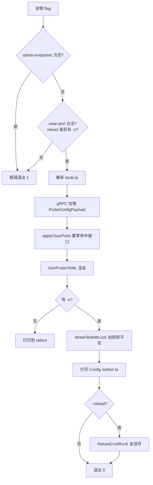

# 设计：gen-config 配置落盘、端口裁剪与 reload

`dbha-probe gen-config` 是 probe 侧配置落盘的唯一入口：从 Admin 拉取元数据、在本机渲染 `probe.yaml`、写入目标文件。本文说明该命令在**并发写入安全**、**采集端口裁剪**、**写后通知运行中进程**三个方面的设计取舍，以及失败退出码的语义。

拉取与渲染的整体链路见 [配置下发](config-sync.md)，本文只覆盖 probe 本地这一段。

相关文档：[配置下发](config-sync.md) · [采集与上报](probe-harvest-and-report.md) · [架构总览](../architecture/overview.md) · [文档索引](../README.md)

## 1. 命令行接口

| Flag | 类型 | 默认值 | 说明 |
| --- | --- | --- | --- |
| `--admin-endpoints` | string | 空（必填） | Admin 服务地址，按 `;` 或空白分隔 |
| `--cloud-id` | uint64 | `0` | 云区域 ID（`bk_cloud_id`） |
| `--local-ip` | string | 空 | 本机 IP；为空时按网卡与路由自动探测 |
| `--local-ip-interface` | string | 空 | 自动探测时优先使用的网卡名 |
| `-o` / `--output` | string | 空 | 输出文件路径；为空则打印到 stdout |
| `--timeout` | duration | `30s` | 拉取 Admin 配置的总超时，非正值回落默认值 |
| `--lock-timeout` | duration | `10s` | 等待目标文件锁的超时，非正值回落默认值 |
| `--clear-port` | string | 空 | 从采集范围中剔除的端口，逗号或分号分隔 |
| `--reload` | bool | `false` | 写完配置后向运行中的 probe 发送 reload 信号 |

`--clear-port` 与 `--reload` 不传时，命令行为与引入这两个 flag 之前完全一致。

典型用法：

```bash
dbha-probe gen-config --admin-endpoints 127.0.0.1:19001 -o etc/probe.yaml
dbha-probe gen-config --admin-endpoints 127.0.0.1:19001 --clear-port 10000 -o etc/probe.yaml
dbha-probe gen-config --admin-endpoints 127.0.0.1:19001 --clear-port '100,200;300;400' -o etc/probe.yaml
dbha-probe gen-config --admin-endpoints 127.0.0.1:19001 -o etc/probe.yaml --reload
```

## 2. 执行顺序

参数校验刻意排在网络调用之前：非法端口或缺少 `-o` 的调用不应该先去连 Admin。



## 3. 写入模型：旁路锁 + 临时文件 + 原子替换

### 3.1 要解决的问题

多个 `gen-config` 可能同时写同一份 `probe.yaml`（定时任务叠加、人工执行与自动化并发）。原实现直接 `os.WriteFile`，没有任何互斥，存在两类风险：并发写者互相覆盖出混合内容；读者（`start` / `health` 等）读到写了一半的文件。

`WriteFileWithLock` 用「旁路锁文件 + 临时文件 + fsync + 原子 rename」同时解决这两类问题。

### 3.2 锁为什么放在旁路文件

锁文件是 `<target>.lock`，而不是目标文件本身。

原因是替换动作用的是 `rename`：rename 会把目标路径指向新的 inode。如果锁加在目标文件的 inode 上，替换完成后先来的写者持有的是**旧 inode 的锁**，后来的写者对新 inode 加锁会立刻成功，互斥就失效了。锁必须落在一个不会被替换的对象上，旁路文件满足这一点。

代价是目录里多出一个 `.lock` 文件，这是可接受的。

### 3.3 符号链接与属主

写入前用 `filepath.EvalSymlinks` 解析真实路径，之后的加锁与替换都针对真实路径。这带来两个效果：

- 直接 rename 到软链路径会把软链本身替换成普通文件，解析后就不会破坏软链；
- 两个软链指向同一个真实文件时，锁落在同一个真实路径上，互斥仍然成立。

替换时保留原文件的权限位（`os.Chmod`）与属主（`os.Chown`）。**属主还原失败只记 warning，不让整次写入失败**：非特权用户本来就无法 chown，而它替换掉的原始实现（直接覆盖写）在这种场景下是能成功的，失败退出会造成回归。

### 3.4 内容无变化则跳过

周期性执行的 `gen-config` 绝大多数时候渲染出的内容与现有文件完全一致。此时直接跳过写入，rename、属主还原、临时文件等所有风险动作都只在配置真的变化时才触发。

但**输出文案保持不变**：无论是否真的落盘，都打印 `Config written to <path>`。这一行是外部脚本已有的判断依据，改成「skip write」会破坏它们。跳过与否只在函数返回值里体现，不外泄到 stdout。

副作用：内容不变时文件 `mtime` 不再刷新。

### 3.5 崩溃与残留

| 场景 | 处理 |
| --- | --- |
| 写临时文件中途失败 | 删除临时文件，原文件保持完好 |
| 写完未 rename 就被杀 | 下一次写入在**持锁期间**清理同前缀的残留临时文件 |
| rename 失败 | 重试 3 次（间隔 100ms），覆盖 Windows 上读者占用目标文件引发的 sharing violation；仍失败则删除临时文件并报错 |
| rename 后目录项未落盘时崩溃 | rename 后对父目录 `fsync`；该步失败只记 warning，不推翻一次已经成功的写入 |
| 持锁进程被杀 | flock 由内核在进程退出时自动释放 |

残留清理用**前缀匹配**而非 `filepath.Glob`：目标文件名里出现 glob 元字符时，Glob 会漏匹配或错匹配。清理必须在持锁期间进行，此时其他写者被排除，凡是匹配到的都确定是残留。

### 3.6 锁等待

`AcquireFileLock` 在超时窗口内按 50ms 间隔重试。循环写成「先尝试一次再判断超时」，这样即使传入极小的超时值也能得到一次真实尝试，而不是没试就失败。超时返回 `gerrors.Timeout`。

## 4. --clear-port：从采集范围剔除端口

### 4.1 语法

只以**英文逗号 `,` 和分号 `;`** 作为分隔符，token 两侧的空白会被 trim，但空白本身不是分隔符。

| 输入 | 结果 |
| --- | --- |
| `10000` | `[10000]` |
| `100,200;300;400` | `[100, 200, 300, 400]` |
| `100; 200, 300` | `[100, 200, 300]` |
| `100,,200;;300` | `[100, 200, 300]`（空段忽略） |
| `100,100;200` | `[100, 200]`（去重、保序） |
| 空串 / 纯空白 | 空，等同于不传 |
| `,,;` / `,` | 报错（非空输入却一个端口都没有） |
| `0` / `70000` | 报错（范围必须是 1-65535） |
| `abc` / `100,abc` | 报错 |
| `100 200` | 报错 |
| `100，200`（全角逗号） | 报错 |

两个刻意的选择：

- **不复用 `parseAdminEndpoints`**：它按 `;` **和空白**切分，会把 `"100 200"` 收成两个端口。端口列表里出现空格更可能是笔误，静默多剔除一个端口的风险高于报错。
- **不用 cobra 的 `IntSlice`**：它只认逗号，不认分号，无法支持 `100,200;300` 这种混合写法。

非空输入解析后一个合法端口都没有时报错而不是当作 no-op，避免 `--clear-port ,,;` 这类调用看起来生效、实际什么都没做。

### 4.2 过滤语义

命中的端口在元数据里被**置 0**，而不是删除整条记录：

```go
func applyClearPorts(metadata []probeconfig.ProbeMetadataItem, ports []int)
```

同一条 `ProbeMetadataItem` 可能同时带数据端口 `Port` 和管理端口 `AdminPort`。只剔除其中一个时，另一个必须保留，因此不能整条删除。数据端口和管理端口都会被检查，命中哪个就清哪个。

置 0 能生效是因为渲染侧已有的规则：[genconfig.go](../../internal/probe/config/genconfig.go) 的分组逻辑本来就丢弃 `Port == 0` 和 `AdminPort == 0` 的条目，两端都为空的 endpoint 会被整条跳过。所以被清掉的端口不会以任何形式出现在 YAML 里，也无需修改 `GenProbeYAML` 的签名。

payload 里本来就没有的端口静默忽略，不报错——批量下发同一条命令到多台机器时，端口只存在于其中一部分机器上是正常的。

### 4.3 连带行为

mysql-proxy 有一条既有规则：**没有管理端口的 endpoint 整条跳过**，包括它剩下的数据端口。因此用 `--clear-port` 清掉某个 proxy 的唯一管理端口时，该 proxy 的数据端口也会一并消失。这是渲染侧的原有逻辑，本设计未做改动，但使用时需要知道。

清空某类 harvester 的全部端口后，对应的 `harvester.mysql` / `harvester.redis` 块不会输出，这同样是既有逻辑。

## 5. --reload：写后通知运行中的进程

### 5.1 行为

配置文件写入成功、并打印 `Config written to` 之后，向运行中的 probe 发送 reload 信号。信号机制完全复用现有的 `dbha-probe reload` 子命令，不新写一套：

| 平台 | 动作 | 成功输出 |
| --- | --- | --- |
| Unix | 向 pid 发送 `SIGHUP` | `sent SIGHUP to dbha-probe (pid=N) for reload` |
| Windows | 置位该进程的具名 reload 事件 | `set reload event for dbha-probe (pid=N) for reload` |

进程未运行、pid 文件不存在或是 stale pid 时，打印提示并**返回成功（退出码 0）**。「配置已经生成好了，进程没跑」不算失败，这与单独执行 `reload` 的语义一致。

### 5.2 必须配合 `-o`

`--reload` 缺少 `-o/--output` 时直接报错 `--reload requires --output`。输出到 stdout 时没有落盘文件，通知进程重新加载没有意义。该校验在连 Admin 之前完成。

### 5.3 刻意不调用 config.Load

发信号时用的是包级默认的 `config.Cfg.PidFile`（`./pids/probe.pid`），与 `GenProbeYAML` 刚渲染出的字段一致，**不对刚写出的文件执行 `config.Load`**。

`config.Load` 仍会覆盖包级 `config.Cfg`，因此 CLI 发信号路径故意不调用它，以免改写当前进程（或单元测试）里已加载的配置；现有的 `ReloadCmdRunE` 本身也不做 Load，保持一致。`config.Load` 已改为委托 `config.Parse`（使用独立的 `viper.New()`），不再污染全局 viper。若只需只读校验刚写出的文件，应调用 `config.Parse`，它返回新配置且不修改 `config.Cfg`。

### 5.4 pid 文件的相对路径语义

`gen-config` **不会**切换到安装根目录（只有 `ensure` 会做 `ChdirInstallRoot`）。因此 `--reload` 使用的相对路径 `./pids/probe.pid` 是相对**当前工作目录**解析的，与单独执行 `dbha-probe reload` 的行为相同。不在安装根目录下执行时会走到 "not running" 分支并退出 0。这是既有语义。

在 `daemon-start` 模式下，pid 文件里记的是 guard 进程：Unix 上信号先到 guard，再由 `forwardReloadToChild` 转发给 worker；Windows 上 worker 自己监听具名事件，转发是 no-op。这条链路保持不变。

### 5.5 probe 热加载行为

probe 收到 reload 信号后（`gen-config --reload` 或独立子命令 `dbha-probe reload`），会重新读取启动时 `-c/--config` 指向的配置文件，并在进程内应用：

1. 用 `config.Parse` 解析文件（从默认值出发，因此删除的 harvester / reporter 块会真正消失）。
2. `pidFile` 与 `log` 不热更（保留进程启动时的身份设置）；改日志路径或级别仍需 `restart`。
3. 与当前已应用配置比较：未变则跳过（防止高频无变化 reload 反复重置采集定时器导致采集饥饿）；解析失败则打 Warn、运行时不动。
4. 有变化时：停止当前 harvester 世代 → 静默 reporter 创建协程 → 写入新 `config.Cfg` → 仅在 reporter（或 client）配置变化时重建 reporter → 启动新世代。

已知限制：

- **两代有界重叠**：`stop` 只等 `runPlugin` 退出，不等 harvester 内部在途 collector；上一代可能还有一次在途查询（上限约等于该 harvester 的 `Timeout`）。
- **首次采集延迟一个 interval**：新世代的 group loop 在第一个 timer 触发前不上报（default / repldelay 约 20s，heartbeat 约 3s），与 `restart` 行为一致。不要以短于采集间隔的频率反复触发「确有变化」的 reload。
- **`-o` 必须与进程 `-c` 指向同一文件**，否则信号发到了进程，但进程读的仍是旧路径下的内容。
- **admin / analysis / receiver** 的 reload 仍是 stub，只有 probe 实现了进程内热加载。

flag 帮助文案仍写作 "signal the running probe to reload it"：CLI 侧只负责发信号，应用由运行中的 probe 完成。

## 6. 失败退出码

`gen-config` 及其他子命令失败时必须返回**非 0** 退出码。此前 `main()` 无论成败都退 0，导致部署脚本无法判定失败。

四个服务（probe / admin / analysis / receiver）的入口统一重构为 `run(args []string) int`，由 `main()` 调用 `os.Exit(run(os.Args[1:]))`。这样退出码逻辑可以直接被单元测试覆盖——`package main` 里的 `main()` 本身没法写单测。

两个细节：

- `run` 内部把 `nil` 参数规范化为 `[]string{}`。cobra 在收到 `nil` 时会回退去读 `os.Args[1:]`，在 `go test` 下那是测试二进制自己的命令行，会导致不可预期的行为。
- 「正常但未执行成功」的场景仍然退 0，不受此次改动影响，例如 `ensure` 遇到锁竞争、`reload` 时进程未运行。只有真正的错误才退 1。

影响面：`start-probe.sh`、`start-probe-keepalive.sh`、`start-server.sh` 直接消费退出码，首次启动真的失败时不会再注册 cron guard——这是期望中的改变。已有的 crontab 条目不受影响。

## 7. 关键代码路径

| 关注点 | 路径 |
| --- | --- |
| Flag 定义 | [internal/probe/command.go](../../internal/probe/command.go) |
| 命令主流程 | [internal/probe/cmds/cmds.go](../../internal/probe/cmds/cmds.go)（`GenConfigCmdRunE`） |
| 端口解析与过滤 | 同上（`parseClearPorts` / `applyClearPorts` / `validateGenConfigFlags`） |
| 加锁原子写 | [pkg/process/filelock.go](../../pkg/process/filelock.go)（`AcquireFileLock` / `WriteFileWithLock`） |
| 平台相关：属主 | [pkg/process/fileowner_unix.go](../../pkg/process/fileowner_unix.go)、[fileowner_windows.go](../../pkg/process/fileowner_windows.go) |
| 平台相关：目录 fsync | [pkg/process/dirsync_unix.go](../../pkg/process/dirsync_unix.go)、[dirsync_windows.go](../../pkg/process/dirsync_windows.go) |
| reload 信号 | [pkg/process/cmds.go](../../pkg/process/cmds.go)（`ReloadCmdRunE`）、[stopper_unix.go](../../pkg/process/stopper_unix.go)、[stopper_windows.go](../../pkg/process/stopper_windows.go) |
| probe 热加载应用 | [internal/probe/reload.go](../../internal/probe/reload.go) |
| YAML 渲染 | [internal/probe/config/genconfig.go](../../internal/probe/config/genconfig.go) |
| 进程入口与退出码 | [cmd/probe/main.go](../../cmd/probe/main.go)、[cmd/admin/main.go](../../cmd/admin/main.go)、[cmd/analysis/main.go](../../cmd/analysis/main.go)、[cmd/receiver/main.go](../../cmd/receiver/main.go) |

## 8. 运维注意

- **配置文件旁边会多出一个 `.lock` 文件**，属于正常产物，不要清理脚本误删（删掉不会损坏数据，但会短暂失去互斥）。
- **内容无变化时不刷新 `mtime`**。用 mtime 判断「配置是否更新过」的监控需要改用内容哈希。
- **并发执行是安全的**，但会互相等待，最长等 `--lock-timeout`（默认 10s）。超时会报错退出 1，可按现场情况调大。
- **`--clear-port` 只影响本次生成的文件**，不是持久开关。下次不带该 flag 执行时，被剔除的端口会重新出现。需要长期剔除应写进定时任务的命令行。
- **`--reload` / `dbha-probe reload` 会让运行中的 probe 热加载新配置**（见 §5.5）。配置确有变化时会产生最长一个采集周期的上报间隙（与 `restart` 相当），不要高频触发「有变化」的 reload。
- **`--reload` 依赖当前工作目录**定位 pid 文件，建议在安装根目录下执行；`-o` 应与进程 `-c` 为同一文件。
- **`Python` 侧的 `scripts/render_configs.py` 也会写 `probe.yaml`，但不参与这把锁**。两者并发不是常见运维场景，属于已知缺口。
