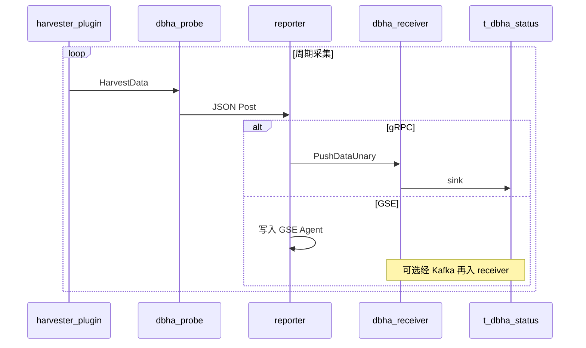

# 流程：采集与上报

Probe 按配置启动 harvester 插件，周期采集实例状态，经 reporter 上报到 Receiver（gRPC）或 GSE；Receiver 将数据 sink 到 MySQL，供 Analysis 消费。

相关文档：[架构总览](../architecture/overview.md) · [配置下发](config-sync.md) · [文档索引](../README.md)

Admin 下发默认写入 GSE reporter 块；运行时 gRPC / GSE 二选一见下。改 gRPC 上报需改本地 `probe.yaml`（见 [配置下发](config-sync.md)）。

## 1. 参与方

| 角色 | 说明 |
|------|------|
| **harvester** | MySQL / mysqlProxyAdmin / Redis 等插件（[`internal/probe/harvester`](../../internal/probe/harvester)） |
| **dbha-probe** | 框架：拉起插件、序列化 `HarvestData`、调用 reporter（[`probe.go`](../../internal/probe/probe.go)） |
| **reporter** | 按配置选择 GSE 或 gRPC→receiver（[`internal/probe/client`](../../internal/probe/client)） |
| **dbha-receiver** | `PushDataUnary` 或 Kafka source → MySQL sink |
| **t_dbha_status** | 探测状态落库表 |

## 2. 工作原理

1. Probe 启动时按工厂配置创建插件（见 `factory.go`），每个插件独立 `Harvest` 协程。
2. 插件产出 `*plugin.HarvestData`（业务侧对应 [`haprobe`](../../pkg/storage/haprobe) 状态结构）。
3. 框架 JSON 序列化后调用 `reporter.Post`。
4. Reporter 路径二选一（或按环境配置）：
   - **gRPC**：`ReceiverService.PushDataUnary`（[`receiver.proto`](../../pkg/proto/idl/receiver.proto)）
   - **GSE**：写入本机 GSE Agent（可选 `localSocketPort`）；下游可经 Kafka 再被 receiver 消费
5. Receiver sink 写入 `t_dbha_status`，供 analysis 扫描。

### 采集类别（`harvest_type`）

MySQL harvester 分成三个独立定时循环，各自按自己的间隔上报，用 `harvest_type` 区分；Redis 等其他 DB 只有 `default` 一类。

| `harvest_type` | 间隔配置 | 内容 |
|----------------|----------|------|
| `default` | `interval` | 全量状态（主机指标、GlobalStatus、proxy backends、spider 路由等） |
| `heartbeat` | `heartbeatInterval` | 写 `infodba_schema.dbha_heartbeat`（`sql_log_bin=OFF`），失败会 emit `dbha_heartbeat_write_failure` |
| `repldelay` | `replDelayInterval` | 主库写 `infodba_schema.dbha_repl_heartbeat`（`sql_log_bin=ON`），从库读复制来的行算 delay |

`harvest_type` 是 `t_dbha_status` 主键的一部分，同一实例的三类结果各占一行、互不覆盖。新增 DB 类型的 harvester 上报时必须设置 `HarvestType`；receiver 对未带该字段的旧版 probe 数据会兜底为 `default` 并打 warn，不丢数据。

### 探针自身指标（`probe` 字段）

框架在 [`internal/probe/selfmetric`](../../internal/probe/selfmetric) 以**固定 60 秒**周期采样当前 **worker** 进程自身指标（与 harvester `interval` 解耦），在 `runPlugin` 挂到 `HarvestData.probe` 后随实例状态上报，并落到 `t_dbha_status.probe` JSON 列。

| 项 | 说明 |
|----|------|
| **采集范围** | 仅 worker；guard / keepalive 不进入 `Probe.Run`，不采样 |
| **内容** | 构建版本（version / git_tag / git_hash / build_time）、进程 CPU/内存、启动时间、运行时长 |
| **CPU 语义** | 单核基准（与 top `%CPU` 一致），多核上可超过 100；携带 `num_cpu` 供归一化 |
| **运行时长** | 操作系统 tick 口径（Linux `/proc`，Windows `GetTickCount64`），不受系统时间调整影响 |
| **启动时刻** | 绝对时间，**不能** tick 免疫（Linux 依赖 `btime`，会随墙钟调整变化） |
| **新鲜度** | `sampled_at` 为采样时刻；与 `report_timestamp` 的差值表示快照陈旧程度 |
| **重启瞬间** | upsert 全字段覆盖：首次采样完成前若刚好上报，`probe` 列可能为 NULL，下一轮自愈，不是采集故障 |

### 两类 version（勿混淆）

| 名称 | 含义 |
|------|------|
| **`ProbeMetric.version`** | 二进制构建版本（`-ldflags -X` 注入） |
| **probe.yaml `version` / `configVersion`** | 配置版本（与 Admin Heartbeat 的配置同步相关） |

### 两类 Heartbeat（勿混淆）

| 名称 | 含义 | 位置 |
|------|------|------|
| **Admin gRPC Heartbeat** | Probe 进程 / 配置连接存活上报 | AdminService |
| **dbha_heartbeat / dbha_repl_heartbeat** | 探针自有心跳表读写与延迟，作为探测指标 | MySQL harvester → 状态字段；切换侧读 `dbha_repl_heartbeat` 并用 `AllowedMaxHeartbeatDelay` 等策略参数 |

### 升级顺序与回滚

`t_dbha_status` 新增 `probe` 列由 `dbha-admin migrate`（GORM AutoMigrate）完成。

**升级顺序（硬约束）**：先 `dbha-admin migrate` → 再升 receiver → 最后升 probe。若 receiver 已升级而表尚无 `probe` 列，全字段 upsert 会因 `Unknown column 'probe'` 失败，实例状态全部写不进库。

**回滚 / 止血**：立刻补跑 migrate（推荐），或回滚 receiver。probe 侧无需回滚；多出的 `probe` JSON 字段会被旧 receiver 忽略。

**`harvest_type` 主键（需人工处理）**：`t_dbha_status` 主键新增 `harvest_type`，而 AutoMigrate 只加列不改主键。已有环境升级后需手工调整主键（把 `harvest_type` 加入主键），否则三类采集会因 `OnConflict UpdateAll` 相互覆盖，只剩最后一次写入。

## 3. 交互顺序图

## 4. 关键代码路径

| 步骤 | 路径 |
|------|------|
| Probe 框架 | [`internal/probe/probe.go`](../../internal/probe/probe.go)、[`run.go`](../../internal/probe/run.go) |
| 探针自身采样 | [`internal/probe/selfmetric`](../../internal/probe/selfmetric)、[`pkg/process` uptime](../../pkg/process/uptime.go) |
| 插件工厂 | [`internal/probe/factory.go`](../../internal/probe/factory.go) |
| MySQL / Redis / Proxy | [`internal/probe/harvester/`](../../internal/probe/harvester) |
| Reporter 创建 | [`internal/probe/client/reporter.go`](../../internal/probe/client/reporter.go) |
| GSE / Receiver 客户端 | [`client/gse.go`](../../internal/probe/client/gse.go)、[`client/receiver.go`](../../internal/probe/client/receiver.go) |
| Receiver 入库 | [`internal/receiver/source`](../../internal/receiver/source)、[`internal/receiver/sink`](../../internal/receiver/sink) |
| 状态模型 | [`pkg/storage/hamodel/hadata.go`](../../pkg/storage/hamodel/hadata.go)、[`pkg/storage/haprobe`](../../pkg/storage/haprobe) |

## 5. Keepalive（运维可选）

Probe 可另开 keepalive HTTP（`--ping-http-addr`），供运维 / 人工确认边缘进程可达。启停脚本见 `scripts/start-probe-keepalive.*`。该路径与 analysis 二次探测（SSH + `dbha-probe health -j`）**解耦**，**不替代**业务实例探测，也不参与入窗判定。

harvester 建连失败会 emit `DetectFailure`（`connection exception`），MySQL 心跳写失败会 emit `dbha_heartbeat_write_failure`；两者写入 `HarvestData.Events` 后仅作为 Analysis 二次探测候选，**不直接入窗**；入窗细则见 [mysql-detection-design.md §5](../detection/mysql-detection-design.md) 与 [故障判定与切换](failure-detection-and-failover.md)。
