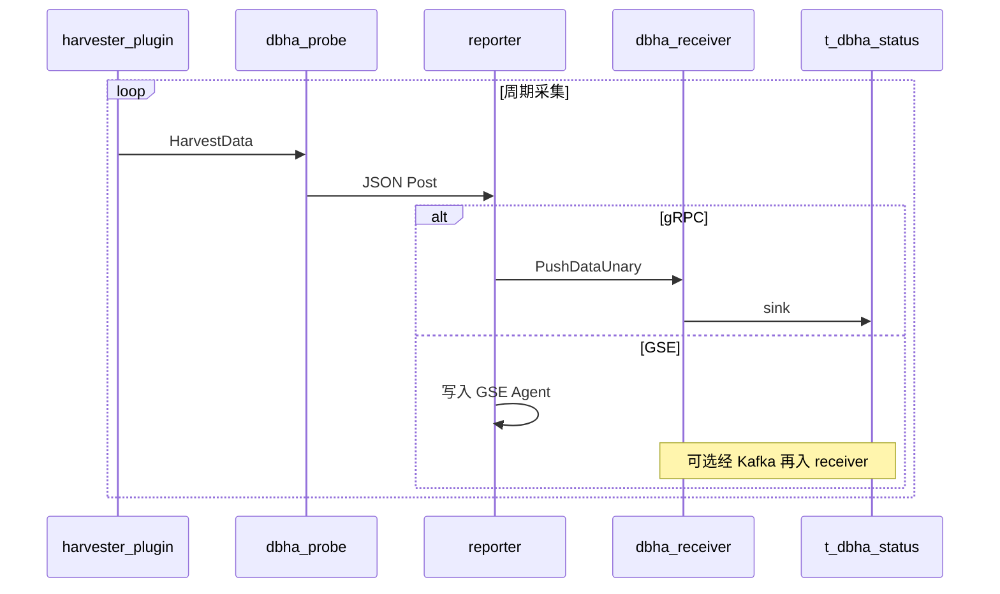

# 流程：采集与上报

Probe 按配置启动 harvester 插件，周期采集实例状态，经 reporter 上报到 Receiver（gRPC）或 GSE；Receiver 将数据 sink 到 MySQL，供 Analysis 消费。

相关文档：[架构总览](../architecture/overview.md) · [配置下发](config-sync.md) · [流程索引](README.md)

## 1. 参与方

| 角色 | 说明 |
|------|------|
| **harvester** | MySQL / mysqlProxyAdmin / Redis 等插件（[`internal/probe/harvester`](../../internal/probe/harvester)） |
| **dbha-probe** | 框架：拉起插件、序列化 `HarvestData`、调用 reporter（[`probe.go`](../../internal/probe/probe.go)） |
| **reporter** | 按配置选择 GSE 或 gRPC→receiver（[`internal/probe/client`](../../internal/probe/client)） |
| **dbha-receiver** | `PushDataUnary` 或 Kafka source → MySQL sink |
| **t_dbha_status** | 探测状态落库表 |

## 2. 工作原理

1. Probe 启动时按工厂配置创建插件（见 `factory.go`），每个插件独立 `Harvest` 协程。
2. 插件产出 `*plugin.HarvestData`（业务侧对应 [`haprobe`](../../pkg/storage/haprobe) 状态结构）。
3. 框架 JSON 序列化后调用 `reporter.Post`。
4. Reporter 路径二选一（或按环境配置）：
   - **gRPC**：`ReceiverService.PushDataUnary`（[`receiver.proto`](../../pkg/proto/idl/receiver.proto)）
   - **GSE**：写入本机 GSE Agent（可选 `localSocketPort`）；下游可经 Kafka 再被 receiver 消费
5. Receiver sink 写入 `t_dbha_status`，供 analysis 扫描。

### 两类 Heartbeat（勿混淆）

| 名称 | 含义 | 位置 |
|------|------|------|
| **Admin gRPC Heartbeat** | Probe 进程 / 配置连接存活上报 | AdminService |
| **master_slave_heartbeat** | MySQL 主从心跳表读写与延迟，作为探测指标 | MySQL harvester → 状态字段；切换侧可用 `AllowedMaxHeartbeatDelay` 等策略参数 |

## 3. 交互顺序图

## 4. 关键代码路径

| 步骤 | 路径 |
|------|------|
| Probe 框架 | [`internal/probe/probe.go`](../../internal/probe/probe.go)、[`run.go`](../../internal/probe/run.go) |
| 插件工厂 | [`internal/probe/factory.go`](../../internal/probe/factory.go) |
| MySQL / Redis / Proxy | [`internal/probe/harvester/`](../../internal/probe/harvester) |
| Reporter 创建 | [`internal/probe/client/reporter.go`](../../internal/probe/client/reporter.go) |
| GSE / Receiver 客户端 | [`client/gse.go`](../../internal/probe/client/gse.go)、[`client/receiver.go`](../../internal/probe/client/receiver.go) |
| Receiver 入库 | [`internal/receiver/source`](../../internal/receiver/source)、[`internal/receiver/sink`](../../internal/receiver/sink) |
| 状态模型 | [`pkg/storage/hamodel/hadata.go`](../../pkg/storage/hamodel/hadata.go)、[`pkg/storage/haprobe`](../../pkg/storage/haprobe) |

## 5. Keepalive（辅助）

Probe 可另开 keepalive HTTP（`--ping-http-addr`），供 analysis 二次探测时确认边缘进程可达。启停脚本见 `scripts/start-probe-keepalive.*`。该路径**不替代**业务实例探测，只辅助主机 / 进程存活判断。
