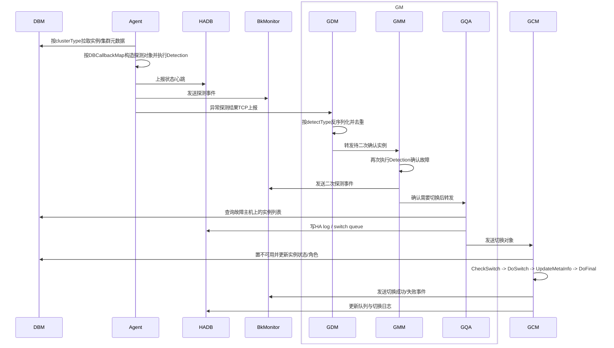
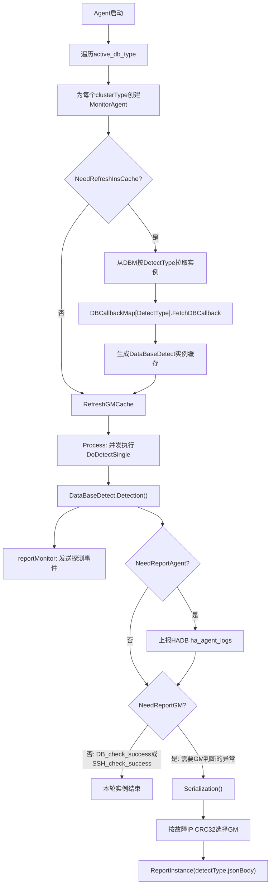
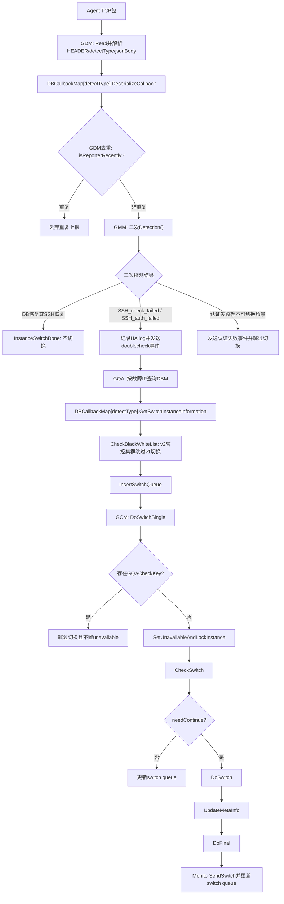
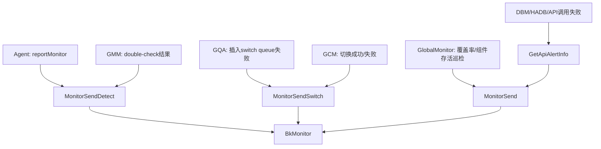

# DBHA v1 故障探测文档索引

## 范围说明

本索引汇总 `dbha-v2/docs` 下基于 `dbha-v1` 源码提炼的故障探测/切换设计文档。

本轮覆盖范围（按当前计划）：

- Redis
- MySQL
- SQLServer
- MongoDB（Mongos）
- Riak（已不再提供相关服务）

---

## DBHA v1 总体架构

DBHA v1 通过启动参数区分运行模式：`agent` 负责按 DB 类型探测实例，`gm` 负责接收异常、二次确认与执行切换，`monitor` 负责全局监控注册。入口逻辑见
[`dbha.go`](../ha-module/dbha.go)。



### 对象职责说明

| 对象 | 职责 |
| --- | --- |
| `DBM` | 保存实例、集群、角色、状态等元数据；供 Agent 拉取探测目标，供 GQA/GCM 查询和更新切换相关元数据。 |
| `Agent` | 按 `active_db_type` / `clusterType` 拉取实例，构造 `DataBaseDetect`，执行主动探测，上报 HADB 与 BkMonitor，并将需要 GM 判断的异常上报 GDM。 |
| `HADB` | 保存 DBHA 组件状态、Agent 探测日志、HA 日志、switch queue 与切换结果。 |
| `BkMonitor` | 接收 DBHA 的探测、二次探测、切换、全局巡检与 API 异常事件。 |
| `GM` | 故障接收、二次确认和切换决策的总控进程。 |
| `GDM` | GM 内部接收 Agent TCP 包，按 `detectType` 反序列化并去重。 |
| `GMM` | GM 内部执行二次探测，确认是否进入切换。 |
| `GQA` | GM 内部根据故障主机查询同机实例、构造切换对象、检查 v2 黑白名单、写 switch queue。 |
| `GCM` | 执行具体切换动作，包含置不可用、`CheckSwitch`、`DoSwitch`、`UpdateMetaInfo`、`DoFinal`、上报结果。 |

核心代码：

- Agent 启动：[`dbha.go`](../ha-module/dbha.go)
- GM 组件装配：[`gm.go`](../ha-module/gm/gm.go)
- Agent 探测循环：[`monitor_agent.go`](../ha-module/agent/monitor_agent.go)

---

## Agent 通用探测流程

Agent 对 DB 类型的感知来自 `active_db_type` 配置。每个 `clusterType` 会创建一个 `MonitorAgent`，并通过 `DBCallbackMap[DetectType]` 找到对应 DB 的实例拉取回调，将 DBM 返回值转换为统一的 `DataBaseDetect`。



核心代码：

- Agent 主循环：[`monitor_agent.go`](../ha-module/agent/monitor_agent.go)
- DB 回调注册：[`register.go`](../ha-module/dbmodule/register.go)

---

## GM 通用诊断与切换流程

GM 内部由四个模块串联：`GDM -> GMM -> GQA -> GCM`。各模块通过 channel 传递 `DoubleCheckInstanceInfo` 或 `DataBaseSwitch`，主流程与具体 DB 类型解耦，差异落在 `DBCallbackMap` 及具体 DB 的 `DataBaseDetect` / `DataBaseSwitch` 实现中。



核心代码：

- GDM：[`gdm.go`](../ha-module/gm/gdm.go)
- GMM：[`gmm.go`](../ha-module/gm/gmm.go)
- GQA：[`gqa.go`](../ha-module/gm/gqa.go)
- GCM：[`gcm.go`](../ha-module/gm/gcm.go)

---

## BkMonitor 事件与数据结构

DBHA v1 通过 `monitor` 包向 BkMonitor 上报事件。这里的 `BkMonitor` 指事件接收与可观测系统；源码包名仍为
[`monitor`](../ha-module/monitor/monitor.go)。

### 上报入口

| 入口 | 主要调用方 | 用途 |
| --- | --- | --- |
| `MonitorSendDetect` | Agent / GMM | 上报主动探测与二次探测事件 |
| `MonitorSendSwitch` | GQA / GCM | 上报切换成功或失败事件 |
| `MonitorSend` | monitor 包统一入口 | 发送 detect / switch / global / api 四类事件 |
| `GetApiAlertInfo` | Agent / GQA / Redis switch / GlobalMonitor | 构造 API 调用失败事件 |

源码：

- BkMonitor 数据结构与发送入口：[`monitor.go`](../ha-module/monitor/monitor.go)
- 事件常量：[`constant.go`](../ha-module/constvar/constant.go)

### 事件清单

| 类型 | 事件名 | 触发来源 |
| --- | --- | --- |
| 探测 | `dbha_detect_db_fail` | Agent 主动探测 DB 失败 |
| 探测 | `dbha_detect_ssh_fail` | Agent 主动探测 DB 失败后 SSH 也失败 |
| 探测 | `dbha_detect_ssh_auth_fail` | Agent SSH 认证失败 |
| 探测 | `dbha_detect_redis_auth_fail` | Agent Redis 鉴权失败 |
| 二次探测 | `dbha_doublecheck_ssh_fail` | GMM 二次探测仍确认 SSH 失败 |
| 二次探测 | `dbha_doublecheck_auth_fail` | GMM 二次探测确认鉴权失败 |
| 切换 | `dbha_redis_switch_succ` / `dbha_redis_switch_err` | Redis 家族切换成功 / 失败 |
| 切换 | `dbha_mysql_switch_ok` / `dbha_mysql_switch_err` | MySQL / TenDBHA / TenDBCluster 切换成功 / 失败 |
| 切换 | `dbha_sqlserver_switch_ok` / `dbha_sqlserver_switch_err` | SQLServer 切换成功 / 失败 |
| 切换 | `dbha_mongos_switch_succ` / `dbha_mongos_switch_err` | MongoDB Mongos 摘除成功 / 失败 |
| 切换 | `dbha_riak_switch_ok` / `dbha_riak_switch_err` | v1 常量仍存在；当前索引范围中 Riak 已不再提供相关服务 |
| 全局 | `dbha_global_monitor` | GlobalMonitor 覆盖率 / 组件存活巡检 |
| API | `dbha_call_api_fail` | DBM / HADB 等 API 调用失败 |

### 上报数据结构

精简结构体定义如下，字段来自 [`monitor.go`](../ha-module/monitor/monitor.go)：

```go
type MonitorInfo struct {
	EventName       string
	MonitorInfoType int
	Switch          SwitchMonitor
	Detect          DetectMonitor
	Global          GlobalMonitor
	ApiInfo         APIMonitor
}
```

```go
type DetectMonitor struct {
	ServerIp    string
	ServerPort  int
	Bzid        string
	MachineType string
	Status      string
	Cluster     string
	ClusterType string
	DBRole      string
}
```

```go
type SwitchMonitor struct {
	ServerIp                string
	ServerPort              int
	Bzid                    string
	MachineType             string
	Role                    string
	Status                  string
	Cluster                 string
	IDC                     string
	CheckID                 int64
	NewMasterHost           string
	NewMasterPort           int
	NewMasterBinlogFile     string
	NewMasterBinlogPosition uint64
}
```

```go
type GlobalMonitor struct {
	ServerIp             string
	UnCoveredCityIDs    []int
	UnCoveredInsNumber  int
	NeedDetectNumber    int
	HADetectedNumber    int
	Content              string
}
```

```go
type APIMonitor struct {
	ApiName string
	Message string
}
```

### 维度字段

`MonitorSend` 会根据 `MonitorInfoType` 展开不同维度：

| 类型 | 维度字段 |
| --- | --- |
| `MonitorInfoDetect` | `appid`、`server_ip`、`server_port`、`status`、`cluster_domain`、`machine_type`、`cluster_type`、`instance_role` |
| `MonitorInfoSwitch` | `instance_role`、`appid`、`server_ip`、`server_port`、`status`、`cluster_domain`、`machine_type`、`idc`、`double_check_id` |
| `MonitorInfoSwitch`（MySQL 主库成功切换补充） | `new_master_binlog_file`、`new_master_binlog_pos`、`new_master_host`、`new_master_port` |
| `MonitorInfoGlobal` | `server_ip`、`uncovered_ins_num`、`need_detect_num`、`ha_detect_num`、`uncovered_city_ids` |
| `MonitorInfoAPI` | `api_name`、`api_message` |

### 触发来源映射



---

## DB 类型无关的扩展点

- `DBCallbackMap[clusterType]` 决定 Agent 拉取、GM 反序列化、GQA 构造切换对象。
- `DataBaseDetect` 抽象 DB 探测，Agent/GMM 只调用 `Detection()`、`Serialization()` 等接口。
- `DataBaseSwitch` 抽象 DB 切换，GQA/GCM 只调用 `CheckSwitch()`、`DoSwitch()`、`UpdateMetaInfo()` 等接口。
- Agent、GDM、GMM、GQA、GCM 的主流程与具体 DB 类型解耦；DB 差异集中在 callback 与对应 DB 模块的结构实现中。

---

## 文档列表

- [`dbha-v1-redis-detection-design.md`](./dbha-v1-redis-detection-design.md)
- [`dbha-v1-mysql-detection-design.md`](./dbha-v1-mysql-detection-design.md)
- [`dbha-v1-sqlserver-detection-design.md`](./dbha-v1-sqlserver-detection-design.md)
- [`dbha-v1-mongodb-detection-design.md`](./dbha-v1-mongodb-detection-design.md)

---
