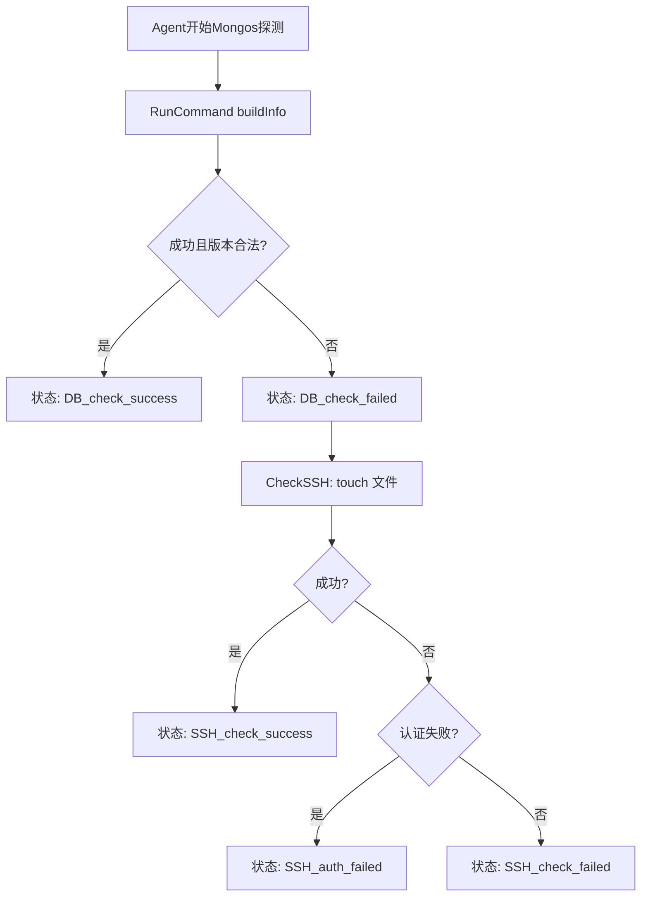

# DBHA v1 MongoDB（Mongos）故障探测设计文档

## 1. 背景与范围

本文档定义 DBHA v1 中 MongoDB 分片集群的故障探测与切换机制，覆盖 `clusterType`：

- `MongoShardedCluster`

本路径为 **mongos 代理层 HA**；不覆盖 `mongodb` 存储节点与 `mongo_config` 配置节点切换。

本文只描述 v1 代码实现与行为，不展开 v2 的实现细节；仅在黑白名单处说明与 v2 的交互边界。

---

## 2. 关键数据结构

### 2.1 通用探测结构

公共探测结构沿用 `BaseDetectDB` / `BaseDetectDBResponse`。

代码：[`dbm-services/common/dbha/ha-module/dbutil/db_detect.go`](../ha-module/dbutil/db_detect.go)

### 2.2 Mongos 探测结构

代码：[`dbm-services/common/dbha/ha-module/dbmodule/mongodb/mongos_detect.go`](../ha-module/dbmodule/mongodb/mongos_detect.go)

`MongosDetectInstance`（Agent/GMM 探测执行态）：

```go
type MongosDetectInstance struct {
	dbutil.BaseDetectDB
	User    string
	Pass    string
	Timeout int
}
```

`MongosDetectInstanceInfoFromCmDB`（DBM 实例转探测输入）：

```go
type MongosDetectInstanceInfoFromCmDB struct {
	Ip          string
	Port        int
	App         string
	ClusterType string
	MetaType    string
	Cluster     string
	DbRole      string
}
```

`MongosDetectResponse`（Agent->GM 上报包体）：

```go
type MongosDetectResponse struct {
	dbutil.BaseDetectDBResponse
}
```

结构关系：

- `NewMongosDetectInstanceForAgent`：Agent 侧将 `MongosDetectInstanceInfoFromCmDB` 转为 `MongosDetectInstance`。
- `DeserializeMongos` / `NewMongosDetectInstanceForGdm`：GM 侧从上报包体还原探测实例。
- MongoDB v1 HA 只构造 `mongos` 探测实例，不覆盖 `mongodb` / `mongo_config` 存储层探测切换。

### 2.3 Mongos 切换结构

代码：[`dbm-services/common/dbha/ha-module/dbmodule/mongodb/mongos_switch.go`](../ha-module/dbmodule/mongodb/mongos_switch.go)

`GwInfo`（接入层绑定信息）：

```go
type GwInfo struct {
	CLBFlag      bool
	DNSFlag      bool
	ServiceEntry dbutil.BindEntry
}
```

`MongosSwitch`（Mongos 切换实例）：

```go
type MongosSwitch struct {
	dbutil.BaseSwitch
	ApiGw GwInfo
	Role  string
}
```

结构关系：

- `ApiGw` 保存 DNS/CLB 绑定信息，`DoSwitch` 会据此从接入层摘除故障 `mongos`。
- `Role` 必须为 `mongos`，否则 `CheckSwitch` 会拒绝执行切换。
- `UpdateMetaInfo` 与 `RollBack` 在 v1 Mongos 路径中为空实现。

---

## 3. 枚举与类型清单

### 3.1 Mongo 相关 `clusterType` / machine_type

定义：[`dbm-services/common/dbha/ha-module/constvar/constant.go`](../ha-module/constvar/constant.go)

- `MongoShardedCluster = "MongoShardedCluster"`
- `Mongos = "mongos"`
- `MongodbMetaType = "mongodb"`
- `MongoConfigMetaType = "mongo_config"`

### 3.2 `status` 枚举

- `DB_check_success`
- `DB_check_failed`
- `SSH_check_success`
- `SSH_check_failed`
- `SSH_auth_failed`

---

## 4. `clusterType` 的作用与路由

Mongo 路径在 `DBCallbackMap` 中的映射：

| clusterType | Fetch（Agent） | Deserialize（GDM） | Switch（GQA） |
| --- | --- | --- | --- |
| `MongoShardedCluster` | `NewMongosInstanceByCmDB` | `DeserializeMongos` | `NewMongosSwitchInstance` |

代码：[`dbm-services/common/dbha/ha-module/dbmodule/register.go`](../ha-module/dbmodule/register.go)

重要路由约束：

- `NewMongosInstanceByCmDB` 只选择 `machine_type=mongos`。
- `NewMongosSwitchInstance` 也只生成 `mongos` 切换实例。

代码：[`dbm-services/common/dbha/ha-module/dbmodule/mongodb/mongos_callback.go`](../ha-module/dbmodule/mongodb/mongos_callback.go)

---

## 5. Agent 的 Mongo 探测机制

### 5.1 探测主流程



### 5.2 关键探测命令

代码：[`dbm-services/common/dbha/ha-module/dbmodule/mongodb/mongos_detect.go`](../ha-module/dbmodule/mongodb/mongos_detect.go)

- Mongo URI：`mongodb://{ip}:{port}`（无鉴权参数）
- 探测指令：`RunCommand({"buildInfo": 1})`
- 版本校验：匹配 `x.y.z` 模式
- SSH 探测：`touch ...`（通过 `BaseDetectDB.DoSSH`）

### 5.3 上报策略

与其他 DB 一致，`NeedReportGM` 在 `DB_check_success` / `SSH_check_success` 时不向 GM 上报。

代码：[`dbm-services/common/dbha/ha-module/agent/monitor_agent.go`](../ha-module/agent/monitor_agent.go)

---

## 6. 异常事件分层

探测事件：

- `dbha_detect_db_fail`
- `dbha_detect_ssh_fail`
- `dbha_detect_ssh_auth_fail`

二次探测事件：

- `dbha_doublecheck_ssh_fail`
- `dbha_doublecheck_auth_fail`

切换事件（mongos）：

- `dbha_mongos_switch_succ`
- `dbha_mongos_switch_err`

事件映射代码：[`dbm-services/common/dbha/ha-module/monitor/monitor.go`](../ha-module/monitor/monitor.go)

---

## 7. 端到端工作流

1. Agent 拉取 `MongoShardedCluster` 下 `mongos` 实例并探测。
2. 故障实例上报 GDM，GDM 反序列化为 `MongosDetectInstance`。
3. GMM 二次探测，确认 SSH 失败后送 GQA。
4. GQA 从 CMDB 获取同 IP 相关实例并构建 `MongosSwitch`。
5. GCM 执行切换（DNS/CLB 摘除），更新 queue 与 monitor 事件。

---

## 8. Agent 探测流程与 GM 切换流程

### 8.1 触发条件与切换动作

代码：[`dbm-services/common/dbha/ha-module/dbmodule/mongodb/mongos_switch.go`](../ha-module/dbmodule/mongodb/mongos_switch.go)

- 仅 `Role == mongos` 才可切换。
- 若 DNS 绑定仅 1 个 IP，则 `CheckSwitch` 拒绝切换（避免摘空）。
- `DoSwitch` 顺序：`KickOffDns` -> `KickOffClb`。
- `UpdateMetaInfo` 与 `RollBack` 当前为 no-op。

### 8.2 与 v2 共存边界

GQA 黑白名单命中后会设置 `GQACheckKey`，GCM 据此跳过 v1 切换执行。

代码：[`dbm-services/common/dbha/ha-module/gm/gqa.go`](../ha-module/gm/gqa.go)

---

## 9. 关键代码索引

- Mongos 回调：[`dbmodule/mongodb/mongos_callback.go`](../ha-module/dbmodule/mongodb/mongos_callback.go)
- Mongos 探测：[`dbmodule/mongodb/mongos_detect.go`](../ha-module/dbmodule/mongodb/mongos_detect.go)
- Mongos 切换：[`dbmodule/mongodb/mongos_switch.go`](../ha-module/dbmodule/mongodb/mongos_switch.go)
- 回调注册：[`dbmodule/register.go`](../ha-module/dbmodule/register.go)
- Agent：[`agent/monitor_agent.go`](../ha-module/agent/monitor_agent.go)
- GM：[`gm/gm.go`](../ha-module/gm/gm.go)
- 全局监控组件：[`globalmonitor/monitor_component.go`](../ha-module/globalmonitor/monitor_component.go)
