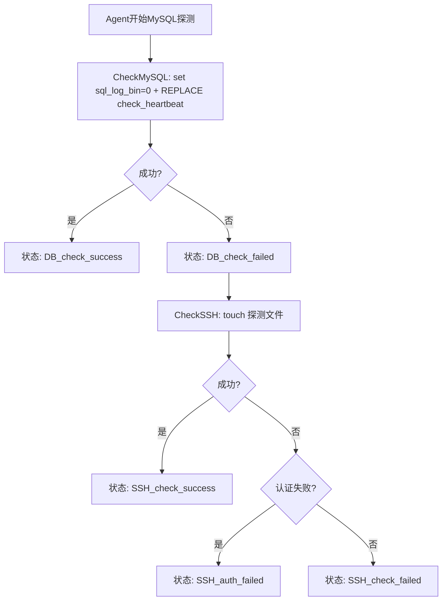
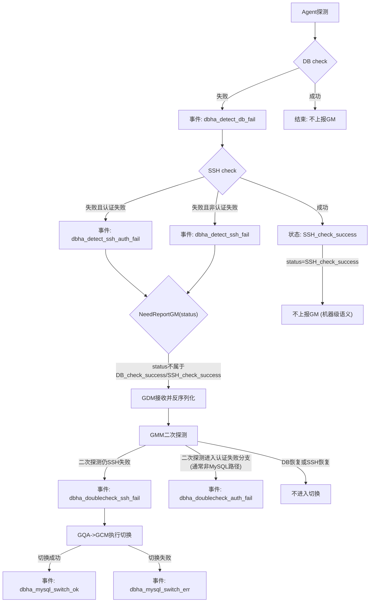
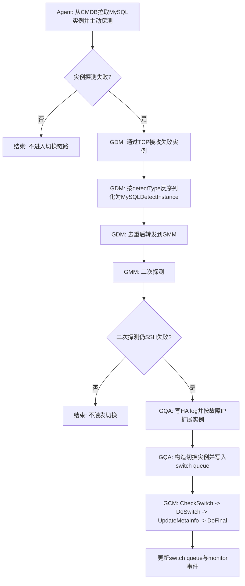
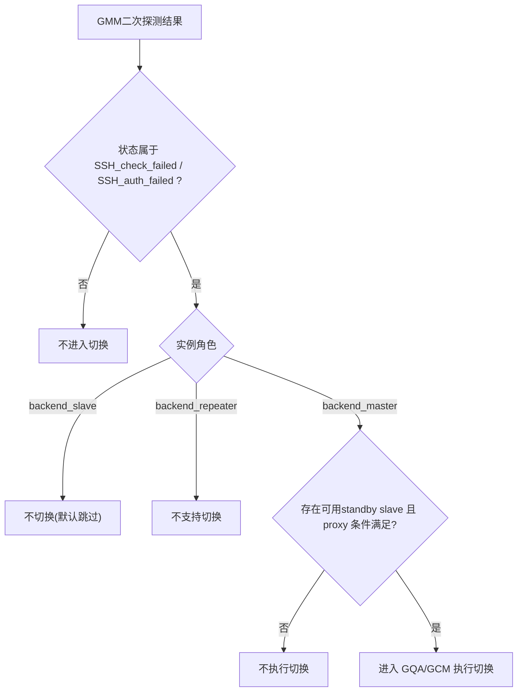

# DBHA v1 MySQL 故障探测设计文档

## 1. 背景与范围

本文档定义 DBHA v1 中 MySQL 家族的故障探测与切换机制，覆盖以下 `clusterType`：

- `tendbha`（TenDBHA）
- `tendbcluster`（TenDBCluster）

---

## 2. 关键数据结构

### 2.1 通用探测结构

代码：[`dbm-services/common/dbha/ha-module/dbutil/db_detect.go`](../ha-module/dbutil/db_detect.go)

`BaseDetectDB`（Agent/GMM 内存态）定义要点：

```go
type BaseDetectDB struct {
	Ip, App, DBRole, Cluster, ClusterType string
	Port, ClusterId, ReportInterval, RetryNumber int
	DBType types.DBType
	Status types.CheckStatus
	SshInfo Ssh
}
```

`BaseDetectDBResponse`（Agent->GM 上报包体）定义要点：

```go
type BaseDetectDBResponse struct {
	DBIp, DBRole, DBType, App, Status, Cluster, ClusterType string
	DBPort, ClusterId int
}
```

字段语义：

- `BaseDetectDB`：探测执行态，包含连接目标、状态机字段（`Status`）和探测策略字段（`RetryNumber`、`SshInfo`）。
- `BaseDetectDBResponse`：传输态，保留 GM 二次探测所需核心字段（`db_ip/db_port/status/cluster_type` 等）。

### 2.2 MySQL 探测结构

代码：[`dbm-services/common/dbha/ha-module/dbmodule/dbmysql/MySQL_detect.go`](../ha-module/dbmodule/dbmysql/MySQL_detect.go)

`MySQLDetectInstance` 定义：

```go
type MySQLDetectInstance struct {
	dbutil.BaseDetectDB
	User, Pass string
	Timeout    int
	realDB     *gorm.DB
	dbMutex    sync.Mutex
}
```

`MySQLDetectInstanceInfoFromCmDB` 定义：

```go
type MySQLDetectInstanceInfoFromCmDB struct {
	Ip, ClusterType, MetaType, Cluster, DbRole string
	Port int
	App  string
}
```

`MySQLDetectResponse` 定义：

```go
type MySQLDetectResponse struct {
	dbutil.BaseDetectDBResponse
}
```

结构关系（结合代码）：

- `AgentNewMySQLDetectInstance`：将 `MySQLDetectInstanceInfoFromCmDB` 转为 `MySQLDetectInstance`，并初始化 `Status=DB_check_success`、`RetryNumber=1`。
- `Serialization()`：将 `MySQLDetectInstance` 转成 `MySQLDetectResponse` 上报 GM。
- `GMNewMySQLDetectInstance`：GM 侧从 `MySQLDetectResponse` 还原探测实例用于二次探测。

### 2.3 MySQL 切换结构

代码：[`dbm-services/common/dbha/ha-module/dbmodule/dbmysql`](../ha-module/dbmodule/dbmysql)

通用父类（共享字段）：

```go
type MySQLCommonSwitch struct {
	dbutil.BaseSwitch
	Role        string
	StandBySlave dbutil.SlaveInfo
	Entry       dbutil.BindEntry
}
```

```go
type SpiderCommonSwitch struct {
	MySQLCommonSwitch
	ClusterName string
	SpiderNodes []dbutil.DBInstanceInfoDetail
	RouteTable  []RouteInfo
	PrimaryTdbctl, NewPrimaryTdbctl *TdbctlInfo
}
```

具体切换结构（按 machine_type）：

```go
type MySQLSwitch struct {
	MySQLCommonSwitch
	AdminPort int
	Proxy     []dbutil.ProxyInfo
	Dumper    []dbutil.DumperInfo
	IsStandBy bool
}
```

```go
type MySQLProxySwitch struct {
	MySQLCommonSwitch
	AdminPort int
}
```

```go
type SpiderStorageSwitch struct {
	SpiderCommonSwitch
	Proxy []dbutil.ProxyInfo
}
```

```go
type SpiderProxyLayerSwitch struct {
	SpiderCommonSwitch
	AdminPort      int
	SecondaryNodes []TdbctlNodes
}
```

代码位置：

- [`MySQLBackend_switch.go`](../ha-module/dbmodule/dbmysql/MySQLBackend_switch.go)
- [`MySQLProxy_switch.go`](../ha-module/dbmodule/dbmysql/MySQLProxy_switch.go)
- [`SpiderStorageLayer_switch.go`](../ha-module/dbmodule/dbmysql/SpiderStorageLayer_switch.go)
- [`SpiderProxyLayer_switch.go`](../ha-module/dbmodule/dbmysql/SpiderProxyLayer_switch.go)

---

## 3. 枚举与类型清单

### 3.1 MySQL 相关 `clusterType`

定义：[`dbm-services/common/dbha/ha-module/constvar/constant.go`](../ha-module/constvar/constant.go)

- `tendbha`
- `tendbcluster`

### 3.2 MySQL 相关 machine_type 与 role

定义：[`dbm-services/common/dbha/ha-module/constvar/constant.go`](../ha-module/constvar/constant.go)

- machine_type：`backend`、`proxy`、`remote`、`spider`
- role：`backend_master` / `backend_slave` / `backend_repeater`，`remote_master` / `remote_slave`，`spider_master` / `spider_slave`

### 3.3 `status` 枚举

定义：[`dbm-services/common/dbha/ha-module/constvar/constant.go`](../ha-module/constvar/constant.go)

- `DB_check_success`
- `DB_check_failed`
- `SSH_check_success`
- `SSH_check_failed`
- `SSH_auth_failed`

---

## 4. `clusterType` 的作用与路由

`clusterType` 是 v1 的端到端主路由键：

1. Agent 按 `active_db_type` 创建对应 `MonitorAgent`。
2. Agent 查询 CMDB 时以 `cluster_type` 过滤实例。
3. Agent 上报 GM 包头 `detectType` 使用 `clusterType`。
4. GM 收包后按 `DBCallbackMap[detectType]` 反序列化并进入二次探测。

关键代码：

- 回调映射：[`dbm-services/common/dbha/ha-module/dbmodule/register.go`](../ha-module/dbmodule/register.go)
- Agent 拉取与探测：[`dbm-services/common/dbha/ha-module/agent/monitor_agent.go`](../ha-module/agent/monitor_agent.go)
- Agent->GM 协议：[`dbm-services/common/dbha/ha-module/agent/connection.go`](../ha-module/agent/connection.go)
- GM 收包与反序列化：[`dbm-services/common/dbha/ha-module/gm/connection.go`](../ha-module/gm/connection.go)

MySQL 家族映射：

| clusterType | Fetch（Agent） | Deserialize（GDM） | Switch（GQA） |
| --- | --- | --- | --- |
| `tendbha` | `NewMySQLClusterByCmDB` | `DeserializeMySQL` | `NewMySQLSwitchInstance` |
| `tendbcluster` | `NewSpiderClusterByCmDB` | `DeserializeMySQL` | `NewMySQLSwitchInstance` |

---

## 5. Agent 的 MySQL 探测机制

### 5.1 探测主流程



### 5.2 关键探测语句

代码：[`dbm-services/common/dbha/ha-module/dbmodule/dbmysql/MySQL_detect.go`](../ha-module/dbmodule/dbmysql/MySQL_detect.go)

- `set sql_log_bin=0`
- `REPLACE INTO infodba_schema.check_heartbeat(uid) value(@@server_id)`

### 5.3 上报策略

代码：[`dbm-services/common/dbha/ha-module/agent/monitor_agent.go`](../ha-module/agent/monitor_agent.go)

- `NeedReportGM` 只在状态非 `DB_check_success` 且非 `SSH_check_success` 时上报 GM。
- 因此“DB 挂但 SSH 通”不会进入切换链路（机器级语义）。

---

## 6. 异常事件分层

探测事件（Agent）定义：[`dbm-services/common/dbha/ha-module/constvar/constant.go`](../ha-module/constvar/constant.go)

- `dbha_detect_db_fail`
- `dbha_detect_ssh_fail`
- `dbha_detect_ssh_auth_fail`

二次探测事件（GMM）：

- `dbha_doublecheck_ssh_fail`
- `dbha_doublecheck_auth_fail`（MySQL路径通常不使用）

切换事件（GCM）：

- `dbha_mysql_switch_ok`
- `dbha_mysql_switch_err`

事件下发入口：[`dbm-services/common/dbha/ha-module/monitor/monitor.go`](../ha-module/monitor/monitor.go)

### 6.1 事件流转与触发条件



---

## 7. 端到端工作流



关键代码：

- GDM：[`dbm-services/common/dbha/ha-module/gm/gdm.go`](../ha-module/gm/gdm.go)
- GMM：[`dbm-services/common/dbha/ha-module/gm/gmm.go`](../ha-module/gm/gmm.go)
- GQA：[`dbm-services/common/dbha/ha-module/gm/gqa.go`](../ha-module/gm/gqa.go)
- GCM：[`dbm-services/common/dbha/ha-module/gm/gcm.go`](../ha-module/gm/gcm.go)

---

## 8. Agent 探测流程与 GM 切换流程

### 8.1 主从切换触发条件（简化）



对应代码：

- [`dbm-services/common/dbha/ha-module/dbmodule/dbmysql/MySQLBackend_switch.go`](../ha-module/dbmodule/dbmysql/MySQLBackend_switch.go)
- [`dbm-services/common/dbha/ha-module/dbmodule/dbmysql/SpiderStorageLayer_switch.go`](../ha-module/dbmodule/dbmysql/SpiderStorageLayer_switch.go)
- [`dbm-services/common/dbha/ha-module/dbmodule/dbmysql/SpiderProxyLayer_switch.go`](../ha-module/dbmodule/dbmysql/SpiderProxyLayer_switch.go)

### 8.2 与 v2 共存边界

GQA 在黑白名单检查中会识别 v2 管控集群，命中后通过 `GQACheckKey` 阻断 v1 切换执行。

代码：[`dbm-services/common/dbha/ha-module/gm/gqa.go`](../ha-module/gm/gqa.go)

---

## 9. 关键代码索引

- 回调注册：[`dbmodule/register.go`](../ha-module/dbmodule/register.go)
- MySQL 探测：[`dbmodule/dbmysql/MySQL_detect.go`](../ha-module/dbmodule/dbmysql/MySQL_detect.go)
- MySQL 回调：[`dbmodule/dbmysql/MySQL_callback.go`](../ha-module/dbmodule/dbmysql/MySQL_callback.go)
- MySQL 切换（backend/proxy/spider）：[`dbmodule/dbmysql`](../ha-module/dbmodule/dbmysql)
- Agent 主流程：[`agent/monitor_agent.go`](../ha-module/agent/monitor_agent.go)
- GM 主流程：[`gm/gm.go`](../ha-module/gm/gm.go)
- 监控事件：[`monitor/monitor.go`](../ha-module/monitor/monitor.go)
