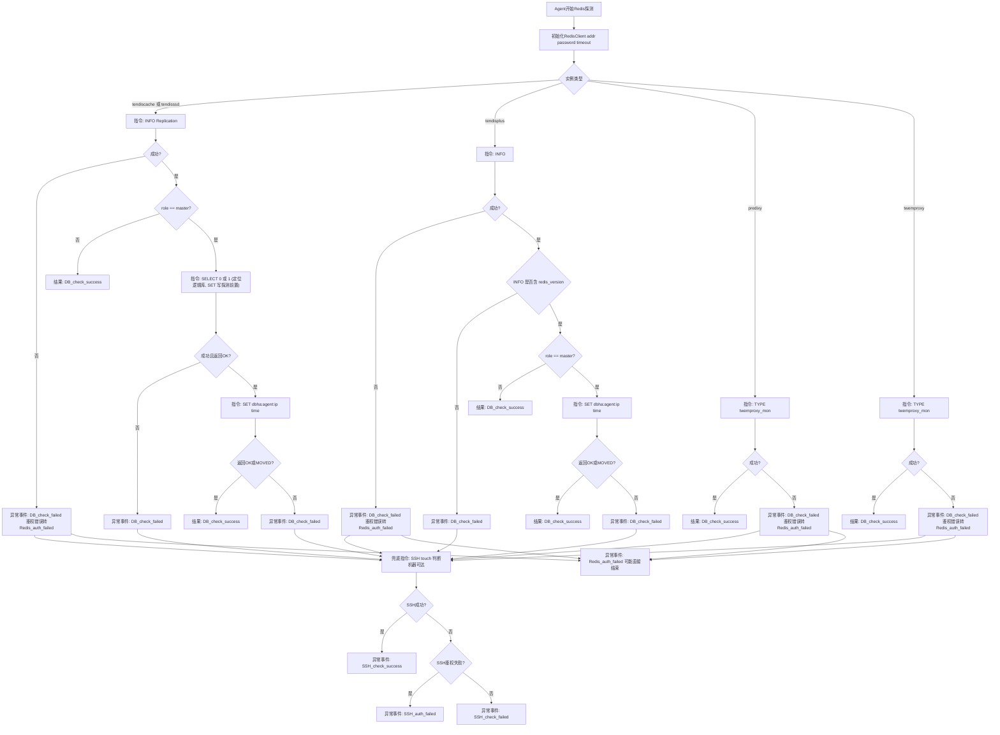
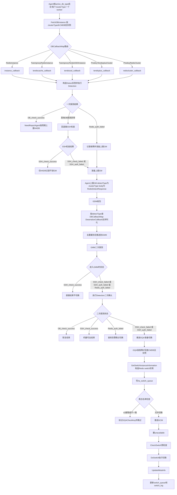
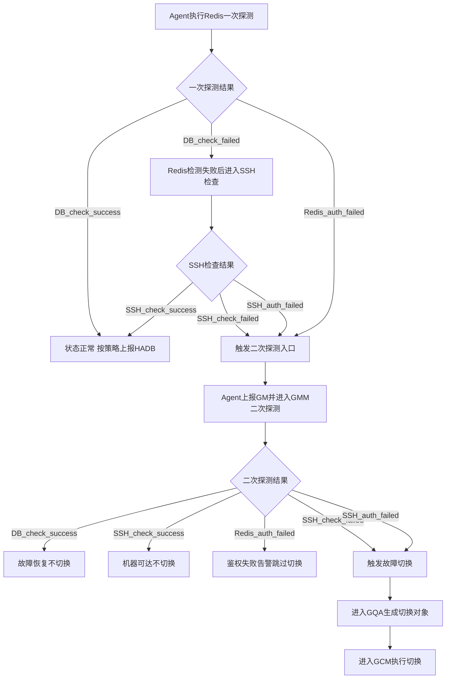

# DBHA v1 Redis 故障探测设计文档

## 1. 背景与范围

本文档定义 DBHA v1 中 Redis 家族的故障探测与切换机制，覆盖以下 `clusterType`：

- `RedisInstance`
- `TwemproxyRedisInstance`
- `TwemproxyTendisSSDInstance`
- `PredixyTendisplusCluster`
- `PredixyRedisCluster`

---

## 2. 关键数据结构

### 2.1 通用探测结构

`BaseDetectDB` 是探测态对象（Agent 内存中维护），`BaseDetectDBResponse` 是 Agent 序列化后上报给 GM 的公共包体。

代码：[`dbm-services/common/dbha/ha-module/dbutil/db_detect.go`](../ha-module/dbutil/db_detect.go)

`BaseDetectDB` 字段：

| 字段 | 含义 |
| --- | --- |
| `Ip` / `Port` | 探测目标实例地址 |
| `App` | 业务标识（`bk_biz_id`） |
| `DBType` | 探测态使用的类型，Redis 家族存放的是 machine_type（如 `tendiscache`） |
| `DBRole` | 实例角色（`instance_role`），缺省返回 `N/A` |
| `ReporterTime` / `ReportInterval` | 上报 HADB 的时间与周期 |
| `Status` | 当前探测状态（见第 3.3 节） |
| `Cluster` / `ClusterType` / `ClusterId` | 集群名 / 集群类型 / 集群 ID |
| `SshInfo` | SSH 兜底连接信息 |
| `RetryNumber` | 探测重试次数 |

### 2.2 上报包体字段清单（`BaseDetectDBResponse` + Redis 扩展）

`RedisDetectResponse` 在公共包体基础上增加 `pass` 字段，是 Agent 上报 Redis 故障实例的实际包体。

| JSON 字段 | 来源字段 | 说明 |
| --- | --- | --- |
| `db_ip` | `Ip` | 实例 IP |
| `db_port` | `Port` | 实例端口 |
| `db_role` | `DBRole` | 实例角色 |
| `db_type` | `DBType` | Redis 家族存放 machine_type（`tendiscache`/`twemproxy`/`predixy`/`tendisssd`/`tendisplus`） |
| `app` | `App` | 业务标识 |
| `status` | `Status` | 上报时的探测状态 |
| `cluster` | `Cluster` | 集群名 |
| `cluster_type` | `ClusterType` | 集群类型，作为 GM 反序列化路由键 |
| `cluster_id` | `ClusterId` | 集群 ID |
| `pass`（Redis 扩展） | `Pass` | 实例访问口令，供 GM 二次探测复用 |

说明：Redis 上报包体存在“双键”分工——包头 `detectType` 与包体 `cluster_type` 用 `ClusterType` 做路由，而包体 `db_type` 携带的是 machine_type。GM 反序列化时先按 `cluster_type` 选回调，再按 `db_type`（machine_type）区分存储节点与代理节点。

### 2.3 Redis 探测结构

代码：[`dbm-services/common/dbha/ha-module/dbmodule/redis/redis_base.go`](../ha-module/dbmodule/redis/redis_base.go)

`RedisDetectBase`（Agent/GMM 探测执行态）：

```go
type RedisDetectBase struct {
	dbutil.BaseDetectDB
	Pass    string
	Timeout int
}
```

`RedisDetectResponse`（Agent->GM 上报包体）：

```go
type RedisDetectResponse struct {
	dbutil.BaseDetectDBResponse
	Pass string `json:"pass"`
}
```

`RedisDetectInfoFromCmDB`（DBM 实例转探测输入）：

```go
type RedisDetectInfoFromCmDB struct {
	Ip          string
	Port        int
	App         string
	ClusterType string
	MetaType    string
	Pass        string
	Cluster     string
	ClusterId   int
	DbRole      string
}
```

结构关系：

- `GetDetectBaseByInfo`：Agent 侧将 `RedisDetectInfoFromCmDB` 转为 `RedisDetectBase`。
- `GetDetectBaseByRsp`：GM 侧将 `RedisDetectResponse` 还原为 `RedisDetectBase`，用于二次探测。
- `RedisDetectBase.GetDetectType()` 返回 `ClusterType`，作为 GM 反序列化和后续回调路由键。

### 2.4 Redis 切换实例结构

代码：[`dbm-services/common/dbha/ha-module/dbmodule/redis/redis_base.go`](../ha-module/dbmodule/redis/redis_base.go)

`RedisSwitchInfo`（存储节点切换实例）：

```go
type RedisSwitchInfo struct {
	dbutil.BaseSwitch
	AdminPort int
	Proxy     []dbutil.ProxyInfo
	Slave     []dbutil.SlaveInfo
	Pass      string
	Role      string
	Timeout   int
}
```

`RedisProxySwitchInfo`（代理节点切换实例）：

```go
type RedisProxySwitchInfo struct {
	dbutil.BaseSwitch
	AdminPort int
	ApiGw     GWInfo
	Pass      string
}
```

结构关系：

- `RedisSwitchInfo` 承载存储主从切换所需的代理列表、从库列表、角色和口令信息。
- `RedisProxySwitchInfo` 承载代理摘除所需的 `ApiGw`、管理端口和访问口令。
- `BaseSwitch` 提供 `Ip` / `Port` / `IdcID` / `Status` / `App` / `ClusterType` / `MetaType` / `Cluster` / `ClusterId` 及 DBM/HADB 客户端。

---

## 3. 枚举与类型清单

### 3.1 Redis 相关 `clusterType`

定义位置：
- [`dbm-services/common/dbha/ha-module/constvar/constant.go`](../ha-module/constvar/constant.go)

枚举值：

- `RedisInstance`
- `PredixyRedisCluster`
- `TwemproxyRedisInstance`
- `PredixyTendisplusCluster`
- `TwemproxyTendisSSDInstance`

### 3.2 Redis 相关 `db_type`

定义位置：
- [`dbm-services/common/dbha/ha-module/constvar/constant.go`](../ha-module/constvar/constant.go)

枚举值：

- `tendiscache` (`RedisMetaType`)
- `twemproxy` (`TwemproxyMetaType`)
- `predixy` (`PredixyMetaType`)
- `tendisssd` (`TendisSSDMetaType`)
- `tendisplus` (`TendisplusMetaType`)

### 3.3 `status` 枚举

定义位置：
- [`dbm-services/common/dbha/ha-module/constvar/constant.go`](../ha-module/constvar/constant.go)

枚举值：

- `DB_check_success`
- `DB_check_failed`
- `SSH_check_failed`
- `SSH_check_success`
- `SSH_auth_failed`
- `Redis_auth_failed`

---

## 4. `clusterType` 的作用与路由

在 v1 中，`clusterType` 是端到端主路由键：

1. Agent 按 `active_db_type` 拉取实例并调度探测。
2. Agent 向 CMDB 查询时以 `cluster_types` 过滤。
3. Agent 上报 GM 的包头 `detectType` 使用 `clusterType`。
4. GM 收包后按 `DBCallbackMap[detectType]` 做反序列化和后续处理。

关键代码：

- 回调映射：[`dbm-services/common/dbha/ha-module/dbmodule/register.go`](../ha-module/dbmodule/register.go)
- Agent 拉取与探测：[`dbm-services/common/dbha/ha-module/agent/monitor_agent.go`](../ha-module/agent/monitor_agent.go)
- Agent->GM 协议：[`dbm-services/common/dbha/ha-module/agent/connection.go`](../ha-module/agent/connection.go)
- GM 收包与反序列化：[`dbm-services/common/dbha/ha-module/gm/connection.go`](../ha-module/gm/connection.go)
- Redis 探测类型返回：[`dbm-services/common/dbha/ha-module/dbmodule/redis/redis_base.go`](../ha-module/dbmodule/redis/redis_base.go)

### 4.1 Redis `clusterType` 到回调的映射

`DBCallbackMap` 以 `clusterType` 为键注册三类回调（[`dbmodule/register.go`](../ha-module/dbmodule/register.go)）。Redis 家族部分：

| clusterType | Fetch（Agent 拉取） | Deserialize（GM 反序列化） | Switch（GQA 生成切换实例） |
| --- | --- | --- | --- |
| `RedisInstance` | `RedisInstanceNewIns` | `RedisInstanceDeserialize` | `RedisInstanceNewSwitchIns` |
| `TwemproxyRedisInstance` | `TendisCacheClusterNewIns` | `TendisCacheClusterDeserialize` | `TendisCacheClusterNewSwitchIns` |
| `TwemproxyTendisSSDInstance` | `TendisssdClusterNewIns` | `TendisssdClusterDeserialize` | `TendisssdClusterNewSwitchIns` |
| `PredixyTendisplusCluster` | `TendisplusClusterNewIns` | `TendisplusClusterDeserialize` | `TendisplusClusterNewSwitchIns` |
| `PredixyRedisCluster` | `RedisClusterNewIns` | `RedisClusterDeserialize` | `RedisClusterNewSwitchIns` |

### 4.2 Agent 主动探测对象与 GM 反序列化对象的差异

回调内部再按 machine_type 区分存储节点与代理节点。各 `clusterType` 的探测/切换对象集合：

| clusterType | Agent 主动探测对象（machine_type） | GM 反序列化可接收（machine_type） | 切换实例（machine_type 到 struct） |
| --- | --- | --- | --- |
| `RedisInstance` | `tendiscache` | `tendiscache` | `tendiscache`/`tendisssd` 到 `RedisSwitch` |
| `TwemproxyRedisInstance` | `tendiscache` + `twemproxy` | `tendiscache` + `twemproxy` | `tendiscache`/`tendisssd` 到 `RedisSwitch`；`twemproxy` 到 `TwemproxySwitch` |
| `TwemproxyTendisSSDInstance` | `tendisssd` + `twemproxy` | `tendisssd` + `twemproxy` | `tendisssd` 到 `RedisSwitch`；`twemproxy` 到 `TwemproxySwitch` |
| `PredixyTendisplusCluster` | `predixy` | `predixy` | `predixy` 到 `PredixySwitch` |
| `PredixyRedisCluster` | `predixy` | `predixy` + `tendiscache` | `predixy` 到 `PredixySwitch`；`tendiscache` 切换分支未接线（见 8.3） |

关键差异：`PredixyRedisCluster` 的 Agent 拉取阶段（`RedisClusterNewIns`）只为 `predixy` 代理生成探测实例，其 Redis 存储节点仅在 GM 反序列化（`RedisClusterDeserialize` 命中 `tendiscache` 分支，构造 `RedisClusterDetectInstance`）与二次探测路径上出现。这与 `TwemproxyRedisInstance`、`TwemproxyTendisSSDInstance` 的 Agent 同时拉取存储 + 代理不同。

---

## 5. Agent 的 Redis 探测机制

### 5.1 Agent 探测 Redis 工作流（含指令标注）

下图是 Agent 单次 Redis 探测的完整路径，命令级细节、`SELECT 0/1` 用途、SSH 回退语义均直接标注在节点上，图下图例给出补充说明。



代码：

- [`dbm-services/common/dbha/ha-module/dbmodule/redis/redis_detect.go`](../ha-module/dbmodule/redis/redis_detect.go)
- [`dbm-services/common/dbha/ha-module/dbmodule/redis/tendisplus_detect.go`](../ha-module/dbmodule/redis/tendisplus_detect.go)
- [`dbm-services/common/dbha/ha-module/dbmodule/redis/twemproxy_detect.go`](../ha-module/dbmodule/redis/twemproxy_detect.go)
- [`dbm-services/common/dbha/ha-module/dbmodule/redis/predixy_detect.go`](../ha-module/dbmodule/redis/predixy_detect.go)
- [`dbm-services/common/dbha/ha-module/dbmodule/redis/rediscluster_detect.go`](../ha-module/dbmodule/redis/rediscluster_detect.go)
- [`dbm-services/common/dbha/ha-module/dbmodule/redis/redis_base.go`](../ha-module/dbmodule/redis/redis_base.go)（SSH 兜底 `CheckSSH`）

图例与说明：

- 该图只聚焦 Agent 探测面，不展开 GQA/GCM 切换编排细节。
- 节点类型到指令映射：存储节点 `tendiscache`/`tendisssd` 用 `INFO Replication`，`tendisplus` 与集群下 redis 用 `INFO`，二者均经 `role` 判断后对 master 执行 `SET` 写探测；代理节点 `predixy`/`twemproxy` 用 `TYPE twemproxy_mon` 探活。
- `SELECT 0/1`：用于切换逻辑库，确保后续 `SET` 落在预期 DB，是写探测前置步骤，并非健康判定本身。
- SSH 回退：Redis 命令失败（非 Redis 鉴权失败）后执行 `touch` 判断机器可达，据结果置 `SSH_check_success` / `SSH_check_failed` / `SSH_auth_failed`；`Redis_auth_failed` 会提前返回，不走 SSH 兜底。
- 上报决策（与第 6 节一致）：`DB_check_success` / `SSH_check_success` 不进入 GM，其余异常进入 GM 二次探测。
- `PredixyRedisCluster` 范围说明：Agent 主动拉取阶段（`RedisClusterNewIns`）仅为 `predixy` 代理生成探测实例；**故图中不再绘制 “PredixyRedisCluster下redis” 分支**。该分支（`INFO Replication` + `SET`，由 `RedisClusterDetectInstance` 实现）在**正常数据流中不可达**：Agent 不为 PredixyRedisCluster 上报 tendiscache 报文，GM 反序列化（`RedisClusterDeserialize`）不会命中 `RedisMetaType` 分支，故无论 Agent 主动探测还是 GM 二次探测都不会实际探测其 redis 存储；代码仅作为预留入口存在。

---

## 6. 异常事件分层

### 6.1 Agent 一次探测可产生的异常事件

- `DB_check_failed`
- `Redis_auth_failed`
- `SSH_check_failed`
- `SSH_auth_failed`

说明：`DB_check_failed` 是中间态。DB 命令探测失败（非鉴权）后，`Detection()` 会立即执行 SSH 兜底并将状态覆盖为 `SSH_check_success` / `SSH_check_failed` / `SSH_auth_failed`，因此它不会作为 Agent 最终上报状态；`Redis_auth_failed` 例外，会提前返回、不走 SSH 兜底。

### 6.2 可触发二次探测（进入 GMM）的异常事件

- `SSH_check_failed`
- `SSH_auth_failed`
- `Redis_auth_failed`

说明：`NeedReportGM` 会过滤掉 `DB_check_success` 与 `SSH_check_success`。

### 6.3 可触发故障切换的异常事件

在 GMM 二次探测后，只有以下状态进入 GQA/GCM 切换链路：

- `SSH_check_failed`
- `SSH_auth_failed`

`Redis_auth_failed` 在二次探测后会告警并跳过切换。

关键代码：

- GMM 分流：[`dbm-services/common/dbha/ha-module/gm/gmm.go`](../ha-module/gm/gmm.go)
- Agent 上报 GM 判定：[`dbm-services/common/dbha/ha-module/agent/monitor_agent.go`](../ha-module/agent/monitor_agent.go)

---

## 7. 端到端工作流



---

## 8. Agent 探测流程与 GM 切换流程

### 8.1 故障检测及异常事件工作流程



### 8.2 机制说明（与流程图对应）

1. Agent 按 `clusterType` 拉取实例并执行命令级探测；异常时进入 SSH 兜底。
2. Agent 将状态写入 HADB，且将需要二次确认的异常状态上报 GM。
3. GDM 执行协议解析与去重，GMM 执行二次探测确认。
4. GQA 基于故障 IP 组装切换对象并做黑白名单边界控制。
5. GCM 执行切换闭环：`SetUnavailable -> CheckSwitch -> DoSwitch -> UpdateMetaInfo`。

### 8.3 Redis 各切换类型实现差异

Redis 家族按节点角色派生出 4 个切换实现，`CheckSwitch`/`DoSwitch`/`UpdateMetaInfo`/`RollBack` 行为差异较大：

| 切换实现 | 适用 machine_type | CheckSwitch | DoSwitch | UpdateMetaInfo | RollBack |
| --- | --- | --- | --- | --- | --- |
| `RedisSwitch`（存储，主从型） | `tendiscache` / `tendisssd` | 真实：从库为 slave 则跳过；校验从库数 >= 1、文件锁；非 `RedisInstance` 时校验 twemproxy 后端一致性；校验主从同步（`master_last_io_seconds_ago` <= 600） | 真实：对选定从库执行 `SLAVEOF NO ONE`；非 `RedisInstance` 时经 twemproxy `change nosqlproxy` 把后端切到新主并踢除异常 twemproxy | 真实：调用 CMDB `SwapRedisRole` 交换主从角色并解锁 | 空 |
| `TwemproxySwitch`（代理） | `twemproxy` | 空（return true） | 真实但仅做接入层摘除：`KickOffDns` / `KickOffClb` / `KickOffPolaris` | 空 | 空 |
| `PredixySwitch`（代理） | `predixy` | 空（return true） | 同上，仅做接入层摘除 | 空 | 空 |
| `TendisplusSwitch` / `RedisClusterSwitch`（集群存储） | `tendisplus` / 集群下 `tendiscache` | 空（return true） | 只读确认：遍历从库执行 `INFO`，确认是否已有从库自动提升为 master（`cluster_enabled:1` 且 `role:master`），不主动改变拓扑 | 空 | 空 |

要点：

- `RedisInstance` 为单实例主从，无代理层，`RedisSwitch` 仅执行 `SLAVEOF NO ONE` + `SwapRedisRole`；`TwemproxyRedisInstance` / `TwemproxyTendisSSDInstance` 额外执行 twemproxy 后端切换。
- 集群型（`PredixyTendisplusCluster` / `PredixyRedisCluster`）依赖 Redis Cluster / Tendisplus 自身的自动选主，DBHA 仅做确认，不写回元数据。
- 未接线说明：`PredixyRedisCluster` 的切换回调 `RedisClusterNewSwitchIns` 仅为 `predixy` 生成 `PredixySwitch`；其 `tendiscache` 存储切换分支（`NewRedisClulsterSwitchIns` 到 `RedisClusterSwitch`）在源码中被注释，因此 `RedisClusterSwitch` 当前不会被装配进切换队列。

代码：

- 存储切换：[`dbm-services/common/dbha/ha-module/dbmodule/redis/redis_switch.go`](../ha-module/dbmodule/redis/redis_switch.go)
- Twemproxy 切换：[`dbm-services/common/dbha/ha-module/dbmodule/redis/twemproxy_switch.go`](../ha-module/dbmodule/redis/twemproxy_switch.go)
- Predixy 切换：[`dbm-services/common/dbha/ha-module/dbmodule/redis/predixy_switch.go`](../ha-module/dbmodule/redis/predixy_switch.go)
- Tendisplus 切换：[`dbm-services/common/dbha/ha-module/dbmodule/redis/tendisplus_switch.go`](../ha-module/dbmodule/redis/tendisplus_switch.go)
- RedisCluster 切换：[`dbm-services/common/dbha/ha-module/dbmodule/redis/rediscluster_switch.go`](../ha-module/dbmodule/redis/rediscluster_switch.go)

---

## 9. 关键代码索引

### 常量与模型

- [`dbm-services/common/dbha/ha-module/constvar/constant.go`](../ha-module/constvar/constant.go)
- [`dbm-services/common/dbha/ha-module/dbutil/db_detect.go`](../ha-module/dbutil/db_detect.go)

### Redis 模块（基础与回调）

- [`dbm-services/common/dbha/ha-module/dbmodule/redis/redis_base.go`](../ha-module/dbmodule/redis/redis_base.go)
- [`dbm-services/common/dbha/ha-module/dbmodule/redis/instance_callback.go`](../ha-module/dbmodule/redis/instance_callback.go)
- [`dbm-services/common/dbha/ha-module/dbmodule/redis/tendiscache_callback.go`](../ha-module/dbmodule/redis/tendiscache_callback.go)
- [`dbm-services/common/dbha/ha-module/dbmodule/redis/tendisssd_callback.go`](../ha-module/dbmodule/redis/tendisssd_callback.go)
- [`dbm-services/common/dbha/ha-module/dbmodule/redis/tendisplus_callback.go`](../ha-module/dbmodule/redis/tendisplus_callback.go)
- [`dbm-services/common/dbha/ha-module/dbmodule/redis/rediscluster_callback.go`](../ha-module/dbmodule/redis/rediscluster_callback.go)

### Redis 模块（探测）

- [`dbm-services/common/dbha/ha-module/dbmodule/redis/redis_detect.go`](../ha-module/dbmodule/redis/redis_detect.go)
- [`dbm-services/common/dbha/ha-module/dbmodule/redis/twemproxy_detect.go`](../ha-module/dbmodule/redis/twemproxy_detect.go)
- [`dbm-services/common/dbha/ha-module/dbmodule/redis/predixy_detect.go`](../ha-module/dbmodule/redis/predixy_detect.go)
- [`dbm-services/common/dbha/ha-module/dbmodule/redis/tendisplus_detect.go`](../ha-module/dbmodule/redis/tendisplus_detect.go)
- [`dbm-services/common/dbha/ha-module/dbmodule/redis/rediscluster_detect.go`](../ha-module/dbmodule/redis/rediscluster_detect.go)

### Redis 模块（切换）

- [`dbm-services/common/dbha/ha-module/dbmodule/redis/redis_switch.go`](../ha-module/dbmodule/redis/redis_switch.go)
- [`dbm-services/common/dbha/ha-module/dbmodule/redis/twemproxy_switch.go`](../ha-module/dbmodule/redis/twemproxy_switch.go)
- [`dbm-services/common/dbha/ha-module/dbmodule/redis/predixy_switch.go`](../ha-module/dbmodule/redis/predixy_switch.go)
- [`dbm-services/common/dbha/ha-module/dbmodule/redis/tendisplus_switch.go`](../ha-module/dbmodule/redis/tendisplus_switch.go)
- [`dbm-services/common/dbha/ha-module/dbmodule/redis/rediscluster_switch.go`](../ha-module/dbmodule/redis/rediscluster_switch.go)

### 路由与调度

- [`dbm-services/common/dbha/ha-module/dbmodule/register.go`](../ha-module/dbmodule/register.go)
- [`dbm-services/common/dbha/ha-module/agent/monitor_agent.go`](../ha-module/agent/monitor_agent.go)
- [`dbm-services/common/dbha/ha-module/agent/connection.go`](../ha-module/agent/connection.go)
- [`dbm-services/common/dbha/ha-module/gm/connection.go`](../ha-module/gm/connection.go)
- [`dbm-services/common/dbha/ha-module/gm/gdm.go`](../ha-module/gm/gdm.go)
- [`dbm-services/common/dbha/ha-module/gm/gmm.go`](../ha-module/gm/gmm.go)
- [`dbm-services/common/dbha/ha-module/gm/gqa.go`](../ha-module/gm/gqa.go)
- [`dbm-services/common/dbha/ha-module/gm/gcm.go`](../ha-module/gm/gcm.go)

---

