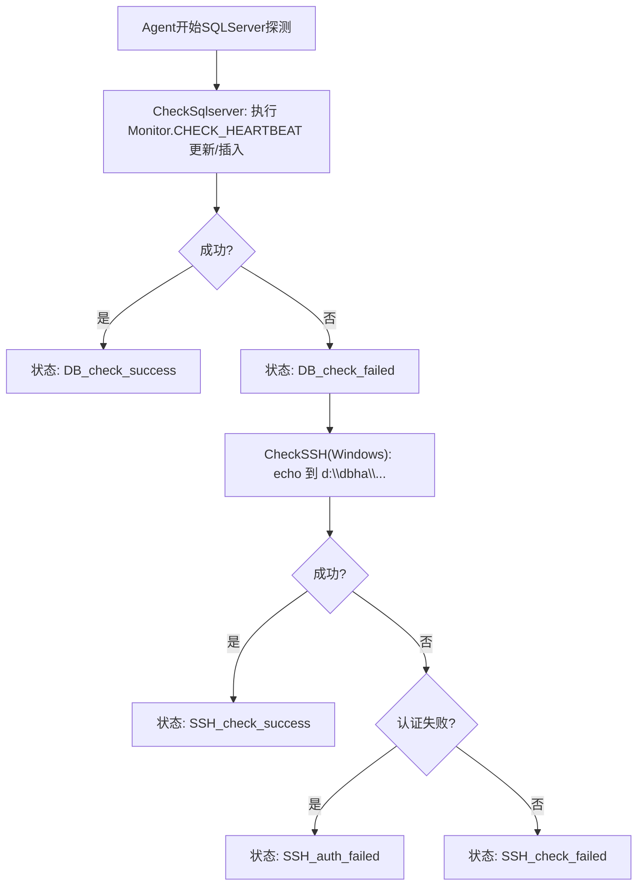

# DBHA v1 SQLServer 故障探测设计文档

## 1. 背景与范围

本文档定义 DBHA v1 中 SQLServer HA 的故障探测与切换机制，覆盖 `clusterType`：

- `sqlserver_ha`

---

## 2. 关键数据结构

### 2.1 通用探测结构

公共探测结构沿用 `BaseDetectDB` / `BaseDetectDBResponse`。

代码：[`dbm-services/common/dbha/ha-module/dbutil/db_detect.go`](../ha-module/dbutil/db_detect.go)

### 2.2 SQLServer 探测结构

代码：[`dbm-services/common/dbha/ha-module/dbmodule/sqlserver/sqlserver_detect.go`](../ha-module/dbmodule/sqlserver/sqlserver_detect.go)

`SqlserverDetectInstance`（Agent/GMM 探测执行态）：

```go
type SqlserverDetectInstance struct {
	dbutil.BaseDetectDB
	User    string
	Pass    string
	Timeout int
	realDB  *DbWorker
	dbMutex sync.Mutex
}
```

`SqlserverDetectInstanceInfoFromCmDB`（DBM 实例转探测输入）：

```go
type SqlserverDetectInstanceInfoFromCmDB struct {
	Ip          string
	Port        int
	App         string
	ClusterType string
	MetaType    string
	Cluster     string
	DbRole      string
}
```

`SqlserverDetectResponse`（Agent->GM 上报包体）：

```go
type SqlserverDetectResponse struct {
	dbutil.BaseDetectDBResponse
}
```

结构关系：

- `AgentNewSqlserverDetectInstance`：Agent 侧将 `SqlserverDetectInstanceInfoFromCmDB` 转为 `SqlserverDetectInstance`。
- `DeserializeSqlserver` / `GMNewSqlserverDetectInstance`：GM 侧从上报包体还原探测实例。
- `SqlserverDetectInstance.GetDetectType()` 返回 `ClusterType`，作为 GQA 构造切换实例时的回调路由键。

### 2.3 SQLServer 切换结构

代码：[`dbm-services/common/dbha/ha-module/dbmodule/sqlserver/sqlserver_switch.go`](../ha-module/dbmodule/sqlserver/sqlserver_switch.go)

`SqlserverSwitch`（SQLServer HA 切换实例）：

```go
type SqlserverSwitch struct {
	dbutil.BaseSwitch
	Role         string
	StandBySlave dbutil.SlaveInfo
	Entry        dbutil.BindEntry
}
```

结构关系：

- `Role` 复用 `backend_master` / `backend_slave` / `backend_repeater` 角色语义。
- `StandBySlave` 保存可提升为新主的备用从库。
- `Entry` 保存 DNS 等接入层绑定信息，供 `DoSwitch` 成功后更新入口。
- `CheckSwitch` / `DoSwitch` / `UpdateMetaInfo` 分别负责切换前校验、执行存储过程、回写元信息。

---

## 3. 枚举与类型清单

### 3.1 SQLServer 相关 `clusterType` / `db_type`

定义：[`dbm-services/common/dbha/ha-module/constvar/constant.go`](../ha-module/constvar/constant.go)

- `SqlserverHA = "sqlserver_ha"`
- `SqlserverMetatype = "sqlserver_ha"`

### 3.2 角色枚举

SQLServer 路径沿用 backend role 名称：

- `backend_master`
- `backend_slave`
- `backend_repeater`

定义：[`dbm-services/common/dbha/ha-module/constvar/constant.go`](../ha-module/constvar/constant.go)

### 3.3 `status` 枚举

- `DB_check_success`
- `DB_check_failed`
- `SSH_check_success`
- `SSH_check_failed`
- `SSH_auth_failed`

---

## 4. `clusterType` 的作用与路由

SQLServer 的 `DBCallbackMap` 注册：

| clusterType | Fetch（Agent） | Deserialize（GDM） | Switch（GQA） |
| --- | --- | --- | --- |
| `sqlserver_ha` | `NewSqlserverInstanceByCmDB` | `DeserializeSqlserver` | `NewSqlserverSwitchInstance` |

代码：[`dbm-services/common/dbha/ha-module/dbmodule/register.go`](../ha-module/dbmodule/register.go)

路由关键点：

1. Agent 使用 `detectType=sqlserver_ha` 上报。
2. GM 通过 `DBCallbackMap[detectType]` 反序列化。
3. GQA 使用同一 `detectType` 取切换实例构造器。

---

## 5. Agent 的 SQLServer 探测机制

### 5.1 探测主流程



### 5.2 关键探测语句/命令

代码：[`dbm-services/common/dbha/ha-module/dbmodule/sqlserver/sqlserver_detect.go`](../ha-module/dbmodule/sqlserver/sqlserver_detect.go)

- DB SQL：
  - `update [Monitor].[dbo].[CHECK_HEARTBEAT] set CHECK_TIME = GETDATE();`
  - `if @@rowcount=0 insert into [Monitor].[dbo].[CHECK_HEARTBEAT] values(GETDATE());`
- SSH（Windows）：
  - `echo __FILE_TOUCH_DONE__ > d:\dbha\{dest}_agent_{port}`

SQLServer 连接封装：[`dbm-services/common/dbha/ha-module/dbmodule/sqlserver/sqlserver_util.go`](../ha-module/dbmodule/sqlserver/sqlserver_util.go)

### 5.3 上报策略

与 MySQL 一致，`NeedReportGM` 在 `DB_check_success` / `SSH_check_success` 时不向 GM 上报。

代码：[`dbm-services/common/dbha/ha-module/agent/monitor_agent.go`](../ha-module/agent/monitor_agent.go)

---

## 6. 异常事件分层

探测事件：

- `dbha_detect_db_fail`
- `dbha_detect_ssh_fail`
- `dbha_detect_ssh_auth_fail`

二次探测事件：

- `dbha_doublecheck_ssh_fail`
- `dbha_doublecheck_auth_fail`（SQLServer路径通常不使用）

切换事件：

- `dbha_sqlserver_switch_ok`
- `dbha_sqlserver_switch_err`

事件映射代码：[`dbm-services/common/dbha/ha-module/monitor/monitor.go`](../ha-module/monitor/monitor.go)

---

## 7. 端到端工作流

1. Agent 拉取 `sqlserver_ha` 实例并探测。
2. 失败实例上报 GDM；GDM 按 `DeserializeSqlserver` 反序列化。
3. GMM 二次探测，确认 SSH 失败后进入 GQA。
4. GQA 构建 `SqlserverSwitch`，写 switch queue。
5. GCM 执行切换：置 `UNAVAILABLE` -> `CheckSwitch` -> `DoSwitch` -> `UpdateMetaInfo`。

---

## 8. Agent 探测流程与 GM 切换流程

### 8.1 切换条件与执行要点

代码：[`dbm-services/common/dbha/ha-module/dbmodule/sqlserver/sqlserver_switch.go`](../ha-module/dbmodule/sqlserver/sqlserver_switch.go)

- `backend_slave`：不触发切换。
- `backend_repeater`：不支持切换。
- `backend_master`：要求存在可用 standby slave。
- `DoSwitch`：在 standby 上调用 `MONITOR.DBO.Sys_AutoSwitch_LossOver`，成功后踢 DNS。
- `UpdateMetaInfo`：调用 CMDB `SwapSqlserverRole`。

### 8.2 与 v2 共存边界

若实例命中 v2 黑白名单策略，GQA 会打 `GQACheckKey` 并跳过 v1 切换执行。

代码：[`dbm-services/common/dbha/ha-module/gm/gqa.go`](../ha-module/gm/gqa.go)

---

## 9. 关键代码索引

- SQLServer 回调：[`dbmodule/sqlserver/sqlserver_callback.go`](../ha-module/dbmodule/sqlserver/sqlserver_callback.go)
- SQLServer 探测：[`dbmodule/sqlserver/sqlserver_detect.go`](../ha-module/dbmodule/sqlserver/sqlserver_detect.go)
- SQLServer 切换：[`dbmodule/sqlserver/sqlserver_switch.go`](../ha-module/dbmodule/sqlserver/sqlserver_switch.go)
- SQLServer 工具：[`dbmodule/sqlserver/sqlserver_util.go`](../ha-module/dbmodule/sqlserver/sqlserver_util.go)
- 回调注册：[`dbmodule/register.go`](../ha-module/dbmodule/register.go)
- Agent：[`agent/monitor_agent.go`](../ha-module/agent/monitor_agent.go)
- GM：[`gm/gm.go`](../ha-module/gm/gm.go)
