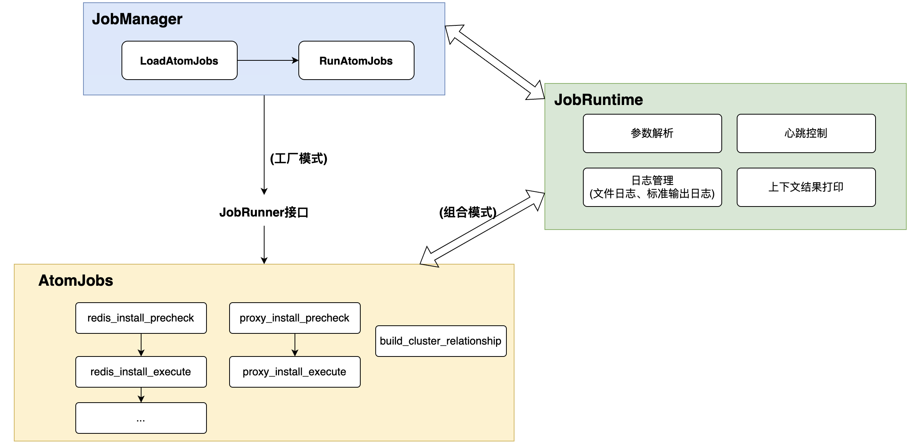

## mongo-dbactuator
mongo原子任务合集,包含mongo复制集、cluster的创建，备份，回档等等原子任务。

使用方式:
```go
./bin/mongo-dbactuator -h
mongo原子任务合集,包含mongo复制集、cluster的创建，备份，回档等等原子任务。

Usage:
  mongo-dbactuator [flags]


Flags:
  -A, --atom-job-list string   多个原子任务名用','分割,如 redis_install,redis_replicaof
  -B, --backup_dir string      备份保存路径,亦可通过环境变量MONGO_BACKUP_DIR指定
  -D, --data_dir string        数据保存路径,亦可通过环境变量 MONGO_DATA_DIR 指定
  -h, --help                   help for mongo-dbactuator
  -N, --node_id string         节点id
  -p, --payload string         原子任务参数信息,base64包裹
  -f, --payload_file string    原子任务参数信息,json/yaml文件
  -R, --root_id string         流程id
  -t, --toggle                 Help message for toggle
  -U, --uid string             单据id
  -V, --version_id string      运行版本id
  -u, --user string            db进程运行的os用户
  -g, --group string           db进程运行的os用户的属主

//执行示例
./bin/dbactuator_redis --uid=1111 --root_id=2222 --node_id=3333 --version_id=v1 --payload='eyJkaXIiOiIvZGF0YS9yZWRpcy8zMDAwMCIsInBvcnQiOjMwMDAwLCJwYXNzd29yZCI6InBhc3MwMSIsInZlcnNpb24iOiJyZWRpcy00LjExLjEyIiwiZGF0YWJhc2VzIjoyfQ==' --atom-job-list="mongod_install"
```

### 架构图


### 开发规范
go开发规范参考: [https://google.github.io/styleguide/go/decisions](https://google.github.io/styleguide/go/decisions)

### 开发流程
- **step1(必须):`pkg/atomJobs`目录下添加类对象,如`pkg/atomJobs/atommongodb/mongod_install.go`**;
以`type MongoDBInstall`为例。  
需实现`JobRunner`中的相关接口:
```go
//JobRunner defines a behavior of a job
type JobRunner interface {
	// Init doing some operation before run a job
	// such as reading parametes
	Init(*JobGenericRuntime) error

	// Name return the name of the job
	Name() string

	// Run run a job
	Run() error

	Retry() uint

	// Rollback you can define some rollback logic here when job fails
	Rollback() error
}
```
而后实现一个New函数,该函数简单返回一个`*MongoDBInstall{}`即可,如:`func NewMongoDBInstall() jobruntime.JobRunner`;
- **step2(必须):`pkg/jobmanager/jobmanager.go`中修改`GetAtomJobInstance()`函数**
加一行代码即可。    
```go
//key名必须和./mongo-dbactuator --atom-job-list 参数中的保持一致;
//value就是step1中的New函数;
m.atomJobMapper["NewMongoDBInstall"] =  atommongodb.NewMongoDBInstall
```
- **step3(非必须):更新README.md中的“当前支持的原子任务”**

### 注意事项
- 第一: **`mongo-dbactuator`中每个原子任务，强烈建议可重入，即可反复执行**  
虽然接口`JobRunner`中有`Rollback() error`实现需求，但其实不那么重要。    
相比可回档，实现可重入有如下优势:
  - **可重入实现难度更低, 基本上每个动作前先判断该动作是否已做过即可，而回档操作难度大，如100个redis实例建立主从关系，其中1个失败，99个成功，可重入实现简单，回档操作则非常麻烦；**
  - **可重入风险更低，创建的回档动作是删除，删除的回档动作是创建。回档操作代码细微bug，影响很大；**
  - **可重入对DBA和用户更实用，用户执行某个操作失败，用户基本诉求是重跑，完全不执行该操作了恢复环境需求很少；**

### 当前支持的原子任务
```go
os_mongo_init   // mongo安装前，os初始化
mongod_install // mongod安装
mongos_replicaof // mongos安装
...
```