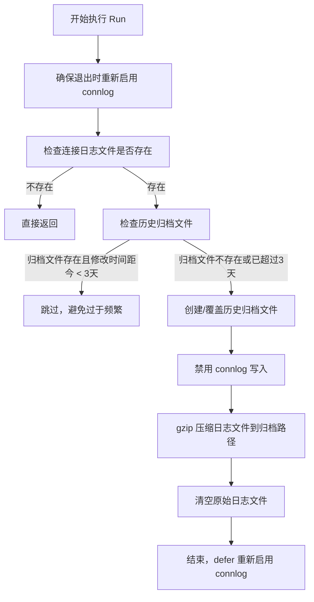

# rotate-proxy-connlog 监控项

## 概述

`rotate-proxy-connlog` 是一个 MySQL Proxy 连接日志轮转监控项，负责定期压缩归档 Proxy 的连接日志文件，防止日志文件无限增长占满磁盘空间。

## 核心逻辑

### 执行流程

### 关键路径

| 路径 | 说明 |
|------|------|
| `/data/mysql-proxy/{port}/log/mysql-proxy.log` | Proxy 连接日志文件 |
| `/data/mysql-proxy/{port}/log/mysql-proxy.log.{weekday}.gz` | 按星期几命名的压缩归档文件 |

### 轮转策略

- **归档命名**：以当前星期几（0-6）作为后缀，最多保留 7 个归档文件，自动覆盖同名旧归档
- **频率控制**：如果目标归档文件的修改时间距当前不足 3 天，则跳过本次轮转，避免过于频繁执行
- **安全机制**：
  1. 轮转前通过 `refresh_connlog(0)` 禁用 Proxy 的连接日志写入
  2. 使用 `defer` 确保无论执行成功与否，最终都会通过 `refresh_connlog(1)` 重新启用连接日志
  3. 先压缩归档，再清空原文件，保证数据不丢失

### 接口实现

该监控项实现了 `MonitorItemInterface` 接口：

- **Name()**：返回监控项名称 `rotate-proxy-connlog`
- **Run()**：执行日志轮转逻辑
- **构造函数**：`NewRotateProxyConnlog`，依赖 `ProxyAdminDB` 连接来执行管理命令

## 依赖

- Proxy Admin 端口的数据库连接（用于执行 `refresh_connlog` 命令）
- 系统 `gzip` 命令
