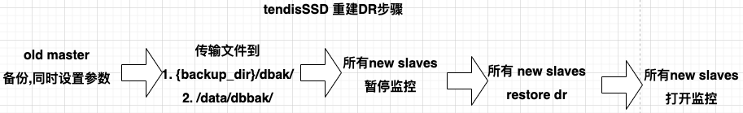

### tendisssd dr restore
tendisSSD 重建dr:
```
./dbactuator_redis  --uid={{uid}} --root_id={{root_id}} --node_id={{node_id}} --version_id={{version_id}} --atom-job-list="tendisssd_dr_restore"  --payload='{{payload_base64}}'
```

`--data_dir`、`--backup_dir` 可留空。  
前置工作:  初始化机器和安装完成tendisSSD
- 初始化机器: [sysinit](./sysinit.example.md)
- 安装tendisSSD: [redis_install](./redis_install.example.md)
- 需先在master上备份, 并把备份文件传输到slave上, 而后slave机器上执行该原子任务;  


原始payload
```json
{
    // backup_tasks 中的内容由redis_backup原子任务返回
    "backup_tasks":[
        {
            "bk_biz_id":"myapp",
            "ip":"127.0.0.1",
            "port":30000,
            "tendis_type":"TendisSSDInstance",
            "backup_type":"normal_backup",
            "role":"slave",
            "data_size":13974781892,
            "data_dir":"/data1/redis/30000/data",
            "backup_dir":"/data/dbbak",
            "backup_files":[
                "/data/dbbak/myapp-TENDISSSD-FULL-slave-127.0.0.1-30000-20220926-113124.tar"
            ],
            "backup_taskids":null
        },
        {
            "bk_biz_id":"myapp",
            "ip":"127.0.0.1",
            "port":30001,
            "tendis_type":"TendisSSDInstance",
            "backup_type":"normal_backup",
            "role":"slave",
            "data_size":11471121387,
            "data_dir":"/data1/redis/30001/data",
            "backup_dir":"/data/dbbak",
            "backup_files":[
                "/data/dbbak/myapp-TENDISSSD-FULL-slave-127.0.0.1-30001-20220926-113208.tar"
            ],
            "backup_taskids":null
        }
    ],
    "master_ip":"127.0.0.1",
    "master_start_port":30000,
    "master_inst_num":2,
    "master_ports":null,
    "master_auth":"xxxxx",
    "slave_ip":"2.2.2.2",
    "slave_start_port":30000,
    "slave_inst_num":2,
    "slave_ports":null,
    "slave_password":"xxxxx",
    "task_dir":"/data/dbbak" //本机备份文件保存的目录
}
```