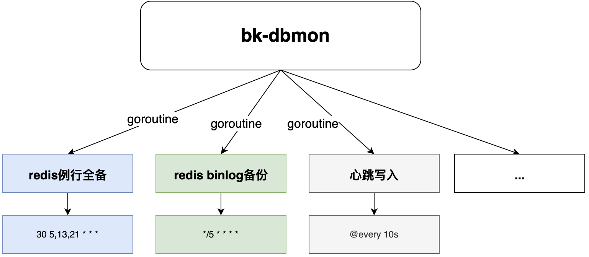

### bk-dbmon
本地例行任务集合,含例行全备、binlog备份、心跳等例行任务。

#### 使用示例
- **配置示例,文件名: dbmon-config.yaml**
```yaml
report_save_dir: /home/mysql/dbareport/
redis_backup:
    cron: '0 5/13/21 * * *' #从分开始
    to_backup_system: yes
    old_file_left_day: 2 # 旧文件本地保存天数
    tar_split: true
    tar_split_part_size: '8G'
redis_binlogbackup:
    to_backup_system: 'no' #是否上传备份系统
    old_file_left_day: '2' # 旧文件本地保存天数
    cron: '@every 10m' #从分开始
redis_heartbeat:
    cron: '@every 10s'  # refer https://pkg.go.dev/github.com/robfig/cron
redis_monitor:
    bkmonitor_event_data_id: 542898
    bkmonitor_event_token: 'xxxx'
    bkmonitor_metric_data_id: 11111
    bkmonitor_metirc_token: 'xxxx'
    cron: '@every 1m'
servers:
    - bk_biz_id: 200500194
      domain: cache01.aaaa.testapp.db
      server_ip: 127.0.0.1
      server_ports:
        - 44000
        - 44001
    - bk_biz_id: 200500195
      domain: cache02.bbbb.testapp.db
      server_ip: 127.0.0.1
      server_ports:
        - 45000
        - 45001
```

- **使用命令**
```sh
./bin/bk-dbmon --config=dbmon-config.yaml
```

#### 架构
