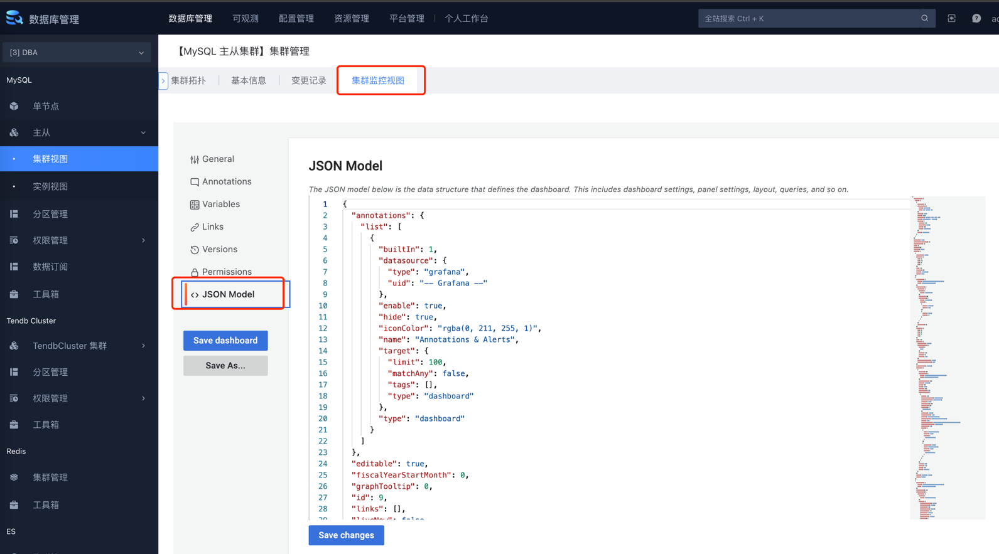

# 导出仪表盘
TODO: 把此步骤脚本化
到开发环境中，配置好仪表盘后，在设置中点击 JSON Model，复制对应的仪表盘到本目录对应的 json 文件中
保留 __inputs 为:
```
{
    "__inputs": [
        {
          "name": "DS_蓝鲸监控_- 指标数据",
          "label": "蓝鲸监控 - 指标数据",
          "description": "",
          "type": "datasource",
          "pluginId": "bkmonitor-timeseries-datasource",
          "pluginName": "BlueKing Monitor TimeSeries"
        }
      ],
    这里粘贴从 JSON Model 复制出来的内容，如:
    "annotations": {},
    "templating": {},
    ....
}
```


# 给仪表盘添加tags
```
"tags": ["{cluster_type}", "{custom_tag}"]
___________________________________
"tags": ["es"],
"tags": ["hdfs"],
"tags": ["kafka"],
"tags": ["pulsar"],
"tags": ["tendbha"],
"tags": ["tendbsingle"],
"tags": ["tendbcluster"],
"tags": ["influxdb"],
"tags": ["TwemproxyRedisInstance"],
"tags": ["PredixyTendisplusCluster"],
"tags": ["TwemproxyTendisSSDInstance"],
// 其中 “慢查询” 仪表盘，会适用于 "tendbsingle", "tendbha", "tendbcluster" 这三种集群类型
"tags": ["tendbsingle", "tendbha", "tendbcluster", "慢查询"],
```

# 刷新监控数据源ID：bkmonitor_timeseries
```
cd backend/bk_dataview/dashboards/json
find . -type f -name "*.json" -exec sed -i '' -e 's#${DS_蓝鲸监控_-_指标数据}#bkmonitor_timeseries#g' {} \;
find . -type f -name "*.json" -exec sed -i '' -e 's#${DS_蓝鲸监控_- 指标数据}#bkmonitor_timeseries#g' {} \;
find . -type f -name "*.json" -exec sed -i '' -e 's#"editable": true#"editable": false#g' {} \;
find . -type f -name "*.json" -exec sed -i '' -e 's#bkmonitor:system:#bkmonitor:dbm_system:#g' {} \;
```
# 批量替换基础指标来源：system -> dbm_system
```
find . -type f -name "*.json" -exec sed -i '' -e 's#bkmonitor:system:#bkmonitor:dbm_system:#g' {} \;
find . -type f -name "*.json" -exec sed -i '' -e 's#"result_table_id": "system.#"result_table_id": "dbm_system.#g' {} \;
```

# 批量替换 id 为 null: 「"id": 123,」 -> 「"id": null,」
```
find . -type f -name "*.json" -exec sed -i '' -e 's#"id": [0-9]*,#"id": null,#g' {} \;
```

# 这里按需隐藏变量，不暴露所有变量
templating.list.hide 设置为 2，这里一般把需暴露出来的变量设置为 0，不暴露的设置为 2

# 替换 datasource 为 bkmonitor_timeseries 或者 bklog
templating.list.datasource.uid 设置为 bkmonitor_timeseries 或者 bklog


# 导入监控的方法，还原模板后导入
```
find . -type f -name "*.json" -exec sed -i '' -e 's#bkmonitor_timeseries#${DS_蓝鲸监控_-_指标数据}#g' {} \;
find . -type f -name "*.json" -exec sed -i '' -e 's#bkmonitor_timeseries#${DS_蓝鲸监控_- 指标数据}#g' {} \;
find . -type f -name "*.json" -exec sed -i '' -e 's#"editable": false#"editable": true#g' {} \;
```
