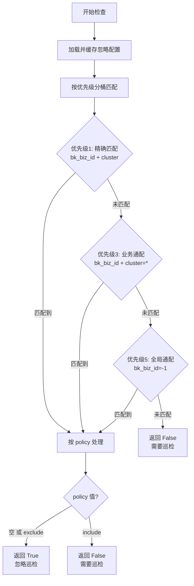

# 如果检查结果需要持久存储, 在 `dbm-ui/backend/db_report` 中添加 `module`

# 巡检排除

### 核心逻辑
local_tasks/mysql_backup/check_ignore.py

### 三级优先级规则

| 优先级 | 条件 | 说明 |
|--------|------|------|
| **1（最高）** | `cluster` 不为 `*` 且 `bk_biz_id` 不为 `-1` | 精确匹配某个业务的某个集群 |
| **3（中等）** | `cluster=*` 且 `bk_biz_id` 匹配 | 匹配某个业务下的所有集群 |
| **5（最低）** | `bk_biz_id=-1` | 匹配所有业务的所有集群 |

### Policy 策略

- `policy` 为空或 `"exclude"`：**忽略巡检**（跳过）
- `policy` 为 `"include"`：**需要巡检**（不跳过）

### 典型场景示例

1. **全局排除 + 某集群包含**：`bk_biz_id=-1, policy=exclude` + `cluster=xxx, policy=include` → 集群 `xxx` 仍会被巡检（优先级 1 > 优先级 5）
2. **业务排除 + 某集群包含**：`bk_biz_id=100, cluster=*, policy=exclude` + `bk_biz_id=100, cluster=xxx, policy=include` → 集群 `xxx` 仍会被巡检
3. **无任何匹配规则**：默认需要巡检