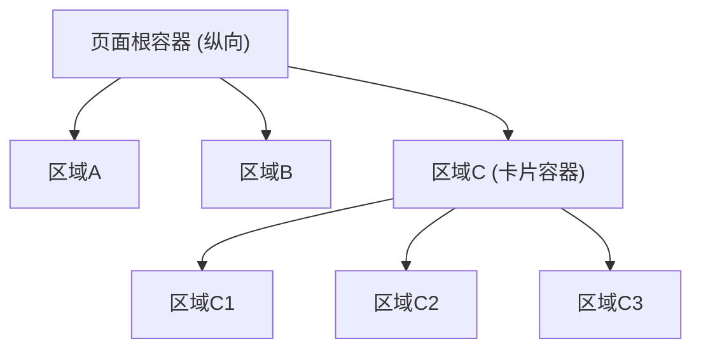

# Design to Code

将设计稿/截图转换为前端代码时，严格按照以下三阶段顺序执行，不可跳步。

## Phase 1: 布局骨架分析

**只看空间划分，忽略具体内容。**

1. 识别页面的整体方向（纵向流式 / 横向分栏 / 混合）
2. 从外到内逐层拆分区域，标注每个区域的：
   - 排列方向（纵向 / 横向）
   - 嵌套层级关系
3. 用 mermaid 树状图输出布局骨架，示例：



4. 输出布局骨架的 template 伪代码（只有 div 和 class，无业务内容）
5. **等待用户确认布局后，再进入 Phase 2**

## Phase 2: 元素填充

在已确认的布局骨架中，逐区域填入具体 UI 元素：

1. 对照设计稿，为每个区域列出需要的 UI 元素（Tab、表格、按钮、输入框等）
2. 确定使用项目中已有的组件还是 bkui-vue 基础组件
3. 在 template 骨架中填入组件标签和属性
4. 编写对应的 script 逻辑（数据定义、Props、Emits 等）
5. 编写对应的 style 样式

## Phase 3: 交互接入

布局和元素就位后，补充交互逻辑：

1. 事件绑定（点击、输入、切换等）
2. 数据请求（API 调用、参数传递）
3. 状态联动（Tab 切换刷新数据、搜索过滤、分页等）
4. 路由跳转（链接点击、页面导航）

## CSS Class 命名规范

### 命名格式

使用 `-` 连接的 BEM 风格，格式为 `block-name-element-name`。

**允许：**
- `db-config-page`
- `db-config-page-header`
- `db-config-page-primary-tabs`
- `db-config-content-table-area`

**禁止：**
- 单个单词：`header`、`toolbar`、`content`
- 双下划线：`db-config-page__header`
- 下划线：`db_config_page`
- 驼峰：`dbConfigPage`
- 除 `-` 以外的任何符号

### 命名原则

- 每个 class 必须至少包含两个用 `-` 连接的语义词组
- class 名应完整可读，不依赖父级上下文即可理解含义
- Block 层级使用页面/模块前缀保证唯一性

## 样式书写规范

### 禁止 `&__` 拼接

所有子选择器必须写完整的 class 名，禁止用 `&` 拼接生成 class。

```less
// 禁止
.db-config-page {
  &__header { }
  &__tabs { }
}

// 禁止
.db-config-page {
  &-header { }
  &-tabs { }
}
```

### 正确写法

在父选择器内嵌套完整的子 class，保持与 DOM 层级一致：

```less
.db-config-page {
  .db-config-page-header { }

  .db-config-page-primary-tabs { }

  .db-config-page-content {
    .db-config-page-secondary-tabs { }

    .db-config-page-toolbar { }

    .db-config-page-table-area { }
  }
}
```

## 完成检查清单

- [ ] Phase 1 布局骨架已输出并经用户确认
- [ ] Phase 2 元素已填充到对应区域
- [ ] Phase 3 交互逻辑已接入
- [ ] 所有 class 名至少两个语义词组，仅用 `-` 连接
- [ ] 无单个单词 class、无 `__`、无 `&__` 拼接
- [ ] 样式嵌套中所有子选择器为完整 class 名
- [ ] 布局结构与设计稿的空间划分一致
