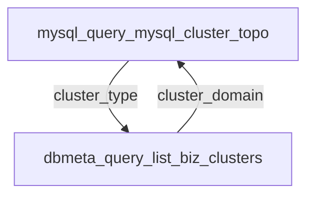

# MCP工具知识库

## 可用MCP工具
### dbmeta_query_list_biz_clusters
- 路径: `/apis/ai/mcp_tools/common/list_biz_clusters/`
- 需要输入: bk_biz_id, cluster_domain, cluster_type
- 产生输出: affinity, bk_cloud_id, cluster_domain, cluster_type, region, status

### dbmeta_query_list_biz_dbmodules
- 路径: `/apis/ai/mcp_tools/common/list_biz_dbmodules/`
- 需要输入: bk_biz_id
- 产生输出: alias_name, charset, cluster_type, db_module_id, db_version

### dbmeta_query_list_bizs_base_info
- 路径: `/apis/ai/mcp_tools/common/list_bizs_base_info/`
- 需要输入: 无
- 产生输出: abbr, bk_biz_id, cluster_type, db_type

### dbmeta_query_list_supported_cluster_type
- 路径: `/apis/ai/mcp_tools/common/list_supported_cluster_type/`
- 需要输入: place_holder
- 产生输出: cluster_type_name, cluster_type_value

### mysql_query_explain_sql
- 路径: `/apis/ai/mcp_tools/mysql/explain_sql/`
- 需要输入: cluster_domain, db_name, query_sql
- 产生输出: explain_result

### mysql_query_mysql_cluster_topo
- 路径: `/apis/ai/mcp_tools/mysql/mysql_cluster_topo/`
- 需要输入: cluster_domain
- 产生输出: address, cluster_type, instance_inner_role, instance_role, is_stand_by, machine_type, master_instance, shard_id, status

### mysql_query_show_biz_mysql_privilege_template
- 路径: `/apis/ai/mcp_tools/mysql/show_biz_mysql_privilege_template/`
- 需要输入: bk_biz_id, cluster_type
- 产生输出: account_name, dbname

### mysql_query_show_cluster_processlist_summary
- 路径: `/apis/ai/mcp_tools/mysql/show_cluster_processlist_summary/`
- 需要输入: cluster_domain
- 产生输出: message, proxy_processlist_summary, storage_processlist_summary

### mysql_query_show_create_table
- 路径: `/apis/ai/mcp_tools/mysql/show_create_table/`
- 需要输入: cluster_domain, db_name, table_name
- 产生输出: create_sql

### mysql_query_show_instance_popular_runtime_status
- 路径: `/apis/ai/mcp_tools/mysql/show_instance_popular_runtime_status/`
- 需要输入: address, bk_cloud_id
- 产生输出: status_name, status_value

### mysql_query_show_instance_slave_status
- 路径: `/apis/ai/mcp_tools/mysql/show_instance_slave_status/`
- 需要输入: address, bk_cloud_id
- 产生输出: status_name, status_value

### mysql_query_show_mysql_popular_runtime_variables
- 路径: `/apis/ai/mcp_tools/mysql/show_mysql_popular_runtime_variables/`
- 需要输入: address, bk_cloud_id
- 产生输出: variable_name, variable_value

### mysql_bill_submit_bill_mysql_apply_priv
- 路径: `/apis/ai/mcp_tools/mysql/submit_bill_mysql_apply_priv/`
- 需要输入: account_name, bk_biz_id, cluster_domain
- 产生输出: bill_id, bill_url

### mysql_bill_submit_bill_mysql_db_rename
- 路径: `/apis/ai/mcp_tools/mysql/submit_bill_mysql_db_rename/`
- 需要输入: bk_biz_id, cluster_domain, source_dbname, target_dbname
- 产生输出: bill_id, bill_url

### mysql_bill_submit_bill_mysql_db_table_backup
- 路径: `/apis/ai/mcp_tools/mysql/submit_bill_mysql_db_table_backup/`
- 需要输入: bk_biz_id, cluster_domain
- 产生输出: bill_id, bill_url

### mysql_bill_submit_bill_mysql_full_backup
- 路径: `/apis/ai/mcp_tools/mysql/submit_bill_mysql_full_backup/`
- 需要输入: backup_type, bk_biz_id, cluster_domain
- 产生输出: bill_id, bill_url

### mysql_bill_submit_bill_mysql_standardize
- 路径: `/apis/ai/mcp_tools/mysql/submit_bill_mysql_standardize/`
- 需要输入: bk_biz_id, with_cc_standardize, with_deploy_binary, with_instance_standardize, with_push_config
- 产生输出: bill_id, bill_url

### mysql_bill_submit_bill_tdbctl_upgrade
- 路径: `/apis/ai/mcp_tools/mysql/submit_bill_tdbctl_upgrade/`
- 需要输入: bk_biz_id, cluster_domain, cluster_id, version
- 产生输出: bill_id, bill_url

## 环路检测报告
⚠️ 发现 1 循环依赖
### 环路 1

## 字段查找表
| 字段名 | 能生成的MCP | 需要该字段的MCP |
|--------|-------------|----------------|
| `abbr` | dbmeta_query_list_bizs_base_info | 无 |
| `account_name` | mysql_query_show_biz_mysql_privilege_template | mysql_bill_submit_bill_mysql_apply_priv |
| `address` | mysql_query_mysql_cluster_topo | mysql_query_show_instance_popular_runtime_status, mysql_query_show_instance_slave_status, mysql_query_show_mysql_popular_runtime_variables |
| `affinity` | dbmeta_query_list_biz_clusters | 无 |
| `alias_name` | dbmeta_query_list_biz_dbmodules | 无 |
| `backup_type` | 无 | mysql_bill_submit_bill_mysql_full_backup |
| `bill_id` | mysql_bill_submit_bill_mysql_apply_priv, mysql_bill_submit_bill_mysql_db_rename, mysql_bill_submit_bill_mysql_db_table_backup, mysql_bill_submit_bill_mysql_full_backup, mysql_bill_submit_bill_mysql_standardize, mysql_bill_submit_bill_tdbctl_upgrade | 无 |
| `bill_url` | mysql_bill_submit_bill_mysql_apply_priv, mysql_bill_submit_bill_mysql_db_rename, mysql_bill_submit_bill_mysql_db_table_backup, mysql_bill_submit_bill_mysql_full_backup, mysql_bill_submit_bill_mysql_standardize, mysql_bill_submit_bill_tdbctl_upgrade | 无 |
| `bk_biz_id` | dbmeta_query_list_bizs_base_info | dbmeta_query_list_biz_clusters, dbmeta_query_list_biz_dbmodules, mysql_query_show_biz_mysql_privilege_template, mysql_bill_submit_bill_mysql_apply_priv, mysql_bill_submit_bill_mysql_db_rename, mysql_bill_submit_bill_mysql_db_table_backup, mysql_bill_submit_bill_mysql_full_backup, mysql_bill_submit_bill_mysql_standardize, mysql_bill_submit_bill_tdbctl_upgrade |
| `bk_cloud_id` | dbmeta_query_list_biz_clusters | mysql_query_show_instance_popular_runtime_status, mysql_query_show_instance_slave_status, mysql_query_show_mysql_popular_runtime_variables |
| `charset` | dbmeta_query_list_biz_dbmodules | 无 |
| `cluster_domain` | dbmeta_query_list_biz_clusters | dbmeta_query_list_biz_clusters, mysql_query_explain_sql, mysql_query_mysql_cluster_topo, mysql_query_show_cluster_processlist_summary, mysql_query_show_create_table, mysql_bill_submit_bill_mysql_apply_priv, mysql_bill_submit_bill_mysql_db_rename, mysql_bill_submit_bill_mysql_db_table_backup, mysql_bill_submit_bill_mysql_full_backup, mysql_bill_submit_bill_tdbctl_upgrade |
| `cluster_id` | 无 | mysql_bill_submit_bill_tdbctl_upgrade |
| `cluster_type` | dbmeta_query_list_biz_clusters, dbmeta_query_list_biz_dbmodules, dbmeta_query_list_bizs_base_info, mysql_query_mysql_cluster_topo | dbmeta_query_list_biz_clusters, mysql_query_show_biz_mysql_privilege_template |
| `cluster_type_name` | dbmeta_query_list_supported_cluster_type | 无 |
| `cluster_type_value` | dbmeta_query_list_supported_cluster_type | 无 |
| `create_sql` | mysql_query_show_create_table | 无 |
| `db_module_id` | dbmeta_query_list_biz_dbmodules | 无 |
| `db_name` | 无 | mysql_query_explain_sql, mysql_query_show_create_table |
| `db_type` | dbmeta_query_list_bizs_base_info | 无 |
| `db_version` | dbmeta_query_list_biz_dbmodules | 无 |
| `dbname` | mysql_query_show_biz_mysql_privilege_template | 无 |
| `explain_result` | mysql_query_explain_sql | 无 |
| `instance_inner_role` | mysql_query_mysql_cluster_topo | 无 |
| `instance_role` | mysql_query_mysql_cluster_topo | 无 |
| `is_stand_by` | mysql_query_mysql_cluster_topo | 无 |
| `machine_type` | mysql_query_mysql_cluster_topo | 无 |
| `master_instance` | mysql_query_mysql_cluster_topo | 无 |
| `message` | mysql_query_show_cluster_processlist_summary | 无 |
| `place_holder` | 无 | dbmeta_query_list_supported_cluster_type |
| `proxy_processlist_summary` | mysql_query_show_cluster_processlist_summary | 无 |
| `query_sql` | 无 | mysql_query_explain_sql |
| `region` | dbmeta_query_list_biz_clusters | 无 |
| `shard_id` | mysql_query_mysql_cluster_topo | 无 |
| `source_dbname` | 无 | mysql_bill_submit_bill_mysql_db_rename |
| `status` | dbmeta_query_list_biz_clusters, mysql_query_mysql_cluster_topo | 无 |
| `status_name` | mysql_query_show_instance_popular_runtime_status, mysql_query_show_instance_slave_status | 无 |
| `status_value` | mysql_query_show_instance_popular_runtime_status, mysql_query_show_instance_slave_status | 无 |
| `storage_processlist_summary` | mysql_query_show_cluster_processlist_summary | 无 |
| `table_name` | 无 | mysql_query_show_create_table |
| `target_dbname` | 无 | mysql_bill_submit_bill_mysql_db_rename |
| `variable_name` | mysql_query_show_mysql_popular_runtime_variables | 无 |
| `variable_value` | mysql_query_show_mysql_popular_runtime_variables | 无 |
| `version` | 无 | mysql_bill_submit_bill_tdbctl_upgrade |
| `with_cc_standardize` | 无 | mysql_bill_submit_bill_mysql_standardize |
| `with_deploy_binary` | 无 | mysql_bill_submit_bill_mysql_standardize |
| `with_instance_standardize` | 无 | mysql_bill_submit_bill_mysql_standardize |
| `with_push_config` | 无 | mysql_bill_submit_bill_mysql_standardize |
