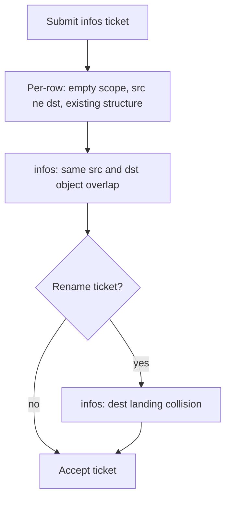

# DTS Multi-Row Ticket Validation - Plan

## Goal Capsule

- **Objective:** 多行 `infos[]` 迁移单在创单时拒掉「同一源+同一目标迁同一批对象」，并与重命名迁移共用每行健康检查。
- **Product authority:** 本计划只覆盖单据校验规则与分层。不改 DTS 引擎、不改跨单据集群互斥、不改单行 `many_to_one` / `one_to_many` 对象重叠。
- **Execution profile:** 先写重叠纯函数单测，再挂 Serializer；不 commit / 不 push。
- **Stop conditions:** 不改 `MysqlDtsInfo.dts_info_clusive`；不改 `build_dts_task_request` 空规则拦截语义；不拦普通迁移不同源同名落地。
- **Open blockers:** 无。
- **Product Contract preservation:** unchanged.

## Product Contract

### Summary

给 MYSQL_TO_MYSQL_MIGRATE、MYSQL_HA_TO_CLUSTER_MIGRATE、MYSQL_RENAME_MIGRATE 补齐多行校验：空范围拒单、源不等于目标、`infos[]` 同源同目标对象不重叠。整实例全量的正式写法是 `do_dbs: ["*"]`。重命名迁移在 infos 上额外拒目标端落地冲突。

### Problem Frame

多行允许同一源集群出现多次（同源同目标、不同库已是合法用例），但单据层没有库表对象冲突检查。空 `sync_scope` 现在能过单据，创建任务时才因「空规则在引擎侧等于全库」被拦，报错来得太晚。

### Key Decisions

- KD1. 对象重叠只看 infos 多行，不看单行多源/多目标。`(session-settled: user-directed — chosen over all_plans: 避免误伤 many_to_one 合并)` Governs R5, R6.
- KD2. 同源可以重复；只有同一源且同一目标时对象重叠才拒。`(session-settled: user-directed — chosen over src-cluster-only: 合法拆库并行)` Governs R5.
- KD3. 目标端同名落地只拦重命名 infos。`(session-settled: user-directed — chosen over both_migrate_types: 普通迁移不同源同名库先放过)` Governs R6.
- KD4. 空范围拒单；整实例全量用 `do_dbs: ["*"]`。`(session-settled: user-directed — chosen over empty-means-all: 与创建任务拦截对齐，并给出全量契约)` Governs R3, R4, R5.
- KD5. 普通迁移和重命名都拒源集群等于目标集群。`(session-settled: user-directed — chosen over rename_allow_same: 避免自己迁自己)` Governs R2.

### Requirements

**Per-row health (all three ticket types)**

- R1. 每条 source 必须能生成非空同步规则；空 `sync_scope`、空 `do_dbs` 且无 `do_tables` / `table_routes` 的行拒单。
- R2. 任一行源集群 ID 与目标集群 ID 相同则拒单。
- R3. 整实例全量必须写 `do_dbs: ["*"]`（或等价的整库通配规则）；禁止靠空范围表达全量。

**infos[] cross-row (migrate + rename)**

- R4. `do_dbs: ["*"]` 表示该源实例全部业务库；与同一源+同一目标上任何其它对象视为重叠。
- R5. 同一 `infos[]` 内，相同源集群且相同目标集群时，对象集合不得相交。整库（`do_dbs` 中的库名，或 `table=*`）覆盖该库下所有表。源集群重复但目标不同、或目标相同但对象不交，均合法。

**Rename-only on infos[]**

- R6. 重命名迁移的 `infos[]` 中，不同行不得落到同一目标集群的同一目标库表（含仅改库名、仅改表名）。已有「必须真实改名的 `table_routes`」保持不变。

**Unchanged existing checks**

- R7. 现有 infos 结构检查保持：仅 `one_to_one`、生命周期字段不在行内、跨行 deploy 机器不交叉、集群存在且 `major_version` 可解析。

**Comment contract**

- R8. 每项校验函数须有注释，写明：拦什么、对谁生效（每行 / infos 跨行 / 仅重命名）、以及合法反例（例如同源同目标不同库可通过）。新增与既有公共检查同样遵守。

### Key Flows

- F1. Submit multi-row migrate ticket
  - **Trigger:** 用户提交带 `infos[]` 的迁移或重命名单据。
  - **Steps:** 先做 R1–R3、R7 的每行检查；再按 R5（及重命名时 R6）做跨行冲突；通过后才建单。
  - **Outcome:** 冲突在单据校验失败信息中指出涉及的行，而不是拖到创建 DTS 任务。
  - **Covered by:** R1, R2, R5, R6, R7.



### Acceptance Examples

- AE1. 同源同目标不同库
  - **Covers R5.**
  - **Given:** infos 两行均为源 100、目标 200，分别 `do_dbs: ["db_a"]` 与 `do_dbs: ["db_b"]`。
  - **Then:** 通过。

- AE2. 同源同目标同库
  - **Covers R5.**
  - **Given:** 同上集群 pair，两行都是 `do_dbs: ["db_a"]`。
  - **Then:** 拒单。

- AE3. 同源不同目标同库
  - **Covers R5.**
  - **Given:** 源 100 的 `db_a` 分别迁到目标 200 与 201。
  - **Then:** 通过。

- AE4. 整库盖住表
  - **Covers R5.**
  - **Given:** 一行 `do_dbs: ["db_a"]`，另一行同源同目标 `table_routes` 含 `db_a.t1`。
  - **Then:** 拒单。

- AE5. 整实例盖住任意对象
  - **Covers R4, R5.**
  - **Given:** 一行 `do_dbs: ["*"]`，另一行同源同目标任意库表。
  - **Then:** 拒单。

- AE6. 空范围
  - **Covers R1, R3.**
  - **Given:** 任一行未填 `sync_scope` / `do_dbs` 且无路由。
  - **Then:** 单据校验失败，不等创建任务。

- AE7. 源等于目标
  - **Covers R2.**
  - **Given:** 一行源与目标都是集群 100。
  - **Then:** 普通迁移和重命名都拒。

- AE8. 重命名落地冲突
  - **Covers R6.**
  - **Given:** 两行源集群不同、目标集群相同，`target_db`/`target_table` 落到同一对象。
  - **Then:** 重命名拒单；普通迁移不因目标同名拒单。

- AE9. 单行 many_to_one
  - **Covers R5.**
  - **Given:** 无 `infos[]` 的 many_to_one，多源对象在目标侧同名。
  - **Then:** 不因对象重叠拒单。

### Scope Boundaries

- 不改跨单据 `MysqlDtsInfo` 集群级互斥。
- 不拦单行 `many_to_one` / `one_to_many` 的对象重叠。
- 不拦普通迁移「不同源、同一目标、同名库」的落地覆盖。
- 不把 `shard_*` 等精细通配做成精确差集；无法证明不交的通配按重叠拒。
- 不改 DTS 引擎空规则=全库的行为。

### Dependencies / Assumptions

- 创建任务路径已拦截空 `table_migrate_rule`；单据层 R1 与之对齐，避免晚失败。
- 引擎空规则语义仍是全库（排除系统库）；产品不用空范围表达该语义。
- `ignore_dbs` / `ignore_tables` 在比较前从对象集合中扣除。

### Sources / Research

- 现有 infos 校验：`dbm-ui/backend/ticket/builders/mysql/dts/mysql_dts_tickets.py`（one_to_one、生命周期、deploy 交叉、major_version）。
- 空规则拦截：`dbm-ui/backend/flow/utils/mysql/dts/migrate_helper.py` 中 `build_dts_task_request`。
- 同源同目标不同对象合法：`dbm-ui/backend/tests/ticket/builders/mysql/dts/test_mysql_dts_tickets.py` 的 `test_infos_same_src_dst_different_objects_valid`。
- 重命名真实改名：同文件 `_validate_rename_routes` / `is_real_rename_route`。

## Planning Contract

### Key Technical Decisions

- KTD1. 对象集合复用 `_build_table_migrate_rules` 的 `(schema, table)`，不另造一套解析。`(session-settled: user-approved — chosen over exact-names-only: 与创建任务同一白名单)` Instantiates R1, R4, R5.
- KTD2. 纯函数放 `dbm-ui/backend/flow/utils/mysql/dts/sync_scope_overlap.py`；Serializer 只负责组 plan、调函数、抛 `ValidationError`。 Instantiates R8.
- KTD3. 名称含 `*` / `%` / 非精确字面时，无法证明与另一对象不交则判重叠。`do_dbs=["*"]` 与任意对象交；命名库的 `table=*` 与该库任意表交。 Instantiates R4, R5.
- KTD4. 重命名落地键：`target_db` 缺省回落到源库，`target_table` 缺省回落到源表（与真实改名语义一致）。 Instantiates R6.

### High-Level Technical Design

单据 `validate` 已 `build_migrate_plans`。在 R7 之后、return 之前：

1. 每条 `task_spec` / `source`：规则为空 → R1；`source.cluster_id == target_cluster_id` → R2。
2. 仅当 `attrs["infos"]` 非空：按 `(src_cluster_id, dst_cluster_id)` 分桶，桶内两两 `objects_overlap` → R5。
3. 仅重命名 Serializer：按 `target_cluster_id` 分桶，桶内落地键两两相交 → R6。

拒单文案带 `infos[i]` / `infos[j]`。

### Assumptions

- 现有 `test_infos_two_one_to_one_valid` 无 `do_dbs`，实现后必须补范围，否则会变成 AE6 拒单。
- 单行 one_to_one 同样走 R1/R2；只是不走 R5/R6。

### Sequencing

U1 → U2 → U3。U3 依赖 U2 的 Serializer 入口。

## Implementation Units

### U1. Sync-scope object overlap helpers

- **Goal:** 从 `SyncScope` 抽出源对象与落地对象，并判断包含/重叠。
- **Requirements:** R4, R5, R6, R8 (helper 注释).
- **Files:**
  - Create: `dbm-ui/backend/flow/utils/mysql/dts/sync_scope_overlap.py`
  - Test: `dbm-ui/backend/tests/flow/utils/mysql/dts/test_sync_scope_overlap.py`
  - Reuse: `dbm-ui/backend/flow/utils/mysql/dts/migrate_helper.py` `_build_table_migrate_rules`
- **Approach:** `source_objects(scope)` 调已有规则构建，得到 `(schema, table)` 集合；空集合表示空范围。`objects_overlap(a, b)`：任一侧 schema=`*` 则交；同 schema 且任一侧 table=`*` 则交；两侧都是精确名则相等才交；任一侧是其它通配则交。`landing_objects(scope)` 用 route 的 target，缺省回落源。扣除 `ignore_dbs` / `ignore_tables` 沿用 `_build_table_migrate_rules`。
- **Test Scenarios:**
  - `do_dbs=["db_a"]` vs `do_dbs=["db_b"]` 不交。
  - 同库整库 vs `db_a.t1` 相交。
  - `do_dbs=["*"]` vs 任意对象相交。
  - 空 scope 得到空集合。
  - `shard_*` vs `shard_1` 相交（保守）。
  - 落地：两路 `target_db=app, target_table=t` 相交；缺省回落源后同键相交。
- **Verification:** `pytest dbm-ui/backend/tests/flow/utils/mysql/dts/test_sync_scope_overlap.py --ds=config.ci -q`
- **Dependencies:** none.

### U2. Wire per-row and infos checks into serializers

- **Goal:** 三种迁移 Serializer 挂上 R1–R6；函数注释满足 R8。
- **Requirements:** R1, R2, R3, R5, R6, R7, R8.
- **Files:**
  - Modify: `dbm-ui/backend/ticket/builders/mysql/dts/mysql_dts_tickets.py`
- **Approach:** 在 `MysqlMigrateBaseDetailSerializer.validate` 组完 `plans` 后调用 `_validate_sync_scope_nonempty(plans)`、`_validate_src_ne_dst(plans)`；若 `infos` 非空再 `_validate_infos_object_overlap(plans)`。`MysqlRenameMigrateDetailSerializer.validate` 在现有 `_validate_rename_routes` 之后，仅 infos 时 `_validate_infos_rename_dest_landing(plans)`。既有 `_validate_infos_*` 补 R8 风格注释。不要改 apply/destroy Serializer。
- **Test Scenarios:** covered by U3.
- **Verification:** U3 命令。
- **Dependencies:** U1.

### U3. Ticket serializer acceptance tests

- **Goal:** AE1–AE9 落在现有单据单测文件；修正空范围用例。
- **Requirements:** R1–R6; AE1–AE9.
- **Files:**
  - Modify: `dbm-ui/backend/tests/ticket/builders/mysql/dts/test_mysql_dts_tickets.py`
- **Approach:** `test_infos_two_one_to_one_valid` 补 `do_dbs`。新增对 `MysqlMigrateBaseDetailSerializer` / `MysqlRenameMigrateDetailSerializer` 的 AE 用例。`MysqlToMysqlMigrateDetailSerializer` 需要 Cluster mock 时沿用文件内现有 patch。AE9 用单行 many_to_one（基类允许；mysql_to_mysql 子类若限制拓扑则测基类）。
- **Test Scenarios:** AE1 通过；AE2 拒；AE3 通过；AE4 拒；AE5 拒；AE6 拒；AE7 普通+重命名拒；AE8 重命名拒且普通通过；AE9 通过。
- **Verification:** `pytest dbm-ui/backend/tests/ticket/builders/mysql/dts/test_mysql_dts_tickets.py --ds=config.ci -q` 以及 U1 命令。
- **Dependencies:** U2.

## Verification Contract

环境：`conda activate dbm-saas && source /root/set_dbm_env.sh`。

```bash
pytest dbm-ui/backend/tests/flow/utils/mysql/dts/test_sync_scope_overlap.py \
  dbm-ui/backend/tests/ticket/builders/mysql/dts/test_mysql_dts_tickets.py \
  --ds=config.ci -q
flake8 dbm-ui/backend/flow/utils/mysql/dts/sync_scope_overlap.py \
  dbm-ui/backend/ticket/builders/mysql/dts/mysql_dts_tickets.py \
  dbm-ui/backend/tests/flow/utils/mysql/dts/test_sync_scope_overlap.py \
  dbm-ui/backend/tests/ticket/builders/mysql/dts/test_mysql_dts_tickets.py
```

不 commit、不 push。

## Definition of Done

- U1–U3 完成；AE1–AE9 有对应测试。
- 校验函数带 R8 注释（拦什么、对谁生效、合法反例）。
- 现有 infos 结构测试（生命周期、deploy 交叉、one_to_one）仍通过。
- 无弃用实验代码留在 diff。
